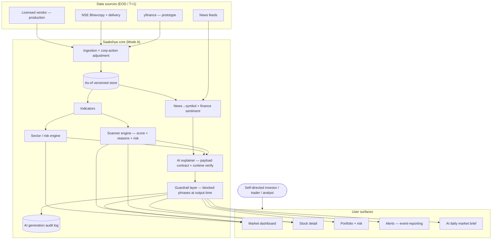

# 01 — Product Overview

Defines what Saakshya is, who it serves, the problem it solves, its evidence-first philosophy, product pillars, and long-term vision.

> Read first: [SPEC.md](../SPEC.md) (canonical source of truth).

---

## 1. What is Saakshya

**Saakshya** (Sanskrit / Hindi: साक्ष्य, "evidence") is an **AI-powered, evidence-first Indian equity research, scanning, and portfolio decision-support platform** for NSE/BSE retail investors, swing traders, and analyst-type users.

It ingests **end-of-day (EOD / T+1) market data**, normalizes and corporate-action-adjusts it, computes indicators, runs technical scanners, scores sector strength, classifies news sentiment, monitors portfolio risk, and uses AI to **explain deterministic, data-grounded signals in plain language**.

The name is the product thesis: **every output traces to visible data and explainable logic.** A scanner result shows the score *and* the reasons. An AI summary references only computed metrics from a structured payload. A risk note points at the data that triggered it. Nothing is asserted that cannot be traced back to evidence on the screen.

### 1.1 What Saakshya is NOT

Saakshya is **not a guaranteed-returns platform, not a stock-tips service, and not (in v1) an advisory product.**

- It does **not** tell users what to buy or sell.
- It does **not** publish per-stock entry / target / stop-loss levels (these are RA-gated — see [Roadmap](02-product-roadmap.md) and [Compliance](21-compliance-risk-and-guardrails.md)).
- It does **not** make or imply return promises.
- It is positioned as **research / analytics / scanner / portfolio-intelligence / decision-support** — users draw their own conclusions from the evidence Saakshya surfaces.

Saakshya operates in **Mode A (pure analytics)** for v1. Recommendation-flavored features unlock only if and when the company completes the required regulatory path — **Registered Research Analyst (RA, Mode B)** for stock-specific research, and only later **Registered Investment Adviser (IA, Mode C)** for personalized advice. See [SPEC.md §2](../SPEC.md) and [Compliance](21-compliance-risk-and-guardrails.md).

---

## 2. The core product promise

> **"Saakshya helps you discover technically strong setups, understand sector momentum, analyse news sentiment, and track portfolio risk — all backed by visible evidence and AI explanations you can trace — so you can make your own, better-informed decisions."**

Three promises, each compliance-safe and differentiating:

1. **Best screener.** Broad, validated technical scanners across the NSE/BSE universe, each result shown with score + reasons + risk flags.
2. **Best explanations.** AI that *explains* what the data shows — never invents numbers, prices, news, targets, or recommendations.
3. **Trustworthy by construction.** As-of versioned data, corporate-action-adjusted series, a data-confidence indicator, and an audit trail behind every AI generation.

---

## 3. Target market

| Segment | Who they are | What Saakshya gives them |
|---|---|---|
| **Retail investors (beginner)** | Self-directed NSE/BSE investors learning to read the market | A clean EOD dashboard, plain-language AI explanations, sector context, portfolio risk flags |
| **Swing traders (active)** | Multi-day to multi-week traders working off EOD signals | Momentum / volume / breakout scanners, watchlists, alerts (event-reporting), peer comparison |
| **Portfolio holders** | Long-term holders tracking what they own | Portfolio tracker, risk engine, holdings-level factual notes ("X broke its 50-DMA") |
| **Advanced traders / analyst-type users** | Power users who build their own filters and test ideas | Custom scanner builder, backtesting (integrity-controlled), strategy rules, exports |
| **Premium / Pro subscribers** | Users who pay for breadth, depth, and automation | Full scanner suite, AI summaries at scale, thematic baskets, institutional activity, advanced risk |
| **Admin / compliance users** | Internal operators and reviewers | Admin console: blocked-phrase lists, prompt versions, source reliability, audit logs |

Geographic and instrument scope for v1: **NSE/BSE cash equities, EOD/T+1.** Live data, intraday, and broker execution are later, separately-licensed tiers (see [Roadmap](02-product-roadmap.md)).

---

## 4. The user problem

Indian retail investors face a market flooded with **unaccountable tips** ("multibagger", "sure-shot", "buy now") and **opaque tools** that either dump raw data without explanation or assert conclusions without evidence. The result:

- **Information overload** — thousands of stocks, dozens of indicators, no synthesis.
- **No traceability** — screeners output numbers but not *why* they matter; tip channels output calls but not *any* basis.
- **No risk context** — momentum is shown without the elevated-volatility caveat; breakouts without false-breakout risk.
- **Corrupted indicators** — many free tools silently misread splits/bonuses as price crashes, corrupting RSI, MAs, and backtests (see [SPEC.md §6.1](../SPEC.md)).
- **AI that hallucinates** — generic AI assistants invent prices, news, and targets, which is both wrong and a regulatory landmine.

Saakshya's answer: **surface the evidence, score it, explain it honestly, flag the risk, and never cross the line into telling users what to do.**

---

## 5. Product philosophy

### 5.1 Evidence-first

Every scanner result, score, AI insight, and risk note is **data-backed, explainable, and traceable**. If a critical input is missing, the AI summary is **suppressed, not guessed** ([SPEC.md §6.2](../SPEC.md)). Displayed values are **as-of versioned** so any figure is reproducible for the date it was shown.

### 5.2 AI explains; it never invents

The AI layer operates on a **structured payload contract** ([SPEC.md §6.6](../SPEC.md)): it receives only computed metrics, scanner tags, news summaries, and risk markers, and may reference **nothing else**. A **runtime validator** checks every number and named fact in AI output against the payload and **blocks or regenerates on mismatch**. See [AI/LLM architecture](14-ai-llm-agent-architecture.md).

**AI never invents** numbers, prices, news, targets, returns, or recommendations.

### 5.3 Compliance is a product property, not a disclaimer

The evidence-first philosophy *is* the compliance posture. Disclaimers do not cure advisory substance ([SPEC.md §0](../SPEC.md)). Mode-A-safe language is enforced **at output time** via a versioned blocked-phrase list.

**Permitted language (descriptive, non-directive):** "appears in the momentum scanner", "trading above its 50-DMA", "volume expanded 2× versus its 20-day average", "historically a resistance zone", "risk is elevated", "evidence suggests", "should be monitored", "not investment advice".

**Always prohibited in every mode:** guarantee, assured / confirmed target, risk-free, multibagger, sure-shot, buy now, best stock for you, or any implied/explicit return claim. See [Compliance](21-compliance-risk-and-guardrails.md) and the [Glossary](29-glossary.md).

---

## 6. Product pillars

Saakshya is organized into ten pillars. Each maps to one or more modules in [Feature modules](04-feature-modules.md) and carries a regulatory mode from [SPEC.md §4](../SPEC.md).

| # | Pillar | What it delivers | Primary modules | Mode | Ships |
|---|---|---|---|---|---|
| 1 | **Market intelligence** | EOD market dashboard, indices, breadth, descriptive AI market summary | Market dashboard, AI daily market brief | A | V1–V2 |
| 2 | **Technical scanners** | Momentum, volume, RSI, MA, breakout, breakdown scanners — score + reasons + risk flags | Scanner engine | A | V1 |
| 3 | **Sector intelligence** | Sector strength dashboard, thematic baskets (bucket views, not model portfolios) | Sector dashboard, theme baskets | A | V1 / V3 |
| 4 | **News sentiment** | Finance-tuned news→symbol resolution, sentiment, corporate announcements | News sentiment, corp actions | A | V2 |
| 5 | **AI explanations** | Grounded, runtime-verified plain-language explanations of structured signals | AI stock summary, AI assistant | A | V2 |
| 6 | **Portfolio intelligence** | Portfolio tracker, holdings-level factual notes, peer comparison | Portfolio tracker, peer comparison | A | V2–V3 |
| 7 | **Risk monitoring** | Risk engine, risk scoring, portfolio risk flags, elevated-volatility caveats | Risk engine | A | V1 / V3 |
| 8 | **Backtesting & strategy** | Custom scanner builder, integrity-controlled backtesting, ML ranking / probability bands | Strategy builder, backtesting | A | V4–V5 |
| 9 | **Agentic workflows** | Multi-step AI agents (market-brief, stock-research, compliance-review) under Mode-A guardrails | AI agent architecture | A / N/A | V6 (phased) |
| 10 | **Live data & broker (future)** | Licensed live/intraday data, WebSocket streaming, broker integration & execution | Live data, broker integration | A* / B / C | V7–V9 (gated) |

> Mode legend: **A** = Mode-A safe · **A+RA** = directive parts need RA · **B** = RA-only · **C** = IA-only · **N/A** = mode-neutral infrastructure · **A\*** = Mode-A-safe in content but gated on data licensing. See [SPEC.md §4](../SPEC.md).

---

## 7. Differentiation

| | Stock-tip channels | Generic screeners | Generic AI assistants | **Saakshya** |
|---|---|---|---|---|
| Basis for output | None / opaque | Raw numbers | Often hallucinated | **Traceable evidence** |
| Explanation | "Buy now!" | None | Plausible-but-unverified | **Grounded, runtime-verified** |
| Corp-action correctness | N/A | Often wrong | N/A | **Adjusted + reconciled** |
| Risk context | Hidden | Absent | Inconsistent | **First-class risk engine** |
| Compliance posture | Reckless | Neutral | Risky | **Mode-A safe by design** |
| Tells you what to buy | Yes (illegally) | No | Sometimes (riskily) | **No — by design (Mode A)** |

Saakshya's moat is **data quality + scanner breadth + explanation quality**, launched on the strongest defensible ground while RA registration proceeds in parallel ([SPEC.md §2](../SPEC.md)).

---

## 8. Long-term vision

Saakshya aims to become the **default evidence-first equity intelligence layer for the Indian retail market** — the place where a self-directed investor goes to *understand* the market rather than be *told* what to do.

The risk-first roadmap ([SPEC.md §10](../SPEC.md), [Roadmap](02-product-roadmap.md)) sequences this deliberately:

- **Near term (V1–V3):** establish the best EOD screener + explanations + portfolio risk on a Mode-A footing.
- **Mid term (V4–V6):** quant depth — backtesting, ML ranking, agentic workflows — all measurement-framed, never return-promising.
- **Long term (V7–V9):** licensed live data, broker integration, and — **only if the RA/IA path is legally completed** — advisory-ready workflows and model portfolios.

The non-negotiable: **no feature ships until the regulatory mode it requires is in force.**

---

## 9. Product context diagram

---

## 10. Related documents

- [02 — Product roadmap](02-product-roadmap.md)
- [03 — User personas and journeys](03-user-personas-and-journeys.md)
- [04 — Feature modules](04-feature-modules.md)
- [13 — Scanner engine and scoring](13-scanner-engine-and-scoring.md)
- [14 — AI/LLM agent architecture](14-ai-llm-agent-architecture.md)
- [16 — Portfolio and risk engine](16-portfolio-and-risk-engine.md)
- [21 — Compliance, risk and guardrails](21-compliance-risk-and-guardrails.md)
- [29 — Glossary](29-glossary.md)
- [30 — Decision log](30-decision-log.md)
