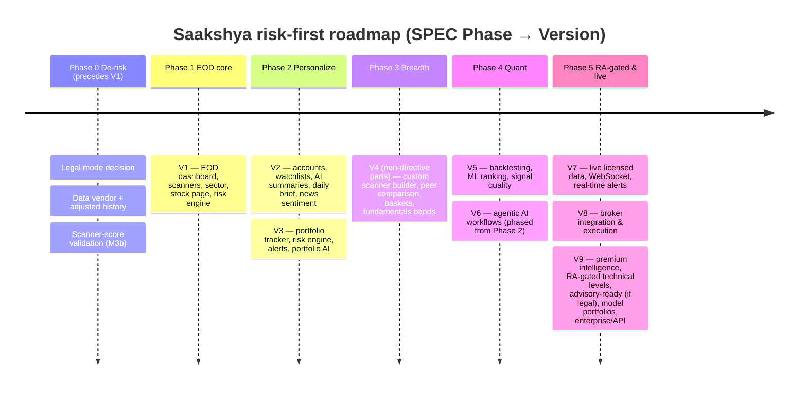

# 02 — Product Roadmap (V1–V9)

The full Saakshya version roadmap, reconciled onto SPEC.md's risk-first phases. Defines objective, features, user value, dependencies, and acceptance criteria for every version.

> Read first: [SPEC.md](../SPEC.md) (canonical source of truth).

---

## 1. The reconciliation up front (read this first)

The Saakshya version roadmap (V1–V9) is **feature-sequenced**. SPEC.md §10 is **risk-sequenced**. **Where they conflict, the risk-first phase ordering wins** ([SPEC.md §0](../SPEC.md)).

Two reconciliations are explicit and non-negotiable:

1. **Phase 0 (De-risk) precedes V1.** Before any user-facing feature, the product must clear three gates: (a) counsel confirms Mode-A scope and starts the RA filing, (b) a signed data-vendor contract with redistribution rights, and (c) **scanner-score validation (M3b)** proving at least one score carries signal. These can kill the product and are retired *first*, on one laptop, for the cost of an API key ([SPEC.md §12](../SPEC.md)).

2. **Technical entry / target / stop-loss / invalidation levels are RA-gated and land LATE (V4 features → Phase 5), not mid-roadmap.** In the original Saakshya spec these were "V4" and appeared in the middle. They are **advisory-in-substance** ([SPEC.md §4, row 5.21](../SPEC.md)) and **cannot ship unregistered**. This document keeps the *non-directive* V4 content (custom scanner builder, strategy rules as lists) mid-roadmap, but moves the **directive technical levels** to V9-era / Phase 5, behind RA registration in force. The same applies to any **"candidate" buy-lean layer** ([SPEC.md row 5.22](../SPEC.md)).

> Naming convention used below: **V-number = Saakshya feature version**; **Phase 0–5 = SPEC.md risk-first phase**. The mapping table in §3 ties them together.

---

## 2. Phase ↔ Version mapping

| SPEC Phase | Focus | Maps to versions | Exit gate (from SPEC §10) |
|---|---|---|---|
| **0 — De-risk** | Legal mode; data + adjusted history; M3b score validation | precedes V1 | Counsel confirms Mode-A & starts RA filing; signed data contract; ≥1 scanner score carries signal |
| **1 — EOD core** | Ingestion + corp-action adj; stock master; dashboard; scanners; sector; stock page; risk engine | **V1** | Indicators reconcile vs 2nd source; corp actions correct on split/bonus test set |
| **2 — Personalize** | Accounts, watchlists; portfolio tracker; AI summary + daily brief; news sentiment; alerts | **V2 + V3** | AI harness blocks fabricated numbers; AI cost within ceiling at projected scale |
| **3 — Breadth** | Custom scanner builder; peer comparison; baskets; corp announcements; valuation bands; navigation personalization | **V4 (descriptive only)** | News-to-symbol precision above target; valuation framed descriptively |
| **4 — Quant** | Backtesting + strategy builder (integrity); advanced risk; institutional activity; ML ranking / probability bands; mobile; premium tiers | **V5 + parts of V4/V6** | Backtests pass survivorship / look-ahead / point-in-time audits; freemium economics validated |
| **5 — RA-gated & live** | **RA-gated recommendation layer (technical levels, candidate layer)**; live licensed data + intraday; broker; community; agentic depth | **V4 (gated) + V6–V9** | RA registration **in force**; execution licensing + moderation counsel-reviewed |

---

## 3. Phase 0 — De-risk (precedes V1)

**Objective:** Retire the three product-killing assumptions — legal-safe Mode-A output, data correctness, and whether scanner scores carry signal — *before* broad feature work. Built entirely on one Apple-Silicon Mac per the local-first plan ([SPEC.md §12](../SPEC.md)).

**Work items:** Legal mode decision (Mode A confirmed; RA filing started in parallel); data-vendor + adjusted-history procurement; the M0–M5 local milestones culminating in **M3b scanner-score validation**.

| Aspect | Detail |
|---|---|
| **User value** | None directly — this is risk retirement. Indirectly: everything downstream is built on validated ground. |
| **Dependencies** | Indian securities counsel; data-vendor negotiation; ANTHROPIC_API_KEY |
| **Data dependencies** | Zerodha Kite Connect (sole EOD source, D-058) behind one `DataSource` adapter; licensed vendor swappable later |
| **Engineering dependencies** | Polyglot TimescaleDB + MongoDB (D-059); vectorized pandas/pandas-ta indicators (no TA-Lib); Claude Haiku via Anthropic SDK; grounding + guardrail prototype |
| **Acceptance criteria** | (1) Counsel confirms Mode-A scope and RA filing initiated. (2) Signed data contract with commercial redistribution rights. (3) **M3b: documented evidence ≥1 scanner score (start: momentum) tracks realized relative strength — or scoring is redesigned now.** (4) Indicators reconcile vs a 2nd source on a split/bonus test set. |

See [Data ingestion](12-data-ingestion-and-market-data.md), [Scanner engine](13-scanner-engine-and-scoring.md), [ML & data science](15-machine-learning-and-data-science.md).

---

## 4. V1 — EOD market core (Phase 1)

**Objective:** Ship the legal, correct, defensible Mode-A core: the best EOD screener + dashboard + sector view + risk engine.

**Features:** EOD/T+1 market dashboard (indices, breadth); stock master / universe; basic scanners (momentum, RSI, volume, MA, breakout, breakdown — score + reasons + risk flags); stock detail pages (facts, scores, **descriptive** support/resistance — **no** entry/target/SL); sector strength dashboard; risk engine (risk scoring).

| Aspect | Detail |
|---|---|
| **User value** | Discover technically strong setups, read market breadth, understand sector momentum and risk — all evidence-backed. |
| **Dependencies** | Phase 0 cleared (data contract, M3b passed) |
| **Data dependencies** | Authoritative EOD OHLCV + volume (Bhavcopy); delivery % (sec_bhavdata) for volume-breakout; corp-action master for adjusted series |
| **Engineering dependencies** | Ingestion + corp-action adjustment workstream; as-of versioned store; indicator library; scanner engine; sector + risk scoring; FastAPI endpoints |
| **Acceptance criteria** | Indicators reconcile vs a 2nd source; corp actions correct on a split/bonus test set; scanners output **score + reasons + risk flags** with **no buy-lean language**; stock pages show **no** RA-gated levels; data-confidence indicator visible. |

> Mode: **A** for all V1 features ([SPEC.md §4](../SPEC.md)). Scanner scores must be **validated** (6.5).

---

## 5. V2 — Personalization & AI explanations (Phase 2)

**Objective:** Add accounts, watchlists, and the grounded AI explanation layer + news sentiment.

**Features:** Watchlists (filter-based discovery, not per-user buy-leans); accounts; AI stock research summaries (grounded, runtime-verified); AI daily market brief (event-reporting — what entered/exited scanners, what to monitor); news sentiment (finance-tuned, entity-resolved).

| Aspect | Detail |
|---|---|
| **User value** | Save and track instruments; get plain-language explanations of structured signals; a morning brief that reports events, not picks. |
| **Dependencies** | V1; auth system; AI verification harness |
| **Data dependencies** | News feeds + curated symbol-alias / corporate-hierarchy map; finance-tuned sentiment classifier; structured payload from indicators/scanners/risk |
| **Engineering dependencies** | Structured payload contract; runtime number/fact validator; golden-dataset eval harness; AI audit log; caching / regenerate-on-change; AI-spend ceiling + alerting |
| **Acceptance criteria** | AI verification harness **blocks fabricated numbers** in regression tests; AI summaries **suppressed (not guessed)** when critical inputs missing; AI cost within ceiling at projected scale; daily brief contains **no ranked "what to buy"**; news→symbol links carry confidence scores above a surfacing threshold. |

> Mode: **A**. AI market summary **descriptive, not directive**; daily brief **never** a ranked actionable list ([SPEC.md §4](../SPEC.md)).

---

## 6. V3 — Portfolio intelligence & alerts (Phase 2)

**Objective:** Let users track holdings and receive factual, event-reporting alerts with portfolio-level risk.

**Features:** Portfolio tracker; risk engine applied to holdings; alerts (EOD-batch, event-reporting); portfolio AI summary (factual, holdings-level).

| Aspect | Detail |
|---|---|
| **User value** | See what you hold, its risk posture, and factual events ("X broke its 50-DMA") — never a prescription to act. |
| **Dependencies** | V2 (accounts, AI layer, alerts infra) |
| **Data dependencies** | User holdings input; EOD prices + indicators per holding; risk model inputs (volatility, drawdown, concentration) |
| **Engineering dependencies** | Portfolio store; risk engine; alert evaluation (EOD batch); portfolio AI summary under guardrails |
| **Acceptance criteria** | Holdings notes are **factual event statements**, never "sell X"; alerts are **event-reporting only** ("entered the scanner"), never "buy at open"; portfolio AI summary passes runtime verification; risk flags trace to inputs. |

> Mode: **A**. "You hold X; it broke its 50-DMA" is factual; "Sell X" is never produced ([SPEC.md §4, row 5.13](../SPEC.md)).

---

## 7. V4 — Advanced technical & builders (split by mode)

**This version is split.** Its **non-directive** parts ship in Phase 3/4. Its **directive technical levels** are RA-gated and move to Phase 5 (see §13).

**Phase 3/4 (Mode A, ships):** Custom scanner builder (no-code; outputs are **lists**, not calls); strategy rules; peer comparison; thematic baskets (bucket views, not model portfolios); fundamentals / valuation bands (descriptive).

**Phase 5 (Mode B / RA-gated, deferred — see §13):** Per-stock entry / target / stop-loss / invalidation zones; "candidate" buy-lean layer.

| Aspect | Detail (Mode-A parts) |
|---|---|
| **User value** | Build your own filters, compare peers, view thematic buckets, read descriptive valuation bands. |
| **Dependencies** | V1–V3; scanner engine extensibility |
| **Data dependencies** | Full indicator set; peer/sector mappings; fundamentals data (descriptive bands); thematic basket definitions |
| **Engineering dependencies** | No-code rule engine; saved-scanner store; peer comparison service; basket definitions; valuation-band computation |
| **Acceptance criteria** | Builder outputs are **lists, not calls**; baskets are **bucket views, not model portfolios**; valuation framed **descriptively**, not as buy/sell triggers; **no entry/target/SL anywhere in Mode A**. |

> Mode: **A** (builder/peer/baskets/valuation) · **B / RA-gated** (technical levels, candidate layer — §13).

---

## 8. V5 — Backtesting, ML ranking, signal quality (Phase 4)

**Objective:** Add quant depth — but only with integrity controls, framed as measurement, never as a return promise.

**Features:** Backtesting engine; ML ranking; signal quality scoring; probability bands.

| Aspect | Detail |
|---|---|
| **User value** | Test scanner/strategy logic on history; see ranked signal quality and probability bands as *measurement*. |
| **Dependencies** | V4 (strategy builder), validated scanner scores |
| **Data dependencies** | Deep adjusted history **including delisted/merged names**; point-in-time index membership; corp-action-adjusted prices as-of each date |
| **Engineering dependencies** | Backtest engine with survivorship + look-ahead + point-in-time controls; realistic fills (slippage + liquidity caps); ML ranking pipeline; probability-band model |
| **Acceptance criteria** | Backtests pass **survivorship / look-ahead / point-in-time audits**; results framed with "past performance does not indicate future results" and exposed assumptions; ML output is **probability bands, never exact price**; framed as measurement, **never a return promise**; freemium unit economics validated. |

> Mode: **A**. An inflated backtest is an implied-performance claim → a compliance risk ([SPEC.md §6.3](../SPEC.md)).

---

## 9. V6 — Agentic AI workflows (phased from Phase 2)

**Objective:** Multi-step AI agents, each landing when its underlying data + guardrails exist — **not** a single big-bang phase.

**Features:** Market-brief agent (Phase 2), stock-research agent (Phase 2), compliance-review agent (infrastructure, required), and deeper orchestration in Phase 5.

| Aspect | Detail |
|---|---|
| **User value** | Higher-quality synthesis and automation, with every step still grounded and verified. |
| **Dependencies** | The data + guardrails each agent needs; AI verification harness |
| **Data dependencies** | Same structured payloads as the AI explanation layer, per agent |
| **Engineering dependencies** | Agent orchestration (LangGraph-style); per-agent output guardrails + grounding; compliance-review agent; audit log |
| **Acceptance criteria** | **Every agent's output passes Mode-A guardrails + grounding**; compliance-review agent operational as required infrastructure; no agent emits directive/RA-gated content. |

> Mode: **A / N/A**. The compliance-review agent is **infrastructure, required** ([SPEC.md §4](../SPEC.md)). See [AI agent architecture](14-ai-llm-agent-architecture.md).

---

## 10. V7 — Live licensed data & real-time (Phase 5)

**Objective:** Add a separately-licensed live/intraday data tier with streaming and real-time alerts.

**Features:** Licensed live data; WebSocket streaming; real-time alerts.

| Aspect | Detail |
|---|---|
| **User value** | Intraday context and faster alerts for active users. |
| **Dependencies** | Phase 5; **live-data licensing in place** |
| **Data dependencies** | Licensed real-time/intraday feed with redistribution rights |
| **Engineering dependencies** | WebSocket tier; streaming ingestion; real-time alert evaluation; latency budgets |
| **Acceptance criteria** | Content remains **Mode-A-safe**; gated on **data licensing**; real-time alerts remain **event-reporting**, never prescriptive. |

> Mode: **A\*** — Mode-A-safe in content but gated on data licensing ([SPEC.md §4, row "Live / real-time"](../SPEC.md)).

---

## 11. V8 — Broker integration & execution (Phase 5+)

**Objective:** Integrate brokers for execution — a separate licensing, security, and operational undertaking; late phase only.

**Features:** Broker account linking; order placement / execution.

| Aspect | Detail |
|---|---|
| **User value** | Act on decisions without leaving the platform. |
| **Dependencies** | Phase 5+; **separate broker/execution licensing**; security review |
| **Data dependencies** | Broker APIs; order/holdings sync |
| **Engineering dependencies** | Secure broker connectors; order lifecycle; elevated security + audit |
| **Acceptance criteria** | Execution licensing + operational duties counsel-reviewed; security review passed; **no advisory substance attached to execution** unless the relevant registration is in force. |

> Mode: **B / C** — separate licensing ([SPEC.md §4](../SPEC.md)).

---

## 12. V9 — Premium intelligence & advisory-ready (Phase 5, gated)

**Objective:** Top-tier intelligence and — **only if the RA/IA path is legally completed** — advisory-ready workflows and model portfolios; enterprise/API.

**Features:** Premium intelligence (institutional activity depth, advanced synthesis); **advisory-ready workflows if legally approved**; model portfolios (IA-gated); enterprise / API tier.

| Aspect | Detail |
|---|---|
| **User value** | Deepest intelligence; for advisory features, genuine (legal) recommendations; enterprise data access. |
| **Dependencies** | RA in force (recommendations); **IA registration** (model portfolios / personalized advice); enterprise contracts |
| **Data dependencies** | Institutional activity data; full licensed feeds |
| **Engineering dependencies** | Enterprise/API gateway, rate limits, billing; RA/IA-specific record-keeping, disclosure, fee-cap structuring |
| **Acceptance criteria** | Recommendation features ship **only with RA in force**; model portfolios / personalized advice ship **only with IA in force**; **mandatory AI-use disclosure** present ([SPEC.md §6.7](../SPEC.md)); SEBI fee cap (~₹1.51L/yr/family) respected where RA applies. |

> Mode: **B** (recommendations) · **C** (model portfolios / personalized advice). Until IA, advisory/model portfolios are **out** ([SPEC.md §4](../SPEC.md)).

---

## 13. The RA-gated recommendation layer (the biggest divergence)

This is called out separately because it is **the single biggest divergence from the original Saakshya spec** ([SPEC.md §4, rows 5.21/5.22](../SPEC.md)).

| Item | Original Saakshya placement | Reconciled placement | Why |
|---|---|---|---|
| Per-stock **entry / target / stop-loss / invalidation** zones | V4 (mid-roadmap) | **Phase 5, RA-only (V9 era)** | Advisory-in-substance; cannot ship unregistered |
| **"Candidate"** buy-lean layer | Philosophy (early) | **Phase 5, RA-only** | A "candidate" that functions as a buy-lean is advisory-in-substance |

Until RA registration is **in force**, Saakshya uses **neutral scanner-membership language** ("appears in the momentum scanner", "matches this filter") and shows **descriptive** support/resistance only ("historically a resistance zone"). See [Language neutralization](21-compliance-risk-and-guardrails.md) and [SPEC.md §5](../SPEC.md).

---

## 14. Always-prohibited, every version

Regardless of mode or version, Saakshya **never** outputs: guarantee, assured/confirmed target, risk-free, multibagger, sure-shot, buy now, best stock for you, or any implied/explicit return claim. Enforced **at output time** ([SPEC.md §3.3, §6.9](../SPEC.md)).

---

## 15. Related documents

- [01 — Product overview](01-product-overview.md)
- [04 — Feature modules](04-feature-modules.md)
- [12 — Data ingestion and market data](12-data-ingestion-and-market-data.md)
- [13 — Scanner engine and scoring](13-scanner-engine-and-scoring.md)
- [14 — AI/LLM agent architecture](14-ai-llm-agent-architecture.md)
- [19 — Backtesting and strategy builder](19-backtesting-and-strategy-builder.md)
- [21 — Compliance, risk and guardrails](21-compliance-risk-and-guardrails.md)
- [30 — Decision log](30-decision-log.md)
