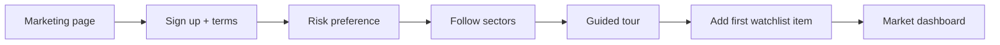
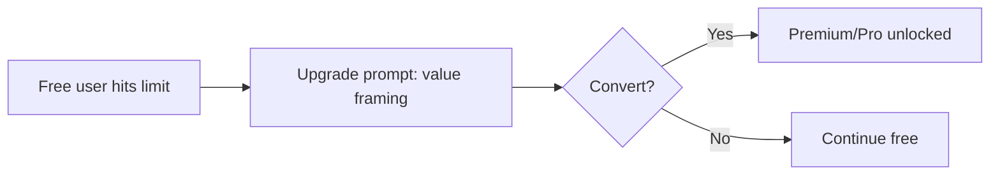

# 03 — User Personas and Journeys

Defines Saakshya's user personas and the detailed, step-by-step journeys they take through the product.

> Read first: [SPEC.md](../SPEC.md) (canonical source of truth).

---

## 1. Personas overview

All personas are served within **Mode A** constraints: Saakshya helps them **understand and decide for themselves** — it never tells anyone what to buy or sell. Personalization is **navigation-only** ([SPEC.md §7](../SPEC.md)): layout, followed sectors, default filters — never behaviour-derived per-stock suggestions.

| Persona | Risk level | Primary surfaces | Tier fit |
|---|---|---|---|
| Beginner retail investor | Low | Market dashboard, stock detail, AI summary | Free → Premium |
| Active swing trader | Medium | Scanners, watchlists, alerts, peer comparison | Premium |
| Portfolio holder | Low–Medium | Portfolio tracker, risk engine, alerts | Premium |
| Advanced trader | Medium–High | Custom scanner builder, backtesting, strategy | Pro |
| Analyst-type user | Low | Sector dashboard, peer, fundamentals bands, exports | Pro |
| Premium subscriber | — | Full suite | Premium/Pro |
| Admin / compliance user | N/A | Admin console | Internal |

---

## 2. Persona profiles

### 2.1 Beginner retail investor

| | |
|---|---|
| **Goals** | Learn to read the market; understand why a stock looks "strong" or "risky"; avoid being misled by tips |
| **Pain points** | Information overload; opaque jargon; tip channels with no basis; fear of bad decisions |
| **Product needs** | Clean dashboard, plain-language AI explanations, visible evidence, risk caveats, education |
| **Preferred surfaces** | Market dashboard, stock detail page, AI stock summary |
| **Feature usage** | Reads summaries and sector context; light scanner use; no building |
| **Risk level** | Low |
| **Success metrics** | Returns within a week; reads ≥3 AI summaries; adds first watchlist item; comprehension (self-reported) |

### 2.2 Active swing trader

| | |
|---|---|
| **Goals** | Find multi-day technical setups; track candidates; get notified on events |
| **Pain points** | Slow manual scanning; missing scanner entries/exits; no consolidated watchlist view |
| **Product needs** | Fast scanners (momentum/volume/breakout), watchlists, event-reporting alerts, peer comparison |
| **Preferred surfaces** | Scanner pages, watchlists, alerts center, stock detail |
| **Feature usage** | Daily scanner runs; multiple watchlists; alert subscriptions |
| **Risk level** | Medium |
| **Success metrics** | Daily active; ≥2 watchlists; ≥5 alerts configured; scanner-to-watchlist conversion |

### 2.3 Portfolio holder

| | |
|---|---|
| **Goals** | Monitor holdings and their risk; know when something materially changes |
| **Pain points** | No single view of holdings' technical/risk state; surprise drawdowns |
| **Product needs** | Portfolio tracker, risk engine, factual holdings notes, event alerts |
| **Preferred surfaces** | Portfolio tracker, risk dashboard, alerts |
| **Feature usage** | Sets up holdings; reviews risk weekly; subscribes to holdings alerts |
| **Risk level** | Low–Medium |
| **Success metrics** | Portfolio created; risk reviewed weekly; alerts acted on (self-directed) |

### 2.4 Advanced trader

| | |
|---|---|
| **Goals** | Build custom filters; test ideas on history; refine strategy |
| **Pain points** | Rigid pre-built scanners; no integrity-controlled backtest; no rule customization |
| **Product needs** | No-code scanner builder, integrity-controlled backtesting, strategy rules, exports |
| **Preferred surfaces** | Strategy builder, backtesting, custom scanners |
| **Feature usage** | Builds and saves scanners; runs backtests; iterates |
| **Risk level** | Medium–High |
| **Success metrics** | ≥1 custom scanner saved; ≥1 backtest run; Pro retention |

### 2.5 Analyst-type user

| | |
|---|---|
| **Goals** | Research sectors, peers, valuation context; export for own models |
| **Pain points** | Fragmented data; non-reproducible figures; no descriptive valuation framing |
| **Product needs** | Sector dashboard, peer comparison, valuation bands (descriptive), exports, as-of reproducibility |
| **Preferred surfaces** | Sector dashboard, peer comparison, stock detail, exports |
| **Feature usage** | Deep reads; comparisons; exports |
| **Risk level** | Low |
| **Success metrics** | Frequent peer/sector use; export usage; Pro retention |

### 2.6 Premium subscriber

| | |
|---|---|
| **Goals** | Get full breadth, depth, and automation across the suite |
| **Pain points** | Free-tier limits (scanner count, watchlist size, AI coverage) |
| **Product needs** | Full scanners, unlimited watchlists, portfolio, AI summaries, news sentiment, alerts |
| **Preferred surfaces** | All |
| **Risk level** | Varies |
| **Success metrics** | Conversion; feature breadth used; renewal |

### 2.7 Admin / compliance user

| | |
|---|---|
| **Goals** | Keep outputs Mode-A-safe; audit AI generations; manage blocked phrases, prompts, source reliability |
| **Pain points** | Language creep across releases; unverifiable AI output; missing audit trail |
| **Product needs** | Admin console: versioned blocked-phrase list, prompt versions, source reliability, AI audit logs |
| **Preferred surfaces** | Admin panel |
| **Risk level** | N/A (governance) |
| **Success metrics** | Zero prohibited phrases reach users; 100% AI generations audited; regression harness green |

See [Admin panel](20-admin-panel.md) and [Compliance](21-compliance-risk-and-guardrails.md).

---

## 3. User journeys

> All journeys honor Mode A: no entry/target/SL, no buy-leans, no return claims. AI explains; it never invents or prescribes.

### 3.1 New-user onboarding

1. User lands on marketing page → positioning is "research & scanner," **not** "stock tips."
2. Signs up (email/OAuth); accepts terms incl. **"not investment advice"** and AI-use notice.
3. States a **risk preference** (used only to default scanner filters — navigation personalization).
4. Selects **sectors to follow** (drives layout, not recommendations).
5. Guided tour: dashboard → scanner → stock detail → AI summary, each showing **evidence + reasons**.
6. Prompted to add a first watchlist item (optional).
7. Lands on the EOD market dashboard.



### 3.2 Returning-user dashboard

1. User logs in → lands on personalized dashboard (followed sectors prioritized).
2. Reads **descriptive** AI market summary (breadth, indices) — never directive.
3. Reviews data-confidence indicator and as-of date.
4. Jumps to a scanner or watchlist.

### 3.3 Watchlist creation

1. From a scanner result or stock page, clicks "Add to watchlist."
2. Creates/names a watchlist (filter-based discovery, not a buy-lean list).
3. Optionally builds a **filter-based "suggested watchlist"** (discovery, not per-user picks).
4. Saves; watchlist appears with EOD indicators per item.

### 3.4 Stock discovery

1. Opens a scanner (e.g., momentum).
2. Sees ranked results with **score + sub-scores + reasons + risk flags**.
3. Filters by sector/risk preference (defaults from onboarding).
4. Clicks a result → stock detail page.

### 3.5 Stock-detail analysis

1. Opens stock detail page.
2. Reviews facts, scores, **descriptive** support/resistance ("historically a resistance zone").
3. Reads grounded AI summary (e.g., "trading above 20-DMA and 50-DMA; volume above 20-day average; RSI elevated → pullback risk higher; nearest resistance is one to watch. *Not investment advice.*").
4. Notes **no** entry/target/SL is shown (RA-gated).
5. Optionally adds to watchlist or compares peers.

```mermaid
sequenceDiagram
  participant U as User
  participant FE as Stock detail UI
  participant API as Backend
  participant AI as AI explainer
  participant G as Guardrail/verify
  U->>FE: Open stock detail
  FE->>API: GET overview + indicators + scores + risk
  API-->>FE: Structured payload (as-of versioned)
  FE->>AI: Request grounded summary (payload only)
  AI->>G: Draft summary
  G-->>AI: Verify numbers vs payload; block banned phrases
  G-->>FE: Verified, Mode-A-safe summary
  FE-->>U: Facts + scores + descriptive S/R + AI summary
```

### 3.6 Portfolio setup

1. Opens Portfolio → "Add holdings."
2. Enters symbols + quantities (manual in v1; broker import is V8).
3. System computes per-holding indicators + risk.
4. Reviews portfolio risk dashboard with **factual** holdings notes ("X broke its 50-DMA").
5. Optionally subscribes to holdings alerts.

### 3.7 Alert setup

1. From a scanner, watchlist, or holding, clicks "Create alert."
2. Chooses an **event** (e.g., "entered the momentum scanner," "crossed 50-DMA").
3. Confirms — alert is **event-reporting**, never "buy at open." EOD-batch in v1.
4. Receives alerts via notification center / email.

### 3.8 AI assistant usage

1. Opens AI assistant.
2. Asks about a stock/sector/scanner result.
3. Assistant answers **only** from the structured payload; runtime validator blocks fabricated numbers/facts; banned phrases blocked.
4. Answer includes "not investment advice" where relevant; **no** targets/recommendations.

### 3.9 Strategy creation (Pro)

1. Opens strategy/scanner builder.
2. Composes no-code rules (e.g., "RSI < 30 AND above 200-DMA AND volume > 2× 20-day avg").
3. Previews matching **list** (not calls).
4. Saves as a reusable scanner.

### 3.10 Backtesting (Pro)

1. Selects a saved strategy.
2. Configures window (uses adjusted, point-in-time data incl. delisted names).
3. Runs backtest with **survivorship / look-ahead / point-in-time** controls and realistic fills.
4. Reviews results framed with "past performance does not indicate future results" + exposed assumptions.

### 3.11 Premium conversion

1. Free user hits a limit (scanner count, watchlist size, AI coverage).
2. Sees upgrade prompt explaining the **value** (breadth/depth), not a return promise.
3. Upgrades to Premium/Pro.
4. Limits lift; advanced surfaces unlock.



---

## 4. Related documents

- [01 — Product overview](01-product-overview.md)
- [04 — Feature modules](04-feature-modules.md)
- [08 — Screen-by-screen documentation](08-screen-by-screen-documentation.md)
- [11 — Pricing / monetization](02-product-roadmap.md)
- [17 — Alerts and notifications](17-alerts-and-notifications.md)
- [21 — Compliance, risk and guardrails](21-compliance-risk-and-guardrails.md)
