# 05 — Information Architecture & URL Paths

> One-line purpose: The canonical map of every Saakshya route — public, authenticated, admin, and API — with access level, SEO posture, canonical behavior, components, and backend bindings.
> Read first: [SPEC.md](../SPEC.md)

Related: [Product Overview](01-product-overview.md) · [Feature Modules](04-feature-modules.md) · [Frontend Architecture](06-frontend-architecture.md) · [Screen-by-Screen](08-screen-by-screen-documentation.md) · [API Contracts](10-api-contracts.md) · [Compliance & Guardrails](21-compliance-risk-and-guardrails.md)

---

## 0. Principles (read before routing)

Saakshya ships **Mode A** for v1 (SPEC §2). The IA must make the **evidence-first, non-advisory** posture structurally visible: there is **no `/recommendations`, `/picks`, `/calls`, `/buy`, or `/signals-to-trade` route — ever in Mode A**. Any route that would imply "what to buy" is forbidden until RA registration is in force (SPEC §4, Phase 5). Routes that *would* host RA-gated content (per-stock entry/target/stop-loss) **do not exist in the v1 router** — they are added behind a feature flag in Phase 5 (see [Feature flags](06-frontend-architecture.md#feature-flags)).

IA design rules:

1. **Mode-gating is route-level first.** A route that requires RA is absent from the v1 route tree, not merely hidden. Mode-A-safe routes that contain *sections* which would be RA-gated render those sections as "Available with Research Analyst registration" placeholders, never as empty target/stop-loss widgets.
2. **Access levels** are `public` (no auth), `auth` (logged-in user), `admin` (staff role). Premium/Pro **tier** gating happens *inside* an `auth` route, not by separate URLs — a free user visits `/backtesting` and sees an upgrade gate, they are not 404'd.
3. **SEO posture** is one of: `indexed` (public, crawlable, in sitemap), `gated` (public shell SSR'd for crawlers but interaction requires auth — partial index), `noindex` (explicit `robots: noindex`), `disallow` (blocked in `robots.txt`, e.g. all `/admin`, `/api`).
4. **Canonical** rules prevent duplicate-content and parameter dilution: filter/sort query params are **never** part of the canonical; paginated and filtered scanner views canonicalize to the clean path.
5. **URL is lowercase, kebab-case, plural for collections** (`/scanners`, `/stocks`), **slug or symbol for entities** (`/stocks/[symbol]`, `/sectors/[sector-slug]`). Symbols are uppercase NSE tickers in the data layer but URLs accept case-insensitively and 301 to the canonical uppercase form.

---

## 1. IA tree

```mermaid
graph TD
  ROOT["/"]:::pub

  ROOT --> MKT["/market"]:::pub
  ROOT --> BRIEF["/brief"]:::pub
  ROOT --> STK["/stocks"]:::pub
  STK --> STKD["/stocks/[symbol]"]:::pub
  STKD --> STKP["/stocks/[symbol]/peers"]:::pub
  STKD --> STKA["/stocks/[symbol]/announcements"]:::pub
  ROOT --> SEC["/sectors"]:::pub
  SEC --> SECD["/sectors/[sector-slug]"]:::pub
  ROOT --> THEMES["/themes"]:::pub
  THEMES --> THEMED["/themes/[theme-slug]"]:::pub

  ROOT --> SCN["/scanners"]:::pub
  SCN --> SCNM["/scanners/momentum"]:::pub
  SCN --> SCNV["/scanners/volume-breakout"]:::pub
  SCN --> SCNR["/scanners/rsi"]:::pub
  SCN --> SCNX["/scanners/[scanner-slug]"]:::pub

  ROOT --> SCR["/scanners — named (MA, breakout, breakdown, sector-strength, near-52-week-high, 200-dma-reclaim, oversold-recovery)"]:::pub

  ROOT --> SCREEN["/screeners"]:::pub
  SCREEN --> SCREEND["/screeners/[slug]"]:::pub

  ROOT --> NEWS["/news"]:::pub
  ROOT --> ANN["/announcements (optional global feed)"]:::pub
  ROOT --> LEARN["/learn"]:::pub
  LEARN --> LEARND["/learn/[slug]"]:::pub
  ROOT --> PRICING["/pricing"]:::pub
  ROOT --> AUTH["/login · /signup"]:::pub
  ROOT --> LEGAL["/legal/* (terms, privacy, disclaimer)"]:::pub

  ROOT --> DASH["/dashboard"]:::auth
  DASH --> WL["/watchlist"]:::auth
  DASH --> PF["/portfolio"]:::auth
  DASH --> ALERTS["/alerts"]:::auth
  DASH --> NOTIF["/notifications"]:::auth
  DASH --> AI["/ai"]:::auth
  DASH --> SB["/strategy-builder"]:::auth
  DASH --> BT["/backtesting"]:::auth
  DASH --> ACCT["/account/*"]:::auth
  DASH --> ONB["/onboarding"]:::auth

  ROOT --> ADM["/admin"]:::adm
  ADM --> ADMDH["/admin/data-health"]:::adm
  ADM --> ADMP["/admin/prompts"]:::adm
  ADM --> ADMS["/admin/scanners"]:::adm
  ADM --> ADMC["/admin/compliance"]:::adm
  ADM --> ADMU["/admin/users"]:::adm

  classDef pub fill:#0b1f3a,stroke:#3b82f6,color:#e6edf7;
  classDef auth fill:#142a1f,stroke:#22c55e,color:#e6f7ed;
  classDef adm fill:#2a1422,stroke:#f59e0b,color:#f7e9da;
```

Legend: **blue = public**, **green = authenticated**, **amber = admin**.

---

## 2. Public routes

These are the acquisition + SEO surface. They must render meaningful content **server-side** for crawlers and first paint (see [SSR/SSG/ISR strategy](06-frontend-architecture.md#seo-rendering-strategy)). All evidence-first language rules (SPEC §3, §5) apply to copy rendered here.

| Route | Purpose | Access | SEO | Canonical behavior | Primary components | Backend APIs |
|---|---|---|---|---|---|---|
| `/` | Landing / marketing. Value prop = "best screener + best explanations", **never** "what to buy". Hero, live-ish market snapshot teaser, scanner preview, evidence-first story, pricing CTA. | public | indexed | self-canonical | `LandingHero`, `MarketTeaser`, `ScannerPreviewCard`, `EvidenceStoryBlock`, `PricingTeaser`, `Footer` | `GET /market/summary` (cached snapshot), `GET /scanners/momentum?preview=1` |
| `/market` | Public market dashboard: indices, breadth, advance/decline, sector heat snapshot, descriptive AI market summary. | public | indexed | self-canonical | `IndexStrip`, `BreadthPanel`, `SectorHeatmap`, `AiMarketSummaryCard`, `MarketMoversTable` | `GET /market/summary`, `GET /market/breadth`, `GET /sectors`, `GET /market/ai-summary` |
| `/brief` | Dedicated, permalinkable **AI daily market brief** page (step 07): market summary, indices, sectors, movers, scanner entries/exits, risk highlights, what-to-monitor. **Event-reporting, never "what to buy"** (SPEC §4). The dashboard `DailyBriefCard` is a compact mirror that deep-links here. `?as_of=` reproduces a historical day's brief. | public | indexed | self-canonical; `as_of` excluded (historical briefs canonicalize to `/brief`) | `BriefHeader`, `BriefMarketSummary`, `BriefIndicesGrid`, `BriefSectorRotation`, `BriefMoversList`, `BriefScannerDeltaList`, `BriefRiskHighlights`, `BriefWhatToMonitor`, `EvidenceDrawer`, `NotAdviceBanner` | `GET /market/ai-brief`, `GET /market/summary`, `GET /sectors`, `GET /scanners` (entry/exit deltas) |
| `/stocks` | Browsable equity universe with search, filter (sector, index membership), sort by **descriptive** metrics (price, %chg, volume ratio, RSI band). **No "top picks" sort.** | public | indexed | self-canonical; filters/sort excluded from canonical | `StockUniverseTable`, `UniverseFilters`, `SymbolSearch` | `GET /stocks`, `GET /stocks/search` |
| `/stocks/[symbol]` | Stock detail: facts, OHLC chart, indicators, scanner memberships, descriptive S/R, risk badge, news, AI summary, corp actions, **Peers** (comparative), **Fundamentals / valuation** (descriptive bands + earnings summary, step 21), **Corporate announcements** (step 17), **Institutional activity** (FII/DII, bulk/block — premium/Phase-4, data-availability dependent, step 22). **No entry/target/SL (RA-gated, Phase 5).** Panels render in-page as tabs/sections; deep surfaces also have their own routes (`/peers`, `/announcements`). | public | indexed (per-symbol) | self-canonical to uppercase symbol; case/suffix variants 301; in-page tab params (`?tab=`) excluded from canonical | `StockHeader`, `PriceChart`, `IndicatorPanel`, `ScannerMembershipChips`, `RiskBadge`, `EvidenceDrawer`, `AiStockSummaryCard`, `NewsList`, `CorporateActionsTable`, `PeersSection`+`PeerComparisonTable`, `FundamentalsPanel`+`ValuationBands`+`EarningsSummary`, `AnnouncementsSection`, `InstitutionalActivityPanel` | `GET /stocks/{symbol}/overview`, `/indicators`, `/scanners`, `/ai-summary`, `/news`, `/corporate-actions`, `/risk`, `/peers`, `/fundamentals`, `/announcements`, `/institutional` |
| `/stocks/[symbol]/peers` | **Peer comparison** (step 18): comparative table of like companies on **descriptive** metrics (size, valuation band, momentum/RSI state, risk flag, volume ratio). **COMPARATIVE not directive** — no buy/switch/"better pick"/ranking-to-act CTA. Peer set is sector/size-derived and disclosed. | public | indexed (per-symbol) | self-canonical to uppercase symbol; sort/filter excluded | `PeerComparisonHeader`, `PeerComparisonTable`, `PeerMetricColumns`, `EvidenceDrawer`, `NotAdviceBanner` | `GET /stocks/{symbol}/peers`, `GET /stocks/{symbol}/overview` |
| `/stocks/[symbol]/announcements` | **Corporate announcements feed** for one symbol (step 17): chronological filings/announcements, **summarized without exaggeration**, source-linked, timestamped, category-tagged. | public | indexed (per-symbol) | self-canonical to uppercase symbol; category filter excluded | `AnnouncementsHeader`, `AnnouncementsFeed`, `AnnouncementCard`, `SourceLink`, `CategoryFilter`, `NotAdviceBanner` | `GET /stocks/{symbol}/announcements` |
| `/announcements` *(optional)* | Global cross-symbol corporate-announcements feed (filterable by symbol/sector/category). Same summarized, source-linked, no-exaggeration rules. | public | indexed | self-canonical; filters excluded | `AnnouncementsFeed`, `AnnouncementCard`, `AnnouncementFilters`, `SourceLink` | `GET /announcements` |
| `/sectors` | Sector strength dashboard: ranked sector momentum, heatmap, rotation view. Index/sector technical analysis is explicitly lower-risk (SPEC §4). | public | indexed | self-canonical | `SectorHeatmap`, `SectorRankTable`, `RotationChart` | `GET /sectors`, `GET /sectors/rotation` |
| `/sectors/[sector-slug]` | One sector: constituents, sector index chart, breadth within sector, leaders/laggards (descriptive). | public | indexed (per-sector) | self-canonical to slug | `SectorHeader`, `SectorIndexChart`, `ConstituentTable`, `SectorBreadthPanel` | `GET /sectors/{slug}`, `/constituents`, `/breadth` |
| `/themes` | Thematic baskets index — **bucket views, not model portfolios** (SPEC §4). Phase 3. | public | indexed | self-canonical | `ThemeGrid`, `ThemeCard` | `GET /themes` |
| `/themes/[theme-slug]` | One theme basket: constituents, aggregate descriptive stats. Explicit "this is a bucket view, not a recommendation" banner. | public | indexed | self-canonical | `ThemeHeader`, `ThemeConstituentTable`, `ThemeDisclaimerBanner` | `GET /themes/{slug}`, `/constituents` |
| `/scanners` | Scanner directory: cards for momentum, volume-breakout, rsi, MA, breakout/breakdown, with last-run time and result counts. | public | indexed | self-canonical | `ScannerDirectoryGrid`, `ScannerCard` | `GET /scanners` (catalog) |
| `/scanners/momentum` | Momentum scanner results: ranked by **momentum score (validated, SPEC §6.5)** with score + reasons + risk flags. Language: "appears in the momentum scanner". | public | indexed | self-canonical; filters excluded | `ScannerResultsTable`, `ScoreBadge`, `ReasonChips`, `RiskFlagChip`, `ScannerFilters`, `EvidenceDrawer` | `GET /scanners/momentum` |
| `/scanners/volume-breakout` | Volume + delivery-% breakout scanner results. False-breakout **risk flag** allowed; **no "buy the breakout"** copy. | public | indexed | self-canonical | same family as above | `GET /scanners/volume-breakout` |
| `/scanners/rsi` | RSI scanner (oversold/overbought bands as descriptive states). | public | indexed | self-canonical | same family | `GET /scanners/rsi` |
| `/scanners/moving-average` | Named scanner — moving-average (price vs MA states, crossovers). Renders via shared scanner-detail template (steps 02, 16). | public | indexed | self-canonical | scanner-detail family (`ScannerHeader`, `ScannerFilters`, `ScannerResultsTable`, `ScoreBadge`, `ReasonChips`, `RiskFlagChip`, `EvidenceDrawer`) | `GET /scanners/moving-average` |
| `/scanners/breakout` | Named scanner — breakout. Shared scanner-detail template. False-breakout shown as **risk flag**, never "buy the breakout". | public | indexed | self-canonical | scanner-detail family | `GET /scanners/breakout` |
| `/scanners/breakdown` | Named scanner — breakdown. Shared scanner-detail template. Descriptive only. | public | indexed | self-canonical | scanner-detail family | `GET /scanners/breakdown` |
| `/scanners/sector-strength` | Named scanner — sector-strength (relative-strength leaders/laggards across sectors). Shared scanner-detail template. | public | indexed | self-canonical | scanner-detail family | `GET /scanners/sector-strength` |
| `/scanners/near-52-week-high` | Named scanner — proximity to 52-week high (descriptive state). Shared scanner-detail template. | public | indexed | self-canonical | scanner-detail family | `GET /scanners/near-52-week-high` |
| `/scanners/200-dma-reclaim` | Named scanner — reclaim of the 200-DMA (descriptive crossover state). Shared scanner-detail template. | public | indexed | self-canonical | scanner-detail family | `GET /scanners/200-dma-reclaim` |
| `/scanners/oversold-recovery` | Named scanner — oversold-recovery (RSI exit-from-oversold state). Shared scanner-detail template. | public | indexed | self-canonical | scanner-detail family | `GET /scanners/oversold-recovery` |
| `/scanners/[scanner-slug]` | Generic resolver / shared scanner-detail template for the canonical built-in scanner slugs above (`momentum`, `volume-breakout`, `rsi`, `moving-average`, `breakout`, `breakdown`, `sector-strength`, `near-52-week-high`, `200-dma-reclaim`, `oversold-recovery`). User-built scanners live under `/strategy-builder`/`/screeners`, not here. | public | indexed | self-canonical to slug; unknown slug → 404 | scanner-detail family | `GET /scanners/{slug}` |
| `/screeners` | **Screener library index** (step 20): browsable catalog of curated/saved fundamental + technical screeners with descriptions and last-run/result counts. Outputs are **list-only**. | public | indexed | self-canonical | `ScreenerLibraryGrid`, `ScreenerCard`, `ScreenerFilters` | `GET /screeners` |
| `/screeners/[slug]` | One screener: browse criteria → **run** → **list-only** matching symbols (descriptive reasons); **save** (auth); **"Open in builder"** handoff to `/strategy-builder`. **No buy/rank-to-act CTA.** | public | indexed | self-canonical to slug; sort/filter excluded; unknown slug → 404 | `ScreenerHeader`, `ScreenerCriteriaPanel`, `ScreenerResultsTable`, `SaveScreenerDialog` (auth), `OpenInBuilderButton`, `EvidenceDrawer` | `GET /screeners/{slug}`, `POST /screeners/{slug}/run`, `POST /screeners` (save, auth) |
| `/news` | Market news + finance-tuned sentiment feed (Phase 2). Source links + timestamps + confidence visible (SPEC §6.4). | public | indexed | self-canonical | `NewsFeed`, `NewsCard`, `SentimentChip`, `SourceLink` | `GET /news`, `GET /news/sentiment` |
| `/learn` | Education hub index (SEO content engine + investor literacy). | public | indexed | self-canonical | `LearnIndexGrid`, `ArticleCard` | `GET /learn` (CMS) |
| `/learn/[slug]` | Education article (MDX/CMS). Strong internal-link target for SEO. | public | indexed (per-article) | self-canonical to slug | `ArticleRenderer`, `Toc`, `RelatedArticles` | `GET /learn/{slug}` |
| `/pricing` | Tier comparison: Free / Premium / Pro / Enterprise (SPEC §11). RA-gated features shown as "coming with Research Analyst registration". | public | indexed | self-canonical | `PricingTable`, `TierCard`, `FaqAccordion` | `GET /billing/plans` |
| `/login` | Auth entry. | public | noindex | self-canonical | `LoginForm`, `OAuthButtons` | `POST /auth/login`, NextAuth callbacks |
| `/signup` | Registration. | public | noindex | self-canonical | `SignupForm`, `OAuthButtons` | `POST /auth/signup` |
| `/legal/terms`, `/legal/privacy`, `/legal/disclaimer`, `/legal/ai-use-disclosure` | Terms, privacy, "not investment advice" disclaimer, mandatory AI-use disclosure (SPEC §6.7). | public | indexed | self-canonical | `LegalDocRenderer` | static/CMS |

> **Compliance hard rule for all public routes:** no copy may contain blocked phrases (SPEC §6.9). Marketing copy is reviewed by the compliance-review agent before publish (see [21](21-compliance-risk-and-guardrails.md)).

> **Build-step cross-references:** AI daily brief `/brief` → [steps/07](steps/07-v2-accounts-watchlist-ai-news.md); peers `/stocks/[symbol]/peers` → [steps/18](steps/18-peer-comparison.md); announcements `/stocks/[symbol]/announcements` (+ `/announcements`) → [steps/17](steps/17-corporate-announcements.md); screener library `/screeners` → [steps/20](steps/20-screener-library.md); fundamentals/valuation panel → [steps/21](steps/21-fundamentals-valuation.md); institutional-activity panel → [steps/22](steps/22-institutional-activity.md); named scanners → [steps/02](steps/02-indicators-and-scanners.md), [steps/16](steps/16-scanners-extended.md). Authenticated notification center `/notifications` → [steps/24](steps/24-account-surfaces.md). Screen specs for all of these live in [08-screen-by-screen-documentation.md](08-screen-by-screen-documentation.md).

---

## 3. Authenticated routes

Require a valid session (NextAuth/custom). Tier gating (Free/Premium/Pro) is enforced **inside** the route by an upgrade gate, not by routing. Middleware redirects unauthenticated users to `/login?next=<path>` (see [middleware](06-frontend-architecture.md#protected-routes--middleware)).

| Route | Purpose | Access | Tier gate | SEO | Primary components | Backend APIs |
|---|---|---|---|---|---|---|
| `/dashboard` | Personalized home: followed sectors, watchlist snapshot, alerts feed, daily brief (event-reporting), portfolio summary. **Navigation personalization only** (SPEC §7) — no per-stock buy-leans. | auth | Free+ | noindex | `DashboardGrid`, `WatchlistSnapshot`, `DailyBriefCard`, `AlertsFeed`, `PortfolioSummaryCard`, `FollowedSectorsRow` | `GET /me/dashboard`, `/me/watchlist`, `/alerts`, `/market/ai-brief`, `/portfolio/summary` |
| `/onboarding` | First-run flow: risk-preference (for **default filters only**), followed sectors, watchlist seed, AI-use + not-advice acknowledgement. | auth | Free+ | noindex | `OnboardingStepper`, `RiskPreferenceStep`, `SectorFollowStep`, `AckStep` | `POST /me/onboarding`, `PATCH /me/preferences` |
| `/watchlist` | User watchlists: add/remove symbols, per-symbol descriptive metrics, scanner memberships, alerts inline. | auth | Free (1 list) / Premium (unlimited) | noindex | `WatchlistTabs`, `WatchlistTable`, `AddSymbolDialog`, `ScoreBadge` | `GET/POST/DELETE /me/watchlist`, `/me/watchlist/{id}/items` |
| `/portfolio` | Holdings tracker + **factual** risk flags ("X broke its 50-DMA"). **Never** "Sell X". Import/manual entry. | auth | Premium+ | noindex | `PortfolioTable`, `HoldingRow`, `RiskFlagChip`, `PortfolioRiskPanel`, `AddHoldingDialog`, `ImportDialog` | `GET/POST /portfolio/holdings`, `GET /portfolio/risk` |
| `/alerts` | Alert rules manager. **Event-reporting only** ("entered the scanner"), never "buy at open". EOD-batch in v1. | auth | Premium+ | noindex | `AlertRuleList`, `AlertRuleEditor`, `AlertHistory` | `GET/POST/PATCH/DELETE /alerts`, `GET /alerts/history` |
| `/notifications` | **Notification center** (step 24): in-app inbox of delivered alert/news events with read/unread, filters (type, symbol, date), mark-read/clear, deep-links to source surface. **Event-reporting only** — mirrors fired `/alerts` and news events, never "buy"/"sell". | auth | Free+ (depth per tier) | noindex | `NotificationInbox`, `NotificationList`, `NotificationRow`, `NotificationFilters`, `MarkAllReadButton`, `EmptyInboxState` | `GET /me/notifications`, `PATCH /me/notifications/{id}`, `POST /me/notifications/read-all` |
| `/ai` | AI assistant: conversational explanation of structured signals only. Grounded + runtime-verified (SPEC §6.6). Refuses "what should I buy". | auth | Free (limited) / Premium (full) | noindex | `AiChatThread`, `AiMessage`, `EvidenceCitation`, `GroundingBadge`, `SuggestedPrompts` | `POST /ai/chat`, `GET /ai/threads` |
| `/strategy-builder` | No-code scanner builder; outputs are **lists, not calls** (SPEC §4). Save/run custom scanners. | auth | Pro+ | noindex | `StrategyCanvas`, `ConditionBuilder`, `ResultPreviewTable`, `SaveStrategyDialog` | `GET/POST /strategies`, `POST /strategies/{id}/run` |
| `/backtesting` | Backtest a saved strategy with integrity controls (survivorship, look-ahead, point-in-time — SPEC §6.3). Honest framing mandatory. | auth | Pro+ | noindex | `BacktestConfigForm`, `EquityCurveChart`, `MetricsTable`, `AssumptionsPanel`, `PastPerformanceBanner` | `POST /backtests`, `GET /backtests/{id}` |
| `/account/profile`, `/account/billing`, `/account/preferences`, `/account/api-keys`, `/account/security` | Account management, subscription, preferences, API keys (Enterprise), security/sessions. | auth | Free+ (billing per tier) | noindex | `ProfileForm`, `BillingPanel`, `PreferencesForm`, `ApiKeyManager`, `SecurityPanel` | `GET/PATCH /me`, `GET /billing/*`, `GET/POST /me/api-keys` |

> **RA-gated sections inside auth routes:** `/portfolio` and `/stocks/[symbol]` are designed with explicit "slots" where entry/target/SL would appear *under RA*. In v1 those slots render an `RaGatedPlaceholder` ("Available with Research Analyst registration"), never a disabled/empty advisory widget. See [Feature flags](06-frontend-architecture.md#feature-flags) and [21](21-compliance-risk-and-guardrails.md).

---

## 4. Admin routes

All `/admin/*` require an admin/staff role (claim checked in middleware + per-API authorization). **Entirely `disallow` in `robots.txt` and `noindex`.** No public link path reaches them.

| Route | Purpose | Access | SEO | Primary components | Backend APIs |
|---|---|---|---|---|---|
| `/admin` | Admin home: system health tiles, pipeline status, AI-spend meter, recent compliance flags. | admin | disallow | `AdminOverviewGrid`, `PipelineStatusCard`, `AiSpendMeter`, `ComplianceFlagFeed` | `GET /admin/overview`, `/admin/pipeline/status`, `/admin/ai-spend` |
| `/admin/data-health` | Data-quality console: missing candles, abnormal jumps, duplicate symbols, delisted, corp-action reconciliation, **data-confidence indicators**, correction workflow (detect→quarantine→correct→re-emit, SPEC §6.2). | admin | disallow | `DataHealthDashboard`, `AnomalyTable`, `CorpActionReconcilePanel`, `CorrectionWorkflowModal`, `ConfidenceGauge` | `GET /admin/data-health`, `POST /admin/data/quarantine`, `POST /admin/data/correct`, `POST /admin/data/reemit` |
| `/admin/prompts` | Prompt registry + versions; golden-dataset eval harness results; payload-contract editor; model/provider config (SPEC §6.6, §6.8). | admin | disallow | `PromptVersionList`, `PromptEditor`, `EvalHarnessPanel`, `PayloadContractViewer`, `ProviderConfigForm` | `GET/POST /admin/prompts`, `POST /admin/prompts/{id}/eval`, `GET /admin/ai/audit-log` |
| `/admin/scanners` | Scanner config: scoring weights, thresholds, M3b validation evidence, enable/disable, schedule. | admin | disallow | `ScannerConfigList`, `WeightEditor`, `ValidationEvidencePanel`, `ScannerScheduleForm` | `GET/PATCH /admin/scanners`, `GET /admin/scanners/{slug}/validation` |
| `/admin/compliance` | **Blocked-phrase/pattern registry** (versioned), guardrail rules, compliance-review-agent queue, audit-log search, output-block events (SPEC §6.9). | admin | disallow | `BlockedPhraseRegistry`, `GuardrailRuleEditor`, `ReviewQueue`, `AuditLogSearch`, `BlockEventTable` | `GET/POST /admin/compliance/phrases`, `GET /admin/compliance/audit`, `GET /admin/compliance/blocks` |
| `/admin/users` | User & subscription admin: roles, tiers, RA-client records (when Mode B), fee-cap tracking (~₹1.51L/yr/family, SPEC §11), support actions. | admin | disallow | `UserTable`, `UserDetailDrawer`, `RoleEditor`, `SubscriptionPanel`, `FeeCapTracker` | `GET /admin/users`, `PATCH /admin/users/{id}`, `GET /admin/users/{id}/fee-cap` |

---

## 5. API route naming principles

The backend is FastAPI (SPEC §9). The Next.js app may add thin `/api/*` BFF route handlers for auth/session and server-only secrets, but **business APIs live on the FastAPI service** and are versioned. Full schemas are in [API Contracts](10-api-contracts.md).

**Conventions:**

1. **Versioned base:** all business APIs under `/api/v1/...`. Breaking changes bump to `/api/v2`. Next.js BFF handlers (`/api/auth/*`, `/api/internal/*`) are **not** versioned and are not public contract.
2. **Resource-oriented, plural nouns:** `/api/v1/stocks`, `/api/v1/scanners`, `/api/v1/sectors`, `/api/v1/portfolio/holdings`. Entity by path param: `/api/v1/stocks/{symbol}`.
3. **Verbs only for non-CRUD actions** as sub-resources: `POST /api/v1/strategies/{id}/run`, `POST /api/v1/backtests`, `POST /api/v1/ai/chat`.
4. **Read-mostly, EOD-cacheable** endpoints are `GET` and carry `ETag` + `Cache-Control` reflecting the EOD batch cadence (SPEC §8). Snapshot endpoints (`/market/summary`) are cache-keyed by trading date.
5. **As-of / point-in-time** is a first-class query param where reproducibility matters: `?as_of=2026-06-26` returns the value as it was for that trading date (SPEC §6.2). Default is latest published date.
6. **AI endpoints always return grounding metadata:** `{ output, payload_ref, model_version, audit_id, grounded: true|false }`. If grounding fails, the endpoint returns the **non-AI fallback** (SPEC §6.8), never a fabricated answer.
7. **Admin APIs** under `/api/v1/admin/...`, role-gated, never in public docs/sitemap.
8. **No advisory endpoints.** There is no `/api/v1/recommendations`, `/picks`, `/signals`, `/targets`, or `/stop-loss` in Mode A. The RA-gated `/api/v1/levels/{symbol}` (entry/target/SL) is **not registered** in the v1 router; it is feature-flagged for Phase 5.
9. **Disallow + auth:** `robots.txt` disallows `/api/`. All non-public APIs require a session/bearer token; rate-limited per tier.

Mapping of UI routes → primary APIs is the rightmost column of §2–§4; per-field request/response shapes are owned by [10-api-contracts.md](10-api-contracts.md).

---

## 6. Cross-cutting routing behaviors

| Behavior | Rule |
|---|---|
| **404 / unknown entity** | Unknown `[symbol]`/`[slug]` → `not-found.tsx` with search + suggestions; returns HTTP 404 for crawlers. |
| **Trailing slash** | No trailing slash; Next.js `trailingSlash: false`; redirect 308. |
| **Case normalization** | `/stocks/tcs` 301 → `/stocks/TCS`. |
| **Locale** | v1 is single-locale (`en-IN`); IA reserves `/[locale]` segment for future without shipping it. |
| **Sitemaps** | Split sitemaps: `sitemap-static.xml`, `sitemap-stocks.xml`, `sitemap-sectors.xml`, `sitemap-scanners.xml`, `sitemap-learn.xml`, indexed by `sitemap.xml`. Only `indexed` routes included. |
| **Canonical query params** | `sort`, `filter`, `page`, `as_of` are **excluded** from canonical; canonical points to the clean entity/collection path. |
| **Deep-link auth** | `/dashboard` etc. preserve intended destination via `?next=`. |

---

## 7. Acceptance criteria

- **Backend dependency:** Every route in §2–§4 resolves to at least the listed FastAPI endpoint(s); no UI route depends on an endpoint absent from [10-api-contracts.md](10-api-contracts.md).
- **Frontend dependency:** Each route maps to an App-Router segment with the listed primary components defined in [06](06-frontend-architecture.md)/[08](08-screen-by-screen-documentation.md).
- **Data dependency:** Public indexed routes render meaningful SSR content from EOD-cached data (SPEC §8); admin/data-health reflects live pipeline + confidence state.
- **Compliance:** No route, sitemap entry, nav link, or copy string references buy/sell/recommendation/target/stop-loss in Mode A; RA-gated paths are **absent from the v1 router** (flag-only).
- **SEO:** `indexed` routes appear in the correct sub-sitemap; `noindex`/`disallow` routes are excluded and carry the right meta/robots headers; canonicals strip filter/sort/page/as_of params.
- **Access control:** `auth` routes redirect anonymous users to `/login?next=`; all `/admin/*` reject non-admin sessions at both middleware and API layers.
