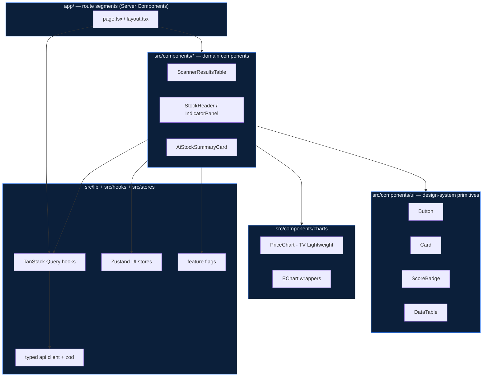

# 06 — Frontend Architecture

> One-line purpose: How the Saakshya web app is structured, rendered, state-managed, and built — the binding rules for every frontend file Claude or a human writes.
> Read first: [SPEC.md](../SPEC.md)

Related: [IA & URL Paths](05-information-architecture-and-url-paths.md) · [Design System & UI/UX](07-design-system-and-ui-ux.md) · [Screen-by-Screen](08-screen-by-screen-documentation.md) · [API Contracts](10-api-contracts.md) · [Compliance & Guardrails](21-compliance-risk-and-guardrails.md) · [Coding Standards](27-coding-standards.md)

---

## 0. Stack & non-negotiables

Production frontend (SPEC §9): **Next.js (App Router) · React · TypeScript · Tailwind CSS · Framer Motion · TanStack Query (server state) · Zustand (client/UI state) · TradingView Lightweight Charts + Apache ECharts · Shadcn UI / custom design system · NextAuth/custom auth.**

> The frontend is **deferred in the local-first build** (SPEC §9, §12: API + notebook first). It is added once the Phase-1 core is validated. This document is the production spec; nothing here is built before M5 of the local plan.

**Hard frontend rules tied to SPEC:**

- **Evidence-first rendering.** The UI never *originates* a number, price, target, or recommendation. Every figure on screen comes from a backend payload and traces to an evidence drawer ([07 evidence drawer](07-design-system-and-ui-ux.md)). The frontend has **no client-side computation of indicators, scores, or signals** — it renders what the API returns.
- **Mode-A safety is structural.** RA-gated UI (entry/target/SL) is behind a feature flag that is **off** in v1; the components either don't exist or render `RaGatedPlaceholder`. No client toggle can turn them on.
- **AI outputs are display-only and pre-verified.** The frontend renders AI text the backend already grounded/verified (SPEC §6.6). It must show a grounding badge and never re-prompt or post-process AI text into actionable language.
- **Blocked-phrase awareness.** Static copy is linted against the blocked-phrase list at build time (SPEC §6.9) — see [coding rules](#explicit-rules-for-claude).

---

## 1. Folder structure

```
web/
  app/                          # App Router (routes = folders)
    (marketing)/                # route group: public marketing shell + layout
      page.tsx                  # /
      pricing/page.tsx
      learn/page.tsx
      learn/[slug]/page.tsx
      legal/[doc]/page.tsx
    (market)/                   # route group: public data surface
      market/page.tsx
      stocks/page.tsx
      stocks/[symbol]/page.tsx
      sectors/page.tsx
      sectors/[slug]/page.tsx
      themes/page.tsx
      themes/[slug]/page.tsx
      scanners/page.tsx
      scanners/momentum/page.tsx
      scanners/volume-breakout/page.tsx
      scanners/rsi/page.tsx
      scanners/[slug]/page.tsx
      news/page.tsx
    (app)/                      # authenticated app shell + sidebar layout
      layout.tsx                # requires session (server-checked)
      dashboard/page.tsx
      onboarding/page.tsx
      watchlist/page.tsx
      portfolio/page.tsx
      alerts/page.tsx
      ai/page.tsx
      strategy-builder/page.tsx
      backtesting/page.tsx
      account/[section]/page.tsx
    admin/                      # admin shell; role-gated in layout + middleware
      layout.tsx
      page.tsx
      data-health/page.tsx
      prompts/page.tsx
      scanners/page.tsx
      compliance/page.tsx
      users/page.tsx
    (auth)/
      login/page.tsx
      signup/page.tsx
    api/                        # Next BFF route handlers ONLY (auth, server secrets)
      auth/[...nextauth]/route.ts
      internal/revalidate/route.ts
    layout.tsx                  # root layout: html, theme, providers
    globals.css
    sitemap.ts  robots.ts  not-found.tsx  error.tsx
  src/
    components/
      ui/                       # design-system primitives (Button, Card, Badge…)
      charts/                   # PriceChart (TV Lightweight), EChart wrappers
      market/                   # IndexStrip, BreadthPanel, SectorHeatmap…
      scanner/                  # ScannerResultsTable, ScoreBadge, ReasonChips…
      stock/                    # StockHeader, IndicatorPanel, EvidenceDrawer…
      ai/                       # AiChatThread, AiStockSummaryCard, GroundingBadge
      portfolio/  watchlist/  alerts/  strategy/  backtest/
      admin/                    # admin-only components (not in public bundles)
      compliance/               # RaGatedPlaceholder, NotAdviceBanner, BlockedNotice
      layout/                   # AppSidebar, TopNav, CommandPalette, Footer
    hooks/                      # useMarketSummary, useScanner, useStock, useAiChat…
    lib/
      api/                      # typed API client + zod schemas (from 10-api-contracts)
      query/                    # TanStack Query client, query keys, prefetch helpers
      auth/                     # session helpers, role guards
      flags/                    # feature-flag client (mode-gating)
      format/                   # number/price/date formatters (en-IN)
      analytics/                # event tracking (see 24)
      motion/                   # shared Framer Motion variants + reduce-motion
    stores/                     # Zustand stores (UI/client state only)
    styles/                     # tailwind layers, tokens (see 07)
    types/                      # shared TS types, generated API types
    constants/                  # blocked-phrases (mirror), route map, query keys
  public/                       # static assets
  middleware.ts                 # auth + admin gating, redirects, headers
  tailwind.config.ts  next.config.ts  tsconfig.json
  vitest.config.ts  playwright.config.ts
```

**Rules:** routes (`app/`) hold **thin** `page.tsx`/`layout.tsx` that compose components from `src/components`. No business logic in `app/`. Components are grouped by domain; `ui/` is the shared design-system layer that depends on nothing domain-specific.

---

## 2. Routing strategy (App Router)

- **Route groups** `(marketing)`, `(market)`, `(app)`, `(auth)` give each surface its own `layout.tsx` (nav chrome, providers) without affecting URLs (see [05](05-information-architecture-and-url-paths.md)).
- **Server Components by default.** Pages fetch initial data on the server and stream. Client interactivity is opted-in with `"use client"` leaves.
- **Per-route rendering mode** set per the table in [§7](#seo-rendering-strategy).
- **Loading & error UI** via co-located `loading.tsx` (skeletons) and `error.tsx` per segment; `not-found.tsx` for unknown entities.
- **Parallel/intercepting routes** used for modal flows (e.g. `@modal/(.)stocks/[symbol]` for a quick-look drawer from the scanner table) so deep links still SSR the full page.

---

## 3. Component architecture & layering



**Layering rules:**
1. `ui/` primitives import only React, Tailwind, design tokens — never hooks/stores/API.
2. Domain components may use hooks (TanStack Query), stores (Zustand), flags, and `ui/`/`charts/`.
3. Pages compose domain components and do server-side prefetch; they don't render raw data directly.
4. **Compliance components** (`RaGatedPlaceholder`, `NotAdviceBanner`, `GroundingBadge`) are mandatory wrappers around AI output and any RA-gated slot.

### RSC vs Client Component decision rules

| Use a **Server Component** when… | Use a **Client Component** (`"use client"`) when… |
|---|---|
| Fetching EOD data for first paint / SEO (market, stocks, sectors, scanners, learn) | Interactivity: filters, sort, dialogs, command palette, tabs |
| Rendering static/CMS content (learn, legal, pricing) | Charts (TradingView Lightweight / ECharts need DOM + refs) |
| Composing layout, reading session on server, gating by role | Anything using `useState`/`useEffect`/Query mutations/Zustand |
| Streaming large tables with server data | AI chat thread, evidence drawer slide-in, animations (Framer Motion) |

Default to Server Components; push `"use client"` to the smallest interactive leaf. A table can be a Server Component that renders a small client `<TableControls>` island.

---

## 4. State management

Two layers, strictly separated (SPEC §9 stack):

### Server state — TanStack Query
- **All API data** (market, stocks, scanners, portfolio, AI, etc.) flows through TanStack Query. No ad-hoc `fetch` in components.
- **Query keys** are centralized in `src/constants/query-keys.ts` and `src/lib/query/keys.ts`, structured: `['scanner', slug, filters]`, `['stock', symbol, 'overview']`, `['stock', symbol, 'ai-summary']`.
- **Caching reflects EOD cadence (SPEC §8):** `staleTime` for EOD data is long (e.g. until next trading-date publish), `gcTime` generous. AI summaries are cached and served-on-unchanged-signals from the backend; the client caches the result keyed by symbol + signal-version.
- **SSR hydration:** server prefetches with `QueryClient` + `HydrationBoundary` so the first paint is data-complete and the client reuses the cache (no double fetch).
- **Mutations** (add watchlist, create alert, run strategy/backtest) use `useMutation` with optimistic updates where safe + `invalidateQueries`.
- **No client-side derived financial values.** Derivations like "score color" map from server values to tokens; they never recompute the score.

### Client/UI state — Zustand
- **UI-only, ephemeral or device-local state:** theme, sidebar collapsed, command-palette open, active filter panel, table density, reduce-motion override, onboarding step, drawer open/target. Persist a subset (theme, density, followed-sector layout) to `localStorage` via `persist`.
- **One store per concern** (`useThemeStore`, `useUiStore`, `useFilterStore`), small and typed. **Never** store server data in Zustand.
- **Navigation personalization** (followed sectors order, default filters — SPEC §7) is server-owned (preferences API) but mirrored into a Zustand store for snappy UI; the server is source of truth.

---

## 5. Data fetching & caching

- **Typed client + Zod.** `src/lib/api` exposes typed functions whose request/response are validated by Zod schemas generated from / kept in sync with [10-api-contracts.md](10-api-contracts.md). Invalid shapes throw and surface an error state — never render unvalidated data.
- **As-of awareness.** Endpoints that support `?as_of=` (SPEC §6.2) pass it through; the UI labels any historical view with its as-of date.
- **Cache layers:** Next.js `fetch` cache / `revalidate` (ISR) for SSR pages + TanStack Query on the client. `revalidate` windows align to the EOD publish (e.g. revalidate market/scanner pages shortly after the overnight batch completes, triggered via `POST /api/internal/revalidate`).
- **Data-confidence + suppression.** When the API marks data low-confidence or suppresses an AI summary (SPEC §6.2), the UI shows the confidence indicator / "summary unavailable — inputs incomplete" state. **It never fabricates or interpolates.**

---

## 6. Error, loading, empty, auth handling

| Concern | Strategy |
|---|---|
| **Loading** | Per-segment `loading.tsx` skeletons that match final layout (no spinner-only). Streaming RSC for tables. TanStack Query `isPending` → skeleton, `isFetching` (background) → subtle top progress, not full reset. |
| **Error** | Segment `error.tsx` (client) with retry; query errors render an inline `ErrorState` card with retry + support link. API/network errors never crash the shell. |
| **Empty** | Distinct `EmptyState` per surface (no watchlist items, scanner returned 0, no holdings) with a clear next action — see [08](08-screen-by-screen-documentation.md). |
| **Suppressed AI** | Explicit "AI summary unavailable — required inputs missing" (SPEC §6.2), not a blank or guessed card. |
| **Auth** | Server reads session in `(app)`/`admin` layouts; `middleware.ts` redirects anonymous users to `/login?next=`. Client uses a `useSession` hook; protected mutations 401 → re-auth flow. |
| **Tier gate** | `<UpgradeGate tier="pro">` wraps Pro-only features; renders the feature for entitled users, an upgrade card otherwise (route still loads — see [05 §3](05-information-architecture-and-url-paths.md)). |

---

## 7. SEO rendering strategy (SSR / SSG / ISR)

| Page type | Mode | Why |
|---|---|---|
| `/`, `/pricing`, `/learn`, `/learn/[slug]`, `/legal/*` | **SSG** (build) + ISR for CMS | Static marketing/content; max crawlability + speed |
| `/market`, `/sectors`, `/scanners/*`, `/themes/*` | **ISR** revalidated post-EOD batch | Data changes once per trading day; serve cached, revalidate on publish |
| `/stocks`, `/stocks/[symbol]`, `/sectors/[slug]`, `/themes/[slug]` | **ISR** with on-demand revalidation per symbol/sector | Per-entity SEO pages; revalidate the specific path when its data updates |
| `/news` | **ISR** (short window) / SSR | More frequent updates within day |
| `/dashboard`, `/watchlist`, `/portfolio`, `/alerts`, `/ai`, `/strategy-builder`, `/backtesting`, `/account/*` | **SSR**, `noindex`, no cache | Personalized + private |
| `/login`, `/signup` | **SSG**, `noindex` | Static, private intent |
| `/admin/*` | **SSR**, `disallow` | Private, role-gated |

Metadata via the App Router `generateMetadata` per route; structured data (JSON-LD `BreadcrumbList`, `FinancialProduct`/`Article`) where relevant. Robots/sitemap per [05 §6](05-information-architecture-and-url-paths.md). SEO detail owned by [24](24-analytics-seo-and-growth.md).

---

## 8. Chart rendering strategy

- **TradingView Lightweight Charts** for price/OHLC, candlesticks, volume, MAs, scanner overlays — the primary financial chart. Wrapped in `src/components/charts/PriceChart`, **client-only**, **lazy-loaded** (`next/dynamic`, `ssr:false`) with a skeleton placeholder sized to final dimensions (no layout shift).
- **Apache ECharts** for analytical viz: sector heatmaps, breadth, rotation, equity curves (backtests), distribution/probability bands. Wrapped per-chart, lazy, client-only.
- **No chart blocks first paint or SSR.** Server renders the page + a chart skeleton; the chart hydrates client-side.
- Charts consume **already-computed series from the API** (SPEC: no client computation). Indicator lines/levels come pre-calculated; the chart only plots.
- Theme tokens drive chart colors (bullish/bearish/neutral, grid, axis) from [07](07-design-system-and-ui-ux.md); charts respect dark/light and reduce-motion (disable the line-reveal animation).

---

## 9. Responsive behavior

- **Mobile-first**; Tailwind breakpoints per [07](07-design-system-and-ui-ux.md) (`sm 640 / md 768 / lg 1024 / xl 1280 / 2xl 1536`).
- Dense data tables collapse to **card/stacked rows** on mobile; the scanner table shows symbol + score + top reason on small screens, expand for detail.
- App shell: sidebar on `lg+`, bottom-nav + sheet menu on mobile; evidence drawer is a side-drawer on desktop, a **bottom sheet** on mobile.
- Charts get reduced control density and touch-optimized interactions on mobile.

---

## 10. Feature flags

- `src/lib/flags` exposes `useFlag('flagKey')` (client) and `getFlag()` (server). Source: env-config + remote config; evaluated server-side for gating-critical flags.
- **Mode-gating flags are compile-time-safe defaults OFF:** `flags.raRecommendationLayer = false`, `flags.technicalLevels = false` (entry/target/SL). When off, components render `RaGatedPlaceholder`; **no client action can enable them** — enabling requires a deploy + server config + (per SPEC §2) RA registration in force.
- Phase rollout flags: `newsSentiment`, `strategyBuilder`, `backtesting`, `themes`, `mlProbabilityBands`. Tier entitlements (`premium`, `pro`) are separate from flags and resolved from the session/billing.

---

## 11. Accessibility (WCAG-aware)

- Target **WCAG 2.2 AA**. Dark-first palette tokens chosen to meet **4.5:1** text contrast / **3:1** for large text & UI components (verified in [07](07-design-system-and-ui-ux.md)).
- **Color is never the only signal:** bullish/bearish/neutral always pair color with icon/sign/label (critical for finance + color-blind users).
- Full keyboard support: focus-visible rings, command palette (`Cmd/Ctrl+K`), tab order, skip-to-content. Drawers/modals/sheets trap focus and restore it; `Esc` closes.
- Semantic HTML + ARIA for tables, tabs, dialogs (Shadcn/Radix primitives provide correct roles). Charts have an accessible text alternative / data-table fallback.
- `prefers-reduced-motion` honored globally (see [07 reduce-motion](07-design-system-and-ui-ux.md)); a user override in preferences.
- Live regions for async updates (alert created, watchlist added) announce politely.

---

## 12. Performance rules (Core Web Vitals)

| Lever | Rule |
|---|---|
| **Bundle** | RSC by default keeps JS off the wire; `"use client"` only at leaves. Per-route JS budget tracked in CI. |
| **Code-split** | Charts, command palette, strategy builder, backtesting, admin all lazy via `next/dynamic`. Admin never ships in public bundles. |
| **Lazy charts** | Charts hydrate after interaction/visibility; never block LCP. |
| **Images/fonts** | `next/image`, `next/font` (self-hosted, `display: swap`), preloaded variable font subset. |
| **CWV targets** | LCP < 2.5s, INP < 200ms, CLS < 0.1 on key pages (landing, market, stock, scanner). Skeletons sized to prevent CLS. |
| **Data** | SSR/ISR prefetch + Query hydration avoids client waterfalls; align ISR revalidate to EOD publish to keep cache hits high. |
| **Memo** | Memoize heavy table rows/cells; virtualize long universe/scanner tables. |

---

## 13. Frontend coding conventions

- **TypeScript strict**, no `any` (use `unknown` + narrow). Public component props are explicit typed interfaces.
- **Naming:** components `PascalCase`, hooks `useX`, files match export. Domain folder per [§1](#1-folder-structure).
- **Tailwind**: use design tokens / semantic classes from [07](07-design-system-and-ui-ux.md); no raw hex in components. Variants via `cva`. No inline magic colors.
- **No business logic in `app/` pages**; compose components + prefetch only.
- **No client-side computation of financial values** (indicators/scores/signals) — render API values only.
- **Formatting** money/percent/dates via `src/lib/format` (`en-IN`, INR `₹`), never inline `toLocaleString` choices scattered around.
- **Imports** absolute via `@/` alias. Server-only modules guarded with `import 'server-only'`.
- Lint/format: ESLint + Prettier + Tailwind plugin; a **custom ESLint rule bans blocked phrases** and bans advisory words in JSX string literals (mirror of SPEC §6.9 list in `src/constants/blocked-phrases.ts`).
- Tests: Vitest + Testing Library (unit/component), Playwright (e2e), per [25](25-qa-testing-and-release-process.md).

---

## 14. Explicit rules for Claude (creating/modifying frontend files)

1. **Read this file + [05](05-information-architecture-and-url-paths.md) + [07](07-design-system-and-ui-ux.md) before creating any frontend file.** Place files per [§1](#1-folder-structure); never invent a new top-level folder.
2. **Thin pages.** `page.tsx`/`layout.tsx` compose domain components and prefetch; no fetching logic or JSX-heavy markup inline.
3. **Default Server Component.** Add `"use client"` only when a component needs state/effects/refs/charts/animation, and isolate it to the smallest leaf.
4. **All data via TanStack Query + typed client.** Never `fetch` directly in a component; add/extend a hook in `src/hooks` and a typed function in `src/lib/api` with a Zod schema matching [10](10-api-contracts.md).
5. **UI state via Zustand only for UI concerns.** Never put server data in a store.
6. **Use design tokens** ([07](07-design-system-and-ui-ux.md)); no raw colors, spacing, or shadows. Use `ui/` primitives before building new ones.
7. **Compliance wrappers are mandatory:** wrap AI output in `GroundingBadge`/`AiCard`, render any entry/target/SL slot as `RaGatedPlaceholder`, show `NotAdviceBanner` where required. **Never** write copy or labels containing buy/sell/target/stop-loss/guarantee/sure-shot/etc. (SPEC §3.3, §6.9).
8. **Never compute financial values client-side.** If a value isn't in the payload, it isn't shown.
9. **Honor reduce-motion** and the animation timing/easing rules in [07](07-design-system-and-ui-ux.md); animations must not delay data legibility.
10. **Accessibility is part of "done":** keyboard, focus, contrast, non-color signals, labels (see [§11](#11-accessibility-wcag-aware)).

---

## 15. Acceptance criteria

- **Backend dependency:** Every data-rendering component sources from a typed client in `src/lib/api` mapped to an endpoint in [10](10-api-contracts.md); no component fabricates data.
- **Frontend dependency:** Folder structure, route groups, RSC/Client split, and state separation (Query=server, Zustand=UI) match this doc; charts are lazy/client-only.
- **Data dependency:** SSR/ISR pages render EOD-cached data and revalidate on publish; low-confidence/suppressed states handled per SPEC §6.2.
- **Compliance:** Build fails if a JSX string literal matches the blocked-phrase list; RA-gated components default off and cannot be client-enabled; AI output always carries a grounding badge.
- **Performance/A11y:** Key routes meet the CWV targets in [§12](#12-performance-rules-core-web-vitals) and WCAG 2.2 AA checks in [§11](#11-accessibility-wcag-aware) in CI.
