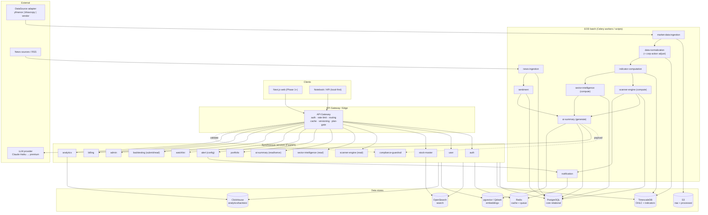
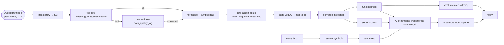

# 09 — Backend Architecture

> Complete service-by-service backend architecture for Saakshya: responsibilities, I/O, dependencies, the EOD/T+1 pipeline, the API gateway, and the local-first simplifications.
>
> Read first: [SPEC.md](../SPEC.md)

---

## 0. Scope & guiding constraints

This document defines **every backend service**, how they depend on each other, how the **event-driven EOD pipeline** is orchestrated, and what the **local-first prototype** collapses into plain scripts. It is bound by the SPEC:

- **Mode A v1** ([SPEC §2](../SPEC.md), [§4](../SPEC.md)). No service may emit per-stock entry/target/SL, "candidate" buy-leans, or ranked "what to buy" output. The **compliance-guardrail service** is *required infrastructure*, not optional.
- **Evidence-first** ([SPEC §1](../SPEC.md), [§6.6](../SPEC.md)). Every value a service returns must be reproducible from stored data with an `as_of` date. The AI layer only **explains** the structured payload it is handed.
- **EOD/T+1 first** ([SPEC §8](../SPEC.md)). The system is batch-oriented; the pipeline runs in an overnight window and finishes before the morning brief. No intraday/real-time path in v1.
- **Single `DataSource` adapter** ([SPEC §8](../SPEC.md)). yfinance (prototype) → NSE Bhavcopy CM-UDiFF + `sec_bhavdata` delivery (authoritative EOD) → TrueData/Global Datafeeds (production) sit behind one interface. No business service imports a vendor SDK directly.
- **Correctness as workstreams** ([SPEC §6.1–6.2](../SPEC.md)). Corporate-action adjustment stores **raw + adjusted** and reconciles vs a 2nd source; all time-series carry **as-of / point-in-time versioning**; an **AI-generation audit log** records every generation.
- **Two stacks** ([SPEC §9](../SPEC.md)). Production: FastAPI + Celery + Redis + PostgreSQL/TimescaleDB + ClickHouse + OpenSearch + pgvector + S3. Local-first: FastAPI + Uvicorn + DuckDB + plain scripts/Makefile, vectorized pandas/NumPy (no TA-Lib).

Related docs: [10-api-contracts.md](./10-api-contracts.md) · [11-database-architecture.md](./11-database-architecture.md) · [12-data-ingestion-and-market-data.md](./12-data-ingestion-and-market-data.md) · [13-scanner-engine-and-scoring.md](./13-scanner-engine-and-scoring.md) · [14-ai-llm-agent-architecture.md](./14-ai-llm-agent-architecture.md) · [21-compliance-risk-and-guardrails.md](./21-compliance-risk-and-guardrails.md).

---

## 1. System architecture diagram

**Reading the diagram:** the left/top path is synchronous request/response through the gateway. The pipeline block is the overnight batch that *produces* the data those services read. The compliance-guardrail service sits across both: it validates AI payloads at generation time and validates any natural-language output at gateway egress.

---

## 2. Service catalogue

Each service below lists **responsibility**, **inputs**, **outputs**, **depends on**, **stores**, **mode/compliance note**, and **acceptance criteria**. Services are grouped by role. In local-first, every "batch" service is a Python module invoked by `scripts/run_pipeline.py`; every "sync" service is a FastAPI router in `app/api/` ([SPEC §12](../SPEC.md)).

### 2.1 auth
- **Responsibility:** registration, login, session/JWT issuance & refresh, password reset, API-key issuance for the Enterprise/API tier.
- **Inputs:** credentials, refresh tokens, OAuth callbacks (later).
- **Outputs:** signed access/refresh JWT (carrying `user_id`, `plan`, `scopes`), API keys.
- **Depends on:** `user` (profile lookup), PostgreSQL, Redis (token blocklist / rate state).
- **Stores:** `users`, `admin_users` (read).
- **Mode note:** N/A infrastructure.
- **Acceptance:** JWT verifiable offline by the gateway; refresh rotation invalidates prior token; brute-force lockout after N failures; API keys scope-limited and revocable.

### 2.2 user
- **Responsibility:** user profile, preferences (followed sectors, default filters, risk preference — *navigation personalization only*, [SPEC §7](../SPEC.md)), notification channels, consent/terms acceptance (incl. AI-use disclosure when RA is in force, [SPEC §6.7](../SPEC.md)).
- **Inputs:** profile edits, preference updates.
- **Outputs:** user/profile DTOs, effective preference set.
- **Depends on:** `auth`, PostgreSQL.
- **Stores:** `users`, `user_profiles`.
- **Mode note:** preferences MUST NOT store per-stock behavioural buy-leans (that is Mode C). Personalization is layout/follow/filter only.
- **Acceptance:** preference write is user-editable and transparent; no preference field can drive a per-stock suggestion.

### 2.3 stock-master
- **Responsibility:** canonical instrument reference — symbol ↔ ISIN ↔ exchange mapping, sector/industry classification, listing/delisting status, corporate hierarchy (parent/subsidiary) used for news resolution.
- **Inputs:** vendor master files, NSE/BSE listings, manual admin overrides.
- **Outputs:** instrument records, symbol-alias map, exchange symbol map.
- **Depends on:** PostgreSQL, OpenSearch (index for `stocks/search`), admin overrides.
- **Stores:** `stock_master`, `exchange_symbols`, `sector_master`, `industry_master`.
- **Mode note:** N/A. Feeds [SPEC §6.4](../SPEC.md) news-to-symbol resolution.
- **Acceptance:** every active instrument resolves to exactly one ISIN and ≥1 exchange symbol; delisted names retained (survivorship control, [SPEC §6.3](../SPEC.md)); search returns canonical symbol within 200 ms P95.

### 2.4 market-data-ingestion
- **Responsibility:** pull EOD OHLCV + delivery data from the **DataSource adapter**, land **raw** payloads to S3, register an ingestion job, hand off to normalization. (See [12-data-ingestion-and-market-data.md](./12-data-ingestion-and-market-data.md).)
- **Inputs:** trading-date trigger, source config (active adapter), symbol universe.
- **Outputs:** raw landed files (S3), `data_quality_logs` job rows, normalization tasks.
- **Depends on:** DataSource adapter, S3, PostgreSQL, Celery broker (Redis).
- **Stores:** `data_quality_logs`; raw to S3.
- **Mode note:** free/unofficial sources are **prototype-only**; production requires licensed redistribution rights ([SPEC §8](../SPEC.md)).
- **Acceptance:** idempotent per `(source, date, symbol)`; partial failure quarantines only affected symbols, not the batch; job status queryable by admin.

### 2.5 data-normalization (includes corporate-action adjustment)
- **Responsibility:** parse raw → canonical schema; symbol mapping (NSE/BSE/ISIN); **apply corporate-action adjustment producing both raw and adjusted series** ([SPEC §6.1](../SPEC.md)); reconcile vs a 2nd source; stamp `as_of` version.
- **Inputs:** raw landed files, `corporate_actions` master, prior series for back-adjustment.
- **Outputs:** `daily_ohlc` (raw + adjusted rows / columns), `index_ohlc`, reconciliation flags.
- **Depends on:** `market-data-ingestion`, `stock-master`, `corporate_actions`, TimescaleDB, a 2nd source via adapter.
- **Stores:** `daily_ohlc`, `index_ohlc`, `corporate_actions` (read).
- **Mode note:** correctness workstream — a missed split corrupts every downstream indicator/backtest.
- **Acceptance:** for any split/bonus test set, adjusted series is continuous; raw is preserved unchanged; `is_adjusted` flag set; reconciliation mismatch above tolerance quarantines the symbol-date.

### 2.6 indicator-computation
- **Responsibility:** compute RSI, SMA(20/50/200), EMA, ATR, MACD, Bollinger, returns, volume ratio over the **adjusted** series; persist with `as_of`.
- **Inputs:** adjusted `daily_ohlc`.
- **Outputs:** `technical_indicators` rows.
- **Depends on:** `data-normalization`, TimescaleDB. Vectorized pandas/NumPy — **no TA-Lib** ([SPEC §9](../SPEC.md), [§12](../SPEC.md)).
- **Stores:** `technical_indicators`.
- **Mode note:** N/A; correctness-critical.
- **Acceptance:** unit-tested vs known series; reconciles vs a 2nd source on a sample; recomputes deterministically for any historical `as_of`.

### 2.7 scanner-engine
- **Responsibility:** evaluate scanner definitions/rules against indicators → produce `scanner_results` with a **0–100 score, sub-scores, plain-language reasons, and risk flags**. Serves read queries for scanner endpoints. (See [13-scanner-engine-and-scoring.md](./13-scanner-engine-and-scoring.md).)
- **Inputs:** `technical_indicators`, `scanner_definitions`, `scanner_rules`, custom-scanner submissions.
- **Outputs:** `scanner_results` (per date), result lists.
- **Depends on:** `indicator-computation`, PostgreSQL/Timescale; `compliance-guardrail` for any text.
- **Stores:** `scanner_definitions`, `scanner_rules`, `scanner_results`.
- **Mode note:** **descriptive only** ([SPEC §4](../SPEC.md), [§5](../SPEC.md)) — "appears in the momentum scanner", never "momentum candidate"; no buy-the-breakout phrasing. Scores must be validated ([SPEC §6.5](../SPEC.md)).
- **Acceptance:** missing sub-scores marked neutral (not zero); output carries reasons traceable to indicator values; reason text passes the guardrail; results reproducible for a past date.

### 2.8 sector-intelligence
- **Responsibility:** compute sector/industry strength scores, breadth, and rotation from constituent indicators; serve sector dashboards.
- **Inputs:** `technical_indicators`, `stock_master` classification, `index_ohlc`.
- **Outputs:** `sector_scores`, sector summaries.
- **Depends on:** `indicator-computation`, `stock-master`, PostgreSQL.
- **Stores:** `sector_scores`.
- **Mode note:** index/sector technical analysis is explicitly lower-risk ([SPEC §4](../SPEC.md)); descriptive framing.
- **Acceptance:** every sector score traces to its constituent set as of the date; constituents reconcile with point-in-time membership.

### 2.9 news-ingestion
- **Responsibility:** fetch news/RSS, deduplicate, resolve articles → symbols using the **symbol-alias + corporate-hierarchy map with confidence scores** ([SPEC §6.4](../SPEC.md)); extract corporate announcements.
- **Inputs:** news feeds, `stock_master` aliases.
- **Outputs:** `news_articles`, `news_entities` (with link confidence), `corporate_announcements`.
- **Depends on:** `stock-master`, PostgreSQL, OpenSearch (article index).
- **Stores:** `news_articles`, `news_entities`, `corporate_announcements`.
- **Mode note:** Phase 2 ([SPEC §4](../SPEC.md)). Surfacing threshold on link confidence; retain source links + timestamps.
- **Acceptance:** every news→symbol link carries a confidence; below-threshold links are not surfaced; duplicates collapsed.

### 2.10 sentiment
- **Responsibility:** classify finance-tuned sentiment/impact per article→symbol link; evaluated against a labelled Indian-market set ([SPEC §6.4](../SPEC.md)).
- **Inputs:** `news_articles`, `news_entities`.
- **Outputs:** `news_sentiment` (label, score, model version).
- **Depends on:** `news-ingestion`, classifier/model, PostgreSQL.
- **Stores:** `news_sentiment`.
- **Mode note:** descriptive ("classified positive"); never directive.
- **Acceptance:** sentiment carries model version + source link; passes regression vs the labelled set ("misses estimates, stock rallies" handled); reproducible per article.

### 2.11 ai-summary
- **Responsibility:** assemble the **structured payload contract** (computed metrics, scanner tags, news summaries, risk markers only), call the LLM provider, run **runtime verification** (every number/fact matches payload, banned phrases blocked), serve cached summaries; write the **AI audit log**. (See [14-ai-llm-agent-architecture.md](./14-ai-llm-agent-architecture.md).)
- **Inputs:** `scanner_results`, `technical_indicators`, `sector_scores`, `news_sentiment`, `risk_scores`.
- **Outputs:** `ai_summaries`, `ai_audit_logs`, embeddings (`pgvector`).
- **Depends on:** all signal services, `compliance-guardrail`, LLM provider (Claude Haiku default; premium for synthesis, [SPEC §9](../SPEC.md)), PostgreSQL, pgvector, Redis (cache).
- **Stores:** `ai_summaries`, `ai_audit_logs`.
- **Mode note:** **AI explains, never invents** ([SPEC §1](../SPEC.md), [§6.6](../SPEC.md)). Drop directive tails ("before fresh action"). **Suppress, don't guess**, when critical inputs are missing ([SPEC §6.2](../SPEC.md)). No entry/target/SL.
- **Acceptance:** mismatch between output and payload **blocks or regenerates**; every generation logs prompt + input + model version + output; regenerate-on-change only (cost ceiling, [SPEC §6.8](../SPEC.md)); EOD generation finishes inside the overnight window.

### 2.12 portfolio
- **Responsibility:** holdings CRUD, valuation against latest EOD prices, P&L, daily snapshots, **factual** risk flags ("you hold X; it broke its 50-DMA").
- **Inputs:** user holdings, `daily_ohlc`, `technical_indicators`, `risk_scores`.
- **Outputs:** `portfolios`, `portfolio_holdings`, `portfolio_snapshots`, portfolio risk view.
- **Depends on:** `stock-master`, `indicator-computation`, `risk` data, PostgreSQL.
- **Stores:** `portfolios`, `portfolio_holdings`, `portfolio_snapshots`.
- **Mode note:** factual event reporting only ([SPEC §4](../SPEC.md)) — never "sell X".
- **Acceptance:** valuation reproducible from `as_of` EOD prices; snapshots written once per session; risk flags are descriptive events, never prescriptions.

### 2.13 watchlist
- **Responsibility:** manage user **watchlists and watchlist items** (CRUD, dedupe, ordering); attach the latest **scanner tags + signals** and most-recent EOD facts to each item so a watchlist reads as a descriptive membership view; surface per-item risk flags; feed the **alert** service the symbol set to evaluate. Membership framing only ("appears in the momentum scanner") — never a buy-lean ([SPEC §4](../SPEC.md), [§5](../SPEC.md)).
- **Inputs:** watchlist/item edits; `scanner_results` (latest per symbol per `as_of`); `technical_indicators`; `risk_scores`; `stock_master` (symbol resolution).
- **Outputs:** `watchlists`, `watchlist_items`, enriched watchlist DTOs (item + attached scanner tags/signals/risk flags + `as_of`).
- **Depends on:** `stock-master`, `scanner-engine` (tags/signals), `indicator-computation`, `risk` data, `alert` (consumes the watchlist set), PostgreSQL.
- **Stores:** `watchlists`, `watchlist_items`.
- **Mode note:** **descriptive membership only** ([SPEC §4](../SPEC.md)) — a watchlist entry is filter-based discovery, never a per-stock suggestion; attached signals inherit the scanner-engine's descriptive posture; no entry/target/SL.
- **Acceptance:** every attached tag/signal traces to a `scanner_results` row for the same `as_of`; missing signals shown as absent, not guessed; item enrichment reproducible for a past date; no field rewordable into a prescription.

### 2.14 alert
- **Responsibility:** alert-rule CRUD, **EOD-batch** evaluation, emit `alert_events` as **event reports** ("entered the scanner"), hand to notification.
- **Inputs:** alert rules, `scanner_results`, `technical_indicators`, `daily_ohlc`.
- **Outputs:** `alerts`, `alert_events`, notification tasks.
- **Depends on:** `scanner-engine`, `indicator-computation`, `notification`, PostgreSQL.
- **Stores:** `alerts`, `alert_events`.
- **Mode note:** EOD-batch in v1; **event-reporting only** ([SPEC §4](../SPEC.md)) — never "buy at open".
- **Acceptance:** alert fires from a stored event with a traceable cause; no prescriptive language; deduplicated per rule per day.

### 2.15 backtesting
- **Responsibility:** run strategy/scanner backtests with **integrity controls** ([SPEC §6.3](../SPEC.md)) — survivorship, look-ahead, point-in-time membership, realistic fills; persist runs/results/trades. Phase 4.
- **Inputs:** strategy definition (from `strategy-builder`), adjusted historical OHLC, point-in-time membership, delisted names.
- **Outputs:** `backtest_runs`, `backtest_results`, `backtest_trades`.
- **Depends on:** `strategy-builder` (compiled backtest spec), `data-normalization` (adjusted history), `stock-master` (delisted + membership), ClickHouse (scale), PostgreSQL.
- **Stores:** `backtest_runs`, `backtest_results`, `backtest_trades`.
- **Mode note:** descriptive ("past performance does not indicate future results"); an inflated backtest is an implied-performance claim.
- **Acceptance:** uses only data available at each simulated decision point; includes delisted/merged names for the period; assumptions exposed in output.

### 2.16 strategy-builder
- **Responsibility:** translate **no-code / natural-language strategy definitions** into the engine's structured form — compile a user's rule set into **scanner rules** (the same `scanner_rules` grammar) plus a **backtest spec** (universe, windows, rebalance, fill/slippage assumptions); persist `strategy_definitions`; collaborate with the **Strategy Builder AI agent** ([14-ai-llm-agent-architecture.md](./14-ai-llm-agent-architecture.md)) which proposes a draft definition from NL that this service validates and grounds. Phase 4 ([SPEC §4](../SPEC.md)).
- **Inputs:** no-code rule builder payloads; natural-language strategy prompts (via the Strategy Builder AI agent); indicator/field vocabulary from `scanner-engine`; `stock_master` universe.
- **Outputs:** `strategy_definitions` (rules JSON + logic + rebalance); compiled scanner-rule sets handed to `scanner-engine`; backtest specs handed to `backtesting`.
- **Depends on:** `scanner-engine` (rule grammar + field validation), `backtesting` (spec consumer), Strategy Builder AI agent (NL → draft), `stock-master`, `compliance-guardrail` (any NL echoed back), PostgreSQL.
- **Stores:** `strategy_definitions`.
- **Mode note:** **descriptive only** — a strategy is a reproducible rule set + integrity-controlled backtest, never a per-stock recommendation; the AI agent **only drafts/validates** rules and may invent no rule the user did not express; no entry/target/SL semantics leak into UI ([SPEC §4](../SPEC.md), [§6.6](../SPEC.md)).
- **Acceptance:** every compiled rule maps 1:1 to a stored `strategy_definitions` clause and a valid `scanner_rules` field/op; an NL-derived strategy is shown back to the user for confirmation before it runs; backtest specs carry the integrity flags `backtesting` enforces; definitions are versioned and reproducible.

### 2.17 notification
- **Responsibility:** deliver alerts/briefs across channels (in-app, email, push later); manage delivery state, retries, quiet hours.
- **Inputs:** notification tasks from `alert`, `ai-summary` (brief), `admin`.
- **Outputs:** `notifications` rows, channel deliveries.
- **Depends on:** Redis (queue), email/push providers, PostgreSQL.
- **Stores:** `notifications`.
- **Mode note:** content inherits the originating service's compliance posture (descriptive).
- **Acceptance:** at-least-once delivery with idempotency key; respects user channel prefs and quiet hours.

### 2.18 admin
- **Responsibility:** operator console — data-quality review/quarantine actions, prompt management, scanner-rule management, compliance-rule (blocked-phrase) management, source-reliability config, audit-log inspection.
- **Inputs:** admin actions (RBAC-gated).
- **Outputs:** rule/prompt versions, quarantine/correction commands, config.
- **Depends on:** `auth` (admin scope), `compliance-guardrail`, all rule/config tables, PostgreSQL.
- **Stores:** `admin_users`, `compliance_rules`, `scanner_definitions`/`scanner_rules` (write), `prompt` versions, `data_quality_logs` (write actions).
- **Mode note:** compliance rules + prompts are **versioned** ([SPEC §6.9](../SPEC.md)).
- **Acceptance:** every config change is versioned and attributed to an admin; blocked-phrase list and prompts roll forward without code deploy.

### 2.19 compliance-guardrail
- **Responsibility:** required infrastructure ([SPEC §4](../SPEC.md), [§6.9](../SPEC.md)). (a) **Payload contract validation** for AI generations; (b) **output-time enforcement** of the versioned blocked-phrase/pattern list on any natural-language output; (c) grounding verification (numbers/facts ⊆ payload). Runs at AI generation time and at gateway egress.
- **Inputs:** AI payloads, candidate outputs, `compliance_rules` (versioned).
- **Outputs:** pass/block/regenerate verdict + reason; violation log.
- **Depends on:** `compliance_rules`, `ai-summary`, gateway hook, PostgreSQL.
- **Stores:** `compliance_rules`, guardrail violation rows (in `ai_audit_logs` / dedicated log).
- **Mode note:** enforces every [SPEC §3.3](../SPEC.md) always-prohibited phrase and every [SPEC §3.2](../SPEC.md) Mode-A prohibition.
- **Acceptance:** a banned phrase or an ungrounded number is blocked at output time, not merely discouraged in the prompt; rules are versioned; verdicts are logged with the matched rule.

### 2.20 analytics
- **Responsibility:** product + platform analytics, usage metering for plan limits and billing, scanner/AI cost telemetry (AI-spend meter, [SPEC §6.8](../SPEC.md)); large-scale analytical queries land in ClickHouse.
- **Inputs:** `usage_events`, request telemetry, AI token usage.
- **Outputs:** usage aggregates, spend metrics, plan-limit counters.
- **Depends on:** ClickHouse, Redis (counters), PostgreSQL.
- **Stores:** `usage_events`; aggregates in ClickHouse.
- **Mode note:** N/A.
- **Acceptance:** per-user plan counters accurate within the billing window; AI-spend meter alerts before the monthly ceiling; graceful degradation triggers documented.

### 2.21 billing
- **Responsibility:** subscription lifecycle (Free/Premium/Pro/Enterprise, [SPEC §11](../SPEC.md)), payment provider integration, invoices, plan changes, **SEBI fee-cap awareness** (~₹1.51L/yr/family) for any RA-operated tier.
- **Inputs:** plan selection, payment webhooks, usage from `analytics`.
- **Outputs:** `subscriptions`, `billing_transactions`.
- **Depends on:** payment provider, `user`, `analytics`, PostgreSQL.
- **Stores:** `subscriptions`, `billing_transactions`.
- **Mode note:** fee-cap ceiling applies if a tier operates under RA for individual clients ([SPEC §11](../SPEC.md)).
- **Acceptance:** plan change is atomic and reflected in JWT scopes on next refresh; transactions reconcile with provider; fee-cap guard prevents over-cap RA pricing.

---

## 3. API gateway responsibilities

The gateway is the single front door; business services trust the identity/plan it asserts.

| Responsibility | Behaviour |
|---|---|
| **Auth** | Verify JWT (offline, via `auth` public key); attach `user_id`, `plan`, `scopes`; reject expired/blocklisted tokens; accept API keys for Enterprise tier. |
| **Rate limiting** | Per-user + per-plan token buckets in Redis; per-endpoint overrides (AI endpoints stricter). Returns `429` with `Retry-After`. |
| **Routing** | Path-prefix routing to services; health-aware; strips internal headers. |
| **Caching** | Honor per-endpoint cache policy (see [10-api-contracts.md](./10-api-contracts.md)); EOD-derived reads are highly cacheable (long TTL until next pipeline run); user-specific and AI on-demand are short/no-cache. Cache keyed incl. `as_of`. |
| **Versioning** | URI versioning (`/api/v1/...`); deprecation headers; contract per [10-api-contracts.md](./10-api-contracts.md). |
| **Plan-based access** | Gate endpoints/features by `plan` ([SPEC §11](../SPEC.md)); return `403 plan_required` with upgrade hint when a Free user hits a Premium/Pro feature. |
| **Egress guardrail hook** | Route AI/natural-language responses through `compliance-guardrail` before returning ([SPEC §6.9](../SPEC.md)). |
| **Envelope + `as_of`** | Ensure the standard response envelope (`data`, `meta`, `error`, `as_of`, `data_confidence`) is present. |

**Local-first simplification ([SPEC §9](../SPEC.md), [§12](../SPEC.md)):** no separate gateway process. FastAPI dependencies handle auth (or a stub), simple in-process rate counters, and the guardrail check runs as a response dependency. Plan-gating is a no-op or single-user. Caching is the `ai_summaries` table + a small in-memory/DuckDB cache.

---

## 4. Event-driven EOD pipeline orchestration

### 4.1 Stage graph

### 4.2 Orchestration model
- **Production:** **Celery** tasks chained per stage, Redis broker, with a beat schedule for the overnight trigger. Each stage is idempotent and emits a completion event the next stage subscribes to (chord/group for fan-out over the universe). Failures route symbol-dates to **quarantine** and re-emit dependents on correction ([SPEC §6.2](../SPEC.md)). Optional Kafka/Redpanda is a future event-bus upgrade.
- **Local-first:** **`scripts/run_pipeline.py`** runs the same stages sequentially in-process (ingest → compute → scan), no Celery/Redis ([SPEC §12](../SPEC.md)). A Makefile target wraps it. Same module boundaries so stages lift into Celery tasks later.

### 4.3 Scheduling window (summary)
The full chain must complete before the morning brief. Detailed timing table lives in [12-data-ingestion-and-market-data.md](./12-data-ingestion-and-market-data.md). The orchestrator enforces a **latency budget**: EOD generation finishes inside the overnight window; on-demand AI has a P95 target with a non-AI fallback ([SPEC §6.8](../SPEC.md)).

**Acceptance (pipeline):** a full overnight run on the universe completes within the window; any quarantined symbol-date blocks only its own dependents; re-emission after correction updates indicators, scanner results, and AI summaries deterministically.

---

## 5. Service-dependency table

`→` = "calls / consumes output of". B = batch (pipeline), S = sync (request path).

| Service | Role | Depends on | Stores (primary) | Mode |
|---|---|---|---|---|
| auth | S | user, PG, Redis | users | N/A |
| user | S | auth, PG | users, user_profiles | A (nav only) |
| stock-master | S | PG, OpenSearch | stock_master, exchange_symbols, sector/industry_master | N/A |
| market-data-ingestion | B | DataSource adapter, S3, PG | data_quality_logs, S3 raw | N/A |
| data-normalization | B | ingestion, stock-master, corporate_actions, Timescale | daily_ohlc, index_ohlc | N/A |
| indicator-computation | B | normalization, Timescale | technical_indicators | N/A |
| scanner-engine | B+S | indicators, definitions, guardrail | scanner_*; scanner_results | **A** |
| sector-intelligence | B+S | indicators, stock-master | sector_scores | A |
| news-ingestion | B | stock-master, OpenSearch | news_articles, news_entities, corporate_announcements | A |
| sentiment | B | news-ingestion, classifier | news_sentiment | A |
| ai-summary | B+S | all signals, guardrail, LLM, pgvector | ai_summaries, ai_audit_logs | **A** |
| portfolio | S | stock-master, indicators, risk | portfolios, holdings, snapshots | A |
| watchlist | S | stock-master, scanner-engine, indicators, risk, alert | watchlists, watchlist_items | A (membership only) |
| alert | B+S | scanner-engine, indicators, notification | alerts, alert_events | A |
| strategy-builder | S | scanner-engine, backtesting, Strategy Builder AI agent, stock-master, guardrail | strategy_definitions | A |
| backtesting | B+S | strategy-builder, normalization, stock-master, ClickHouse | backtest_runs/results/trades | A |
| notification | B | Redis, email/push, PG | notifications | inherits |
| admin | S | auth, guardrail, rule tables | compliance_rules, prompts, scanner rules | N/A |
| compliance-guardrail | S(+B hook) | compliance_rules, ai-summary, gateway | compliance_rules, violations | **enforces A** |
| analytics | S | ClickHouse, Redis | usage_events | N/A |
| billing | S | payment provider, user, analytics | subscriptions, billing_transactions | A (fee-cap) |

---

## 6. Local-first simplifications (consolidated, [SPEC §9](../SPEC.md) / [§12](../SPEC.md))

| Production concept | Local-first form |
|---|---|
| API gateway process | FastAPI dependencies (auth stub, in-proc rate counters, guardrail dependency) |
| Celery + Redis orchestration | `scripts/run_pipeline.py` sequential stages + Makefile |
| PostgreSQL + TimescaleDB + ClickHouse | single-file **DuckDB** |
| OpenSearch search | DuckDB filter / simple `LIKE`; defer real search |
| pgvector / Qdrant | deferred (or in-memory) until AI RAG needed |
| S3 object storage | local `data/` directory |
| Provider abstraction → premium model | Claude **Haiku** (`claude-haiku-4-5-20251001`) via env var |
| Compliance admin console | prototype-grade guardrail + grounding check in `app/ai/` |
| Notification channels | log/console; in-app only |
| Billing / plan-gating | no-op (single user) |

**What stays even locally (non-negotiable):** the **DataSource adapter** boundary, **raw + adjusted** storage with reconciliation, **as-of versioning** on time-series, the **AI grounding/verification + audit log**, and **Mode-A guardrails**. These are the three product-killing risks the local build exists to retire ([SPEC §12](../SPEC.md)).
