# 11 — Database Architecture

> Full data-store strategy and table-level design for Saakshya: store choices, every table with columns/keys, relationships, indexes, partitioning, retention, and migration rules — with as-of/point-in-time versioning throughout.
>
> Read first: [SPEC.md](../SPEC.md)

---

## 0. Principles

- **As-of / point-in-time versioning is mandatory** on all time-series and indicator entities ([SPEC §6.2](../SPEC.md), [§9](../SPEC.md)). Any displayed value must be reproducible for the date it was shown.
- **Raw + adjusted both stored** for prices ([SPEC §6.1](../SPEC.md)); corporate-action adjustment is a first-class workstream with a dedicated `corporate_actions` master and reconciliation flags.
- **AI-generation audit log is a first-class entity** ([SPEC §6.6](../SPEC.md), [§9](../SPEC.md)).
- **Survivorship control:** delisted/merged instruments are retained, never deleted ([SPEC §6.3](../SPEC.md)).
- **Two stacks** ([SPEC §9](../SPEC.md)): production uses PostgreSQL + TimescaleDB + ClickHouse + OpenSearch + pgvector + Redis + S3; local-first collapses all of it into a single **DuckDB** file. SQL below is Postgres/Timescale flavored; DuckDB equivalents noted where they differ.

Related: [09-backend-architecture.md](./09-backend-architecture.md) · [12-data-ingestion-and-market-data.md](./12-data-ingestion-and-market-data.md) · [13-scanner-engine-and-scoring.md](./13-scanner-engine-and-scoring.md) · [14-ai-llm-agent-architecture.md](./14-ai-llm-agent-architecture.md).

---

## 1. Store choices

| Store | Holds | Why |
|---|---|---|
| **PostgreSQL** | Core relational: users, subscriptions, masters, scanners, watchlists, portfolios, alerts, news, AI metadata, admin/compliance, billing | ACID, relations, JSONB for flexible rule/config bodies |
| **TimescaleDB** (PG ext) | `daily_ohlc`, `index_ohlc`, `technical_indicators` as **hypertables** | Time-partitioned OHLC + indicators; chunk-by-date; compression |
| **Redis** | Cache (envelope responses, AI summaries hot set), Celery broker, rate-limit counters, idempotency keys | Low-latency cache + queues |
| **ClickHouse** | Backtesting at scale, analytics/usage aggregation, large historical scans | Columnar, fast aggregation over years × universe |
| **OpenSearch** | Symbol/name search, news full-text | Relevance search the relational store can't do well |
| **pgvector / Qdrant** | Embeddings for AI RAG / similarity | Vector search co-located (pgvector) or dedicated (Qdrant) |
| **S3** | Raw landed feeds, processed parquet, backups, exports | Cheap durable object storage; immutable raw for reproducibility |

**Local-first:** one DuckDB file replaces PG/Timescale/ClickHouse; OpenSearch → `LIKE`/filters; pgvector/Qdrant deferred; Redis deferred (in-proc cache); S3 → local `data/` ([SPEC §9](../SPEC.md), [§12](../SPEC.md)).

---

## 2. Entity-relationship diagram

```mermaid
erDiagram
  users ||--|| user_profiles : has
  users ||--o{ subscriptions : has
  users ||--o{ watchlists : owns
  users ||--o{ portfolios : owns
  users ||--o{ alerts : owns
  users ||--o{ usage_events : generates
  users ||--o{ billing_transactions : pays

  subscriptions }o--|| users : for

  stock_master ||--o{ exchange_symbols : maps
  stock_master }o--|| sector_master : in
  sector_master ||--o{ industry_master : contains
  stock_master ||--o{ daily_ohlc : has
  stock_master ||--o{ technical_indicators : has
  stock_master ||--o{ corporate_actions : has
  stock_master ||--o{ news_entities : referenced_by
  stock_master ||--o{ scanner_results : appears_in
  stock_master ||--o{ risk_scores : scored

  scanner_definitions ||--o{ scanner_rules : has
  scanner_definitions ||--o{ scanner_results : produces

  watchlists ||--o{ watchlist_items : contains
  portfolios ||--o{ portfolio_holdings : contains
  portfolios ||--o{ portfolio_snapshots : snapshots

  alerts ||--o{ alert_events : fires
  alert_events ||--o{ notifications : delivered_as

  news_articles ||--o{ news_entities : mentions
  news_entities ||--o{ news_sentiment : scored
  stock_master ||--o{ corporate_announcements : announces

  ai_summaries ||--|| ai_audit_logs : logged_by
  strategy_definitions ||--o{ backtest_runs : run
  backtest_runs ||--o{ backtest_results : yields
  backtest_runs ||--o{ backtest_trades : records

  sector_master ||--o{ sector_scores : scored
  admin_users ||--o{ compliance_rules : maintains
  index_ohlc }o--|| sector_master : optional
  data_quality_logs }o--|| stock_master : about
```

---

## 3. Table definitions

> Conventions: `id` = surrogate PK (`bigserial`/`uuid`). `as_of_date` = point-in-time date the row is valid for. `ingested_at`/`computed_at`/`created_at` = write timestamps. Soft state via status enums, never hard-delete time-series.

### 3.1 Identity & accounts

#### users
| Column | Type | Notes |
|---|---|---|
| id | uuid PK | |
| email | citext UNIQUE NOT NULL | |
| password_hash | text | null if OAuth |
| status | text | `active|suspended|deleted` |
| created_at | timestamptz | |
| last_login_at | timestamptz | |

#### user_profiles
| Column | Type | Notes |
|---|---|---|
| user_id | uuid PK/FK→users | |
| display_name | text | |
| followed_sectors | text[] | navigation personalization only ([SPEC §7](../SPEC.md)) |
| default_filters | jsonb | default scanner filters |
| risk_preference | text | `conservative|moderate|aggressive` (filter default only) |
| notification_channels | jsonb | |
| ai_use_ack_at | timestamptz | AI-use disclosure ack (RA, [SPEC §6.7](../SPEC.md)) |
| updated_at | timestamptz | |

#### subscriptions
| Column | Type | Notes |
|---|---|---|
| id | uuid PK | |
| user_id | uuid FK→users | |
| plan | text | `free|premium|pro|enterprise` |
| status | text | `active|canceled|past_due` |
| started_at | timestamptz | |
| renews_at | timestamptz | |
| ra_operated | boolean | true → SEBI fee-cap applies ([SPEC §11](../SPEC.md)) |

### 3.2 Instrument master

#### stock_master
| Column | Type | Notes |
|---|---|---|
| id | bigserial PK | internal instrument id |
| isin | char(12) UNIQUE | canonical identity |
| primary_symbol | text | display symbol |
| name | text | |
| sector_id | bigint FK→sector_master | |
| industry_id | bigint FK→industry_master | |
| parent_isin | char(12) | corporate hierarchy (news resolution, [SPEC §6.4](../SPEC.md)) |
| status | text | `listed|delisted|merged|suspended` (retain, never delete) |
| listed_on | date | |
| delisted_on | date | survivorship control |
| created_at / updated_at | timestamptz | |

#### exchange_symbols
| Column | Type | Notes |
|---|---|---|
| id | bigserial PK | |
| stock_id | bigint FK→stock_master | |
| exchange | text | `NSE|BSE` |
| symbol | text | exchange ticker (`.NS`/`.BO` mapping) |
| series | text | `EQ|BE|...` |
| valid_from / valid_to | date | symbol-change history (point-in-time) |
| UNIQUE | (exchange, symbol, valid_from) | |

#### sector_master / industry_master
| Column | Type | Notes |
|---|---|---|
| id | bigserial PK | |
| name | text UNIQUE | |
| (industry) sector_id | bigint FK→sector_master | industry rolls up to sector |

### 3.3 Time-series (TimescaleDB hypertables)

#### daily_ohlc — **raw + adjusted**, hypertable on `session_date`
| Column | Type | Notes |
|---|---|---|
| stock_id | bigint FK→stock_master | |
| session_date | date | partition/chunk key |
| open_raw / high_raw / low_raw / close_raw | numeric(18,4) | unadjusted ([SPEC §6.1](../SPEC.md)) |
| open_adj / high_adj / low_adj / close_adj | numeric(18,4) | corp-action adjusted |
| volume | bigint | |
| delivery_qty | bigint | from `sec_bhavdata` |
| delivery_pct | numeric(6,2) | volume-breakout scanner input |
| is_adjusted | boolean | adjusted columns populated & reconciled |
| adj_factor | numeric(18,8) | cumulative adjustment factor |
| source | text | `yfinance|nse_bhavcopy|vendor` |
| as_of_version | int | bumped on restatement (point-in-time) |
| reconciled | boolean | passed 2nd-source check |
| ingested_at | timestamptz | |
| **PK** | (stock_id, session_date, as_of_version) | |

> `SELECT create_hypertable('daily_ohlc', 'session_date', chunk_time_interval => INTERVAL '1 month');`

#### index_ohlc — hypertable on `session_date`
| Column | Type | Notes |
|---|---|---|
| index_symbol | text | `NIFTY50|SENSEX|NIFTYBANK|...` |
| sector_id | bigint FK | nullable (sectoral indices) |
| session_date | date | chunk key |
| open/high/low/close | numeric(18,4) | |
| as_of_version | int | |
| **PK** | (index_symbol, session_date, as_of_version) | |

#### technical_indicators — hypertable on `session_date`
| Column | Type | Notes |
|---|---|---|
| stock_id | bigint FK→stock_master | |
| session_date | date | chunk key |
| rsi_14 / sma_20 / sma_50 / sma_200 / ema_21 | numeric | computed on **adjusted** series |
| atr_14 / macd / macd_signal / bb_upper / bb_lower | numeric | |
| adx_14 | numeric | Wilder trend strength (0–100); EOD-computable ([SPEC §13](13-scanner-engine-and-scoring.md)) |
| stoch_rsi_k / stoch_rsi_d | numeric | Stochastic RSI %K/%D momentum oscillator (0–100); EOD-computable |
| pivot / pivot_r1 / pivot_r2 / pivot_s1 / pivot_s2 | numeric | classic floor-trader pivots from prior session H/L/C; descriptive support/resistance |
| vwap | numeric | **intraday-only** — NULL in EOD mode; populated when live/intraday data lands (V7) |
| ret_5d / ret_20d / ret_60d | numeric | |
| volume_ratio_20 | numeric | |
| relative_strength | numeric | vs index/sector |
| indicator_version | int | recompute lineage |
| as_of_version | int | point-in-time |
| computed_at | timestamptz | |
| **PK** | (stock_id, session_date, as_of_version) | |

### 3.4 Corporate actions (first-class master)

#### corporate_actions
| Column | Type | Notes |
|---|---|---|
| id | bigserial PK | |
| stock_id | bigint FK→stock_master | |
| action_type | text | `split|bonus|dividend|rights|merger|symbol_change` |
| ex_date | date | |
| ratio_from / ratio_to | numeric | e.g. 1→2 split |
| dividend_amount | numeric | for dividend |
| new_symbol | text | for symbol_change |
| factor | numeric(18,8) | derived adjustment factor |
| source | text | feed origin |
| reconciled | boolean | vs 2nd source ([SPEC §6.1](../SPEC.md)) |
| as_of_version | int | |
| created_at | timestamptz | |

### 3.5 Scanners

#### scanner_definitions
| Column | Type | Notes |
|---|---|---|
| id | text PK | `momentum|volume-breakout|rsi|...` |
| name | text | |
| owner_user_id | uuid FK→users | null = system |
| plan_required | text | gating |
| weights | jsonb | sub-score weights ([SPEC §6.5](../SPEC.md)) |
| version | int | versioned (admin) |
| validated | boolean | M3b evidence on file |
| created_at | timestamptz | |

#### scanner_rules
| Column | Type | Notes |
|---|---|---|
| id | bigserial PK | |
| scanner_id | text FK→scanner_definitions | |
| field | text | indicator field |
| op | text | `>|>=|<|<=|=|between` |
| value | jsonb | scalar or range |
| logic_group | text | AND/OR grouping |

#### scanner_results — per session
| Column | Type | Notes |
|---|---|---|
| id | bigserial PK | |
| scanner_id | text FK | |
| stock_id | bigint FK→stock_master | |
| session_date | date | |
| score | numeric(6,2) | 0–100 |
| sub_scores | jsonb | missing → neutral, not zero |
| reasons | jsonb | plain-language, descriptive ([SPEC §5](../SPEC.md)) |
| risk_flags | jsonb | |
| as_of_version | int | |
| **UNIQUE** | (scanner_id, stock_id, session_date, as_of_version) | |

### 3.6 Sector scores

#### sector_scores
| Column | Type | Notes |
|---|---|---|
| id | bigserial PK | |
| sector_id | bigint FK→sector_master | |
| session_date | date | |
| strength_score | numeric | |
| sub_scores | jsonb | momentum/breadth/relative_strength |
| constituent_count | int | point-in-time |
| as_of_version | int | |
| **UNIQUE** | (sector_id, session_date, as_of_version) | |

### 3.7 Watchlists & portfolio

#### watchlists / watchlist_items
| Column | Type | Notes |
|---|---|---|
| (watchlists) id | uuid PK; user_id FK; name text; created_at | UNIQUE(user_id, name) |
| (watchlist_items) id | bigserial PK; watchlist_id FK; stock_id FK; added_at | UNIQUE(watchlist_id, stock_id) |

#### portfolios / portfolio_holdings / portfolio_snapshots
| Column | Type | Notes |
|---|---|---|
| (portfolios) id | uuid PK; user_id FK; name text; base_currency text; created_at | |
| (portfolio_holdings) id | bigserial PK; portfolio_id FK; stock_id FK; quantity numeric; avg_cost numeric; opened_at; updated_at | |
| (portfolio_snapshots) id | bigserial PK; portfolio_id FK; snapshot_date date; market_value numeric; invested numeric; pnl numeric; as_of_version int | UNIQUE(portfolio_id, snapshot_date, as_of_version); valuation reproducible from `as_of` prices |

### 3.8 Alerts & notifications

#### alerts / alert_events / notifications
| Column | Type | Notes |
|---|---|---|
| (alerts) id | uuid PK; user_id FK; type text (`scanner_entry|indicator_cross|...`); target text; stock_id FK null; params jsonb; channels jsonb; active bool; created_at | EOD-batch |
| (alert_events) id | bigserial PK; alert_id FK; stock_id FK; fired_at; session_date date; message text; cause jsonb | event-reporting only ([SPEC §4](../SPEC.md)); UNIQUE(alert_id, stock_id, session_date) dedupe |
| (notifications) id | bigserial PK; user_id FK; alert_event_id FK null; channel text; status text (`queued|sent|failed`); payload jsonb; idempotency_key text; created_at; sent_at | UNIQUE(idempotency_key) |

### 3.9 News & sentiment

#### news_articles / news_entities / news_sentiment / corporate_announcements
| Column | Type | Notes |
|---|---|---|
| (news_articles) id | bigserial PK; url text UNIQUE; headline text; body text; source text; published_at timestamptz; hash text; ingested_at | dedupe by hash |
| (news_entities) id | bigserial PK; article_id FK; stock_id FK; link_confidence numeric; resolved_via text | confidence + surfacing threshold ([SPEC §6.4](../SPEC.md)) |
| (news_sentiment) id | bigserial PK; news_entity_id FK; label text (`positive|neutral|negative`); score numeric; model_version text; created_at | finance-tuned; reproducible |
| (corporate_announcements) id | bigserial PK; stock_id FK; type text; headline text; announced_date date; effective_date date; url text; source text | do not exaggerate impact |

### 3.10 AI

#### ai_summaries
| Column | Type | Notes |
|---|---|---|
| id | uuid PK | |
| scope | text | `stock|market|sector` |
| stock_id | bigint FK null | |
| session_date | date | |
| summary_text | text | descriptive, guardrail-passed |
| evidence | jsonb | claim→field→value traces |
| signals_hash | text | regenerate-on-change key ([SPEC §6.8](../SPEC.md)) |
| model_version | text | |
| data_confidence | text | `high|medium|low|suppressed` |
| audit_id | uuid FK→ai_audit_logs | |
| created_at | timestamptz | |
| **UNIQUE** | (scope, stock_id, session_date) | cache row |

#### ai_audit_logs (first-class, [SPEC §6.6](../SPEC.md))
| Column | Type | Notes |
|---|---|---|
| id | uuid PK | |
| scope | text | |
| stock_id | bigint FK null | |
| prompt_key | text | + version |
| prompt_rendered | text | exact prompt sent |
| input_payload | jsonb | the structured contract payload |
| model_version | text | |
| raw_output | text | model output before guardrail |
| final_output | text | user-visible (post-guardrail) |
| verification | jsonb | grounding result, mismatches |
| guardrail_verdict | text | `pass|blocked|regenerated` |
| blocked_rule_id | bigint FK→compliance_rules null | |
| tokens_in / tokens_out | int | AI-spend meter ([SPEC §6.8](../SPEC.md)) |
| created_at | timestamptz | |

### 3.11 Strategy & backtesting (ClickHouse for `*_results`/`*_trades` at scale)

#### strategy_definitions / backtest_runs / backtest_results / backtest_trades
| Column | Type | Notes |
|---|---|---|
| (strategy_definitions) id | uuid PK; user_id FK; name text; rules jsonb; logic text; rebalance text; created_at | |
| (backtest_runs) id | uuid PK; strategy_id FK; user_id FK; from_date; to_date; params jsonb (slippage, liquidity cap); status text; survivorship_controlled bool; look_ahead_controlled bool; point_in_time_membership bool; created_at; completed_at | integrity flags ([SPEC §6.3](../SPEC.md)) |
| (backtest_results) run_id FK; cagr_pct; max_drawdown_pct; sharpe; trades int; win_rate_pct; equity_curve jsonb | honest framing |
| (backtest_trades) id; run_id FK; stock_id FK; entry_date; exit_date; entry_price_adj; exit_price_adj; qty; pnl; slippage_applied | adjusted prices as-of decision date |

### 3.12 Risk

#### risk_scores
| Column | Type | Notes |
|---|---|---|
| id | bigserial PK | |
| stock_id | bigint FK→stock_master | |
| session_date | date | |
| value | numeric(6,2) | 0–100 |
| band | text | `low|moderate|elevated|high` (descriptive, [SPEC §4](../SPEC.md)) |
| components | jsonb | volatility, drawdown, liquidity, etc. |
| as_of_version | int | |
| **UNIQUE** | (stock_id, session_date, as_of_version) | |

### 3.13 Ops, admin, compliance, billing

#### data_quality_logs
| Column | Type | Notes |
|---|---|---|
| id | bigserial PK | |
| job_id | uuid | ingestion run |
| source | text | |
| session_date | date | |
| stock_id | bigint FK null | |
| check_type | text | `missing_candle|abnormal_jump|duplicate_symbol|stale|sector_mismatch|job_failure` |
| severity | text | `info|warn|quarantine` |
| status | text | `open|quarantined|corrected|reemitted` ([SPEC §6.2](../SPEC.md)) |
| detail | jsonb | |
| created_at / resolved_at | timestamptz | |

#### admin_users
| Column | Type | Notes |
|---|---|---|
| id | uuid PK | |
| user_id | uuid FK→users | |
| role | text | `data_admin|prompt_admin|compliance_admin|superadmin` (RBAC) |
| created_at | timestamptz | |

#### compliance_rules (versioned, [SPEC §6.9](../SPEC.md))
| Column | Type | Notes |
|---|---|---|
| id | bigserial PK | |
| version | int | |
| rule_type | text | `blocked_phrase|pattern` |
| pattern | text | enforced at output time |
| mode_scope | text | `always|mode_a` ([SPEC §3.2](../SPEC.md), [§3.3](../SPEC.md)) |
| active | boolean | |
| created_by | uuid FK→admin_users | |
| created_at | timestamptz | |

#### billing_transactions / usage_events
| Column | Type | Notes |
|---|---|---|
| (billing_transactions) id | uuid PK; user_id FK; amount numeric; currency text; status text; provider_ref text; created_at | |
| (usage_events) id | bigserial PK; user_id FK; event_type text (`api_call|ai_generation|scanner_run`); units int; cost_estimate numeric; created_at | plan-limit + AI-spend metering; high-volume → ClickHouse |

---

## 4. Indexes

| Table | Index | Purpose |
|---|---|---|
| stock_master | UNIQUE(isin); btree(primary_symbol); btree(status) | identity, search, survivorship filter |
| exchange_symbols | btree(symbol); btree(stock_id); UNIQUE(exchange,symbol,valid_from) | symbol mapping/history |
| daily_ohlc | hypertable chunks(session_date); btree(stock_id, session_date DESC) | latest-EOD reads |
| technical_indicators | hypertable chunks(session_date); btree(stock_id, session_date DESC) | overview/technicals |
| scanner_results | btree(scanner_id, session_date); btree(stock_id, session_date) | scanner lists, memberships |
| news_entities | btree(stock_id); btree(article_id); btree(link_confidence) | resolved-news fetch, threshold |
| ai_summaries | UNIQUE(scope, stock_id, session_date); btree(signals_hash) | cache lookup, regenerate-on-change |
| ai_audit_logs | btree(stock_id, created_at); btree(model_version) | audit, cost rollup |
| alert_events | UNIQUE(alert_id, stock_id, session_date) | dedupe |
| data_quality_logs | btree(status); btree(session_date, source) | quarantine queue |

**OpenSearch:** `stock_master` (symbol/name) and `news_articles` (full-text) are indexed separately for search. **pgvector:** `ai_summaries`/news embeddings table with HNSW index.

---

## 5. Partitioning strategy

- **TimescaleDB hypertables** — `daily_ohlc`, `index_ohlc`, `technical_indicators` chunked by `session_date`, **1-month chunks**. Enable **native compression** on chunks older than ~90 days (segment by `stock_id`, order by `session_date`). This keeps recent reads hot and old data compact.
- **ClickHouse** — `backtest_trades`, `usage_events` partitioned by month (`toYYYYMM`), ordered by `(stock_id, session_date)` / `(user_id, created_at)`.
- **Postgres core tables** — generally unpartitioned; `scanner_results` and `alert_events` may be range-partitioned by `session_date` if volume warrants.
- **DuckDB (local)** — single file, no partitioning; date-filtered queries over the full table.

---

## 6. Retention strategy

| Data | Retention | Notes |
|---|---|---|
| Raw landed feeds (S3) | Indefinite (immutable) | reproducibility / audit; lifecycle to cold storage after 1y |
| `daily_ohlc` (raw+adj) | Full history (years incl. delisted) | required for scanners/backtests ([SPEC §6.3](../SPEC.md), [§8](../SPEC.md)) |
| `technical_indicators` | Full history | recomputable but kept for as-of reproducibility |
| `scanner_results` | ≥ 3y hot, then ClickHouse/cold | history powers validation + backtests |
| `ai_summaries` | Latest per (scope,stock,date) + history | cache + audit |
| `ai_audit_logs` | Indefinite (compliance) | every generation, never purged in Mode B |
| `news_articles`/sentiment | ≥ 2y | source links retained |
| `data_quality_logs` | ≥ 2y | ops/audit |
| `usage_events` | 13 months hot, then aggregate | billing window + analytics |
| `billing_transactions` | Per statutory requirement | |

---

## 7. Migration rules

- **Tool:** **Alembic** (autogenerate reviewed, never blind). One migration per logical change.
- **Forward-only:** no destructive down-migrations in production; roll forward with corrective migrations. Down-migrations exist for local/CI only.
- **As-of preservation:** schema changes to time-series add columns/versions; **never rewrite historical rows in place** — bump `as_of_version` instead. Restatements are new versions, preserving point-in-time history ([SPEC §6.2](../SPEC.md)).
- **Backfill discipline:** data backfills run as explicit jobs, logged in `data_quality_logs`, and re-emit dependent indicators/scanners/AI summaries ([SPEC §6.2](../SPEC.md)).
- **Timescale specifics:** hypertable creation and compression policies are migration steps; chunk interval changes apply to new chunks only.
- **Local-first:** DuckDB schema lives in `app/storage/schema.sql`; migrations are forward-only `ALTER`/versioned scripts mirroring the Alembic intent so modules lift into production cleanly ([SPEC §12](../SPEC.md)).

**Acceptance:** every time-series table carries `as_of_version`; no migration deletes delisted instruments or rewrites historical OHLC; a restated split re-versions affected rows and re-emits dependents; any displayed value is reproducible for its `as_of`.
