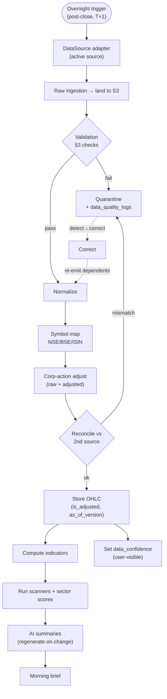
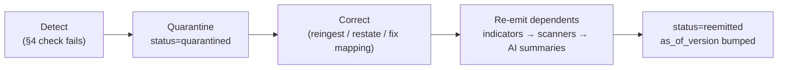

# 12 — Data Ingestion & Market Data

> The EOD/T+1 data feed strategy for Saakshya: pipeline stages, the layered source table behind one `DataSource` adapter, data-quality checks, the correction workflow, and the overnight schedule.
>
> Read first: [SPEC.md](../SPEC.md)

---

## 0. Principles

- **EOD-first (T+1)** ([SPEC §8](../SPEC.md)): ingest the previous session after close → normalize → corp-action adjust → indicators + sector scores → scanners → news → AI summaries → morning brief. No intraday/live path in v1; live data is a later, separately-licensed tier (WebSocket).
- **One `DataSource` adapter** ([SPEC §8](../SPEC.md)): business logic never depends on the vendor. **Zerodha Kite Connect is the sole source** (D-058); the adapter seam is kept so a future vendor drops in behind the same interface.
- **Corporate-action adjustment is a first-class workstream** ([SPEC §6.1](../SPEC.md)): store **raw + adjusted**, reconcile vs a 2nd source. Kite provides **no corp-action feed**, so series are currently stored unadjusted — a documented gap (§3.4), never a silent mis-adjustment.
- **Licensing reality** ([SPEC §8](../SPEC.md)): Kite data is licensed for the authenticated user; commercial redistribution stays blocked (`supports("redistribution") == False`) until a redistribution licence is in force. Historical adjusted depth (incl. delisted names) remains a separate procurement and a gating dependency for scanners/backtesting.
- **As-of versioning + user-visible data-confidence** ([SPEC §6.2](../SPEC.md)) flow through every stage.

Related: [09-backend-architecture.md](./09-backend-architecture.md) · [11-database-architecture.md](./11-database-architecture.md) · [13-scanner-engine-and-scoring.md](./13-scanner-engine-and-scoring.md).

---

## 1. Pipeline stages

```
raw ingestion → validation → normalization → symbol mapping (NSE/BSE/ISIN)
→ corporate-action adjustment → storage → indicator computation → scanner run scheduling
```

| Stage | Input | Output | Notes |
|---|---|---|---|
| **1. Raw ingestion** | trigger + active source | raw files landed to S3/`data/`; job row | immutable raw for reproducibility |
| **2. Validation** | raw payload | pass / quarantine verdict | runs the §3 checks before anything is trusted |
| **3. Normalization** | validated raw | canonical OHLCV schema | unify column names/types across sources |
| **4. Symbol mapping** | normalized rows | rows keyed to `stock_id`/ISIN | NSE/BSE ticker ↔ ISIN via `exchange_symbols`; handles symbol changes |
| **5. Corp-action adjustment** | mapped rows + `corporate_actions` | raw + adjusted series, reconciled | [SPEC §6.1](../SPEC.md); reconcile vs 2nd source before publish |
| **6. Storage** | raw + adjusted | `daily_ohlc`, `index_ohlc` (Timescale) | `is_adjusted`, `adj_factor`, `as_of_version`, `source` set |
| **7. Indicator computation** | adjusted series | `technical_indicators` | vectorized pandas/NumPy, no TA-Lib ([SPEC §9](../SPEC.md)) |
| **8. Scanner run scheduling** | indicators | `scanner_results`, `sector_scores` triggered | feeds AI summaries + alerts |

---

## 2. Ingestion flow diagram



---

## 3. Data source: Zerodha Kite Connect (behind one `DataSource` adapter)

**Kite Connect is the sole EOD source (D-058, [SPEC §8](../SPEC.md)).** yfinance, NSE Bhavcopy and the TrueData/Global-Datafeeds layering were removed. The adapter seam is retained so business logic (scanners, indicators, AI) still depends only on the interface — a future vendor drops in without touching business code.

| Source | Provides | Use-stage | Caveat |
|---|---|---|---|
| **Zerodha Kite Connect** | Daily OHLCV via `historical_data`; NSE/BSE instrument master | **Sole source (local + production)** | Paid API (~₹500/mo). Candles are **unadjusted** (no split/bonus adjustment). **No delivery %** and **no corporate-action API**. Daily `access_token` (expires ~07:30 IST). Licensed for the authenticated user — `supports("redistribution") == False` until a redistribution licence is in force. |

**Config:** `SAAKSHYA_ACTIVE_DATA_SOURCE=kite`; credentials `KITE_API_KEY`/`KITE_API_SECRET` and the daily `KITE_ACCESS_TOKEN` come from `.env`. Token acquisition + refresh: `app/data/kite_auth.py` (see §3.3). The adapter is `app/data/kite_source.py`.

### 3.1 Adapter interface (`app/data/base.py`)

```python
class DataSource(Protocol):
    name: str
    def fetch_history(self, symbols: Iterable[str], period: str) -> list[OHLCRow]: ...
    def fetch_eod(self, symbols: Iterable[str], session_date: date) -> list[OHLCRow]: ...
    def fetch_delivery(self, session_date: date) -> list[DeliveryRow] | None: ...  # None for Kite
    def fetch_corporate_actions(self, symbols, since: date) -> list[CorpActionRow]: ...  # [] for Kite
    def supports(self, capability: str) -> bool: ...   # "delivery_pct", "adjusted", "redistribution"
```

`KiteSource` declares `adjusted=False`, `delivery_pct=False`, `redistribution=False`; `assert_publishable()` refuses commercial publishing from a non-redistributable source ([SPEC §8](../SPEC.md)). `KiteSource` normalizes seam symbols (`RELIANCE`, `RELIANCE.NS`, `NSE:RELIANCE`) to the Kite tradingsymbol and resolves the `instrument_token` from the instrument master, throttling to Kite's ~3 req/s historical limit.

### 3.3 Daily token flow (`app/data/kite_auth.py`, D-058)

The `access_token` expires each morning and is re-acquired unattended, tried in order:
1. **Automated TOTP login (primary):** scripts the Kite web login (`KITE_USER_ID` + `KITE_PASSWORD` + a `pyotp`-generated TOTP from `KITE_TOTP_SECRET`) to get a `request_token` with zero interaction, then `generate_session()` → `access_token`. Suits the overnight cron.
2. **Browser callback (fallback):** opens the Kite login URL and captures the `request_token` on the registered redirect `http://127.0.0.1:8000/kite/callback` via a tiny local HTTP server. Used when Zerodha forces a manual re-auth.

The token is written back to `.env` (`KITE_ACCESS_TOKEN`) so same-day runs reuse it. Secrets are read from settings only, never logged.

**Corporate TLS-inspection proxies (e.g. Sophos / Zscaler).** If the network re-signs Kite's certificate with a private CA, `requests`/`httpx` will fail cert verification (`CERTIFICATE_VERIFY_FAILED`). The fix is **not** to disable verification — export the proxy's CA cert (Keychain Access → the interception CA → export as PEM), append it to a bundle, and set `KITE_CA_BUNDLE` to that path. Both the kiteconnect and kite_auth HTTP clients honour it. Alternatively, run the pipeline from a network without TLS inspection, or have IT whitelist `kite.trade`/`kite.zerodha.com` from inspection.

### 3.4 Known gaps (Kite-only, documented — never silently mis-handled)

- **No corporate-action feed.** Kite Connect exposes no CA API, so `fetch_corporate_actions` returns `[]` and series are stored **unadjusted** (`is_adjusted=False`). The M1 corp-action adjuster runs but has nothing to apply until a dedicated CA feed is added. Splits/bonuses will therefore show as raw discontinuities — a **tracked gap**, surfaced via `data_quality_logs`, not hidden.
- **No delivery %.** `fetch_delivery` returns `None`; downstream marks delivery-based signals neutral, not zero.
- **Reconciliation is a no-op** while the source is unadjusted (the second-source comparison compares equal values); it re-activates when a corp-action feed lands.

### 3.2 Future live data
Licensed **live/real-time** data arrives via **WebSocket** in a later phase (Phase 5, [SPEC §4](../SPEC.md), [§10](../SPEC.md)), separately licensed and Mode-A-safe in content but gated on data licensing. It lands behind the same adapter with a streaming capability flag.

---

## 4. Data-quality checks

Run at the **validation** stage (and re-run after corp-action adjustment). Each failed check writes a `data_quality_logs` row ([SPEC §6.2](../SPEC.md)).

| Check | Detects | Action |
|---|---|---|
| **Missing candles** | gaps vs trading calendar | quarantine symbol-date; flag |
| **Abnormal price jumps** | jump beyond threshold not explained by a `corporate_actions` event | quarantine; likely unadjusted split |
| **Duplicate symbols** | same symbol/ISIN mapping collision | quarantine; admin resolve |
| **Stale data** | source returns prior session's data | block publish; mark `data_confidence=low` |
| **Incorrect sector mapping** | constituent in wrong sector vs master | flag; correct in `stock_master` |
| **Failed ingestion jobs** | source fetch/parse failure | retry; partial failure quarantines affected symbols only, not the batch |

Thresholds (e.g. jump %) are configurable via the admin console and versioned.

### 4.1 Correction workflow — detect → quarantine → correct → re-emit



- Quarantined symbol-dates block **only their own dependents**, never the whole batch ([SPEC §6.2](../SPEC.md)).
- Correction bumps `as_of_version` (point-in-time preserved, [SPEC §11](./11-database-architecture.md)); it does **not** overwrite history.
- Re-emission deterministically updates `technical_indicators`, `scanner_results`, and `ai_summaries`.

### 4.2 User-visible data-confidence indicator
Every response carries `data_confidence` ∈ `high | medium | low | suppressed` ([SPEC §6.2](../SPEC.md), [10-api-contracts.md](./10-api-contracts.md)):
- `high` — reconciled, complete, fresh.
- `medium` — minor gap or single-source.
- `low` — stale or unreconciled.
- `suppressed` — a critical input was missing; **the value/AI summary is not guessed** ([SPEC §6.2](../SPEC.md), [§6.6](../SPEC.md)).

---

## 5. Scheduling (overnight window before the morning brief)

T+1: NSE/BSE close ~15:30 IST; bhavcopy/delivery files publish after close. The chain must finish before the morning brief (target ~07:00 IST). Times are illustrative targets, enforced as a **latency budget** ([SPEC §6.8](../SPEC.md)).

| Window (IST) | Stage | Depends on | Gate |
|---|---|---|---|
| 18:00–18:30 | Raw ingestion (bhavcopy + delivery; yfinance prototype) | source publish | files landed for the date |
| 18:30–19:00 | Validation + quarantine | raw landed | §3 checks complete |
| 19:00–20:00 | Normalize + symbol map + corp-action adjust + reconcile | validation pass, `corporate_actions` | adjusted series continuous & reconciled |
| 20:00–20:30 | Store OHLC (raw+adjusted, as_of) | adjustment done | `is_adjusted` set; reconciled |
| 20:30–21:30 | Indicator computation | stored OHLC | reconcile vs 2nd source on sample |
| 21:30–22:30 | Scanners + sector scores | indicators | scores validated; reasons descriptive |
| 22:30–23:00 | News fetch + symbol resolution + sentiment | stock master | links above threshold only |
| 23:00–01:00 | AI summaries (regenerate-on-change) | all signals | finishes inside window; suppress on missing input |
| 01:00–01:30 | Alert evaluation (EOD-batch) | scanners | event-reporting only |
| 06:30–07:00 | Morning brief assembly + notify | AI summaries | descriptive; no ranked "what to buy" |

**Production:** Celery beat triggers the chain; chained/grouped tasks per stage ([SPEC §9](../SPEC.md), [09-backend-architecture.md](./09-backend-architecture.md)). **Local-first:** `scripts/run_pipeline.py` runs the same stages sequentially, no scheduler/Celery ([SPEC §12](../SPEC.md)).

---

## 6. Acceptance criteria

- **Adapter:** the same symbol returns consistent data via either adapter; a vendor swap touches no business logic (scanners/indicators/AI unchanged) ([SPEC §12](../SPEC.md) M1).
- **Adjustment:** for a split/bonus test set, adjusted series is continuous and reconciles vs a 2nd source; raw is preserved; `is_adjusted` + `adj_factor` set ([SPEC §6.1](../SPEC.md)).
- **Quality:** each §3 check writes a `data_quality_logs` row; a quarantined symbol-date blocks only its own dependents; correction bumps `as_of_version` and re-emits indicators → scanners → AI summaries ([SPEC §6.2](../SPEC.md)).
- **Confidence:** every served value carries a `data_confidence`; missing critical inputs yield `suppressed`, never a guessed value.
- **Schedule:** a full overnight run completes before the morning brief; AI generation fits the window with a non-AI fallback on overrun ([SPEC §6.8](../SPEC.md)).
- **Licensing:** publishing is refused from a source lacking redistribution rights; production runs on a licensed vendor ([SPEC §8](../SPEC.md)).
