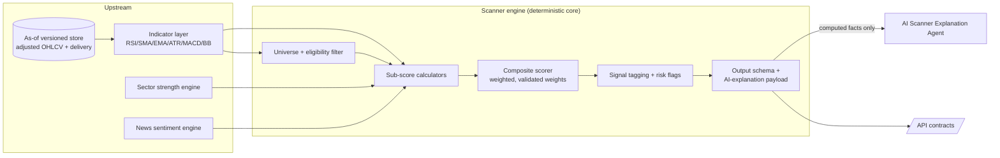
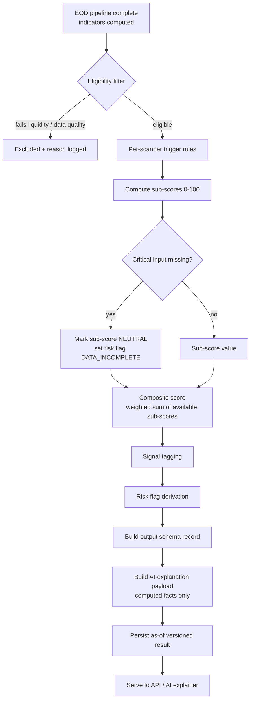

# 13 — Scanner Engine and Scoring

The deterministic intelligence core: rule-based, explainable scanners and multi-factor scoring that produce score + reasons + risk flags, with AI only explaining the output.

> Read first: [SPEC.md](../SPEC.md) (canonical source of truth).

---

## 0. First principles (non-negotiable)

1. **Scoring is rule-based and explainable in v1.** Every score decomposes into named sub-scores, each computed by a transparent formula from observable inputs. ML ranking is a **later phase** (Phase 4–5; see [ML](15-machine-learning-and-data-science.md) and [SPEC.md §4](../SPEC.md)).
2. **Scores must be validated before UI is built on them.** The composition weights below (25/20/15/15/10/10/5) are a **starting hypothesis**, not a result. The **M3b score-validation spike** ([SPEC.md §6.5, §12](../SPEC.md)) must prove on historical adjusted data that at least one score (start with momentum) tracks realized relative strength. If it is noise, the scoring is redesigned **now** — before any UI ships. This is measurement validation, **not** a performance claim.
3. **The AI only explains.** The scanner engine emits a structured **AI-explanation payload** of computed facts. The AI ([AI/LLM architecture](14-ai-llm-agent-architecture.md)) may reference **nothing outside that payload**, and never invents numbers, prices, news, targets, or returns.
4. **Mode-A output discipline.** Scanner output is **descriptive**: "appears in the momentum scanner", "volume expanded 2× vs its 20-day average". It carries **no** per-stock entry/target/stop-loss, **no** "candidate" buy-leans, **no** "buy the breakout" phrasing ([SPEC.md §3, §5](../SPEC.md), [compliance](21-compliance-risk-and-guardrails.md)).
5. **Inputs must be corp-action-adjusted and as-of versioned.** A split/bonus on an unadjusted series silently corrupts every indicator ([SPEC.md §6.1–6.2](../SPEC.md)). Scanners read only adjusted series; missing critical inputs → sub-score marked **neutral**, never guessed.

---

## 1. Where the scanner engine sits



- **Backend dependency:** indicator layer, sector-strength engine, news-sentiment engine, corp-action-adjusted store ([database](11-database-architecture.md)).
- **Data dependency:** adjusted OHLCV history (years incl. delisted), NSE delivery file (delivery %), sector classification, finance-tuned sentiment scores.
- **Acceptance criteria:** for any scanner result, every displayed number is reproducible from as-of versioned inputs; no buy-lean language appears in any field; the AI-explanation payload contains only values present in the output schema.

---

## 2. Scanner engine flow



---

## 3. Shared mechanics

### 3.1 Eligibility filter (runs before every scanner)

A symbol enters any scanner only if it passes the universe gate. This prevents illiquid, corrupted, or stale names from producing misleading scores.

| Check | Rule (starting hypothesis) | On fail |
|---|---|---|
| Listing status | Active on NSE/BSE for the as-of date | Exclude |
| Price floor | Adjusted close ≥ ₹10 | Exclude (penny-stock noise) |
| Liquidity | 20-day median traded value ≥ ₹1 crore | Exclude |
| Data completeness | ≥ 200 adjusted candles available (for 200-DMA scanners) or ≥ required lookback | Exclude or mark sub-score neutral |
| Data quality | No quarantined candle in lookback ([SPEC.md §6.2](../SPEC.md)) | Exclude + log |
| Corp-action freshness | Corp-action master reconciled for the symbol | Exclude until reconciled |

> Thresholds are configurable per scanner and per tier. All thresholds live in versioned config, not code constants.

### 3.2 Sub-score normalization

Every sub-score is normalized to **0–100** so the composite is a clean weighted sum. Two normalization helpers are used throughout:

```python
def clamp01(x):                       # bound to [0, 1]
    return max(0.0, min(1.0, x))

def scale(value, lo, hi):             # linear map [lo, hi] -> [0, 100]
    if hi == lo:
        return 50.0
    return 100.0 * clamp01((value - lo) / (hi - lo))

def pct_rank(value, distribution):    # cross-sectional percentile -> [0, 100]
    # rank of `value` within today's eligible-universe distribution
    return 100.0 * (count_lte(distribution, value) / len(distribution))
```

- **Cross-sectional** sub-scores (e.g. momentum vs the universe today) use `pct_rank`.
- **Absolute** sub-scores (e.g. RSI band health) use `scale` against fixed thresholds.
- **Missing input** → sub-score = `NEUTRAL` sentinel; excluded from the weighted sum and its weight redistributed pro-rata across available sub-scores (so a stock is never silently penalized for a vendor gap).

### 3.3 Composite scoring — multi-factor composition

The composite score (0–100) is a weighted sum of seven sub-scores.

| Sub-score | Weight | Source | Direction |
|---|---|---|---|
| **Price momentum** | **25%** | returns over 1m/3m/6m, relative strength vs Nifty | higher = stronger |
| **Volume expansion** | **20%** | volume ratio vs 20-day avg, delivery % | higher = stronger |
| **Moving-average trend** | **15%** | price vs 20/50/200-DMA, MA stacking, slope | aligned uptrend = higher |
| **Sector strength** | **15%** | sector relative strength rank | stronger sector = higher |
| **RSI health** | **10%** | RSI(14) band (penalizes overbought/oversold extremes) | mid-bullish band = higher |
| **News sentiment** | **10%** | finance-tuned sentiment, entity-resolved | positive (resolved) = higher |
| **Risk adjustment** | **5%** | ATR%/volatility, drawdown, gap risk | lower risk = higher |

```
composite = Σ ( weightᵢ × subScoreᵢ )   over available sub-scores,
            with weights renormalized to sum to 1.0 across available sub-scores.
```

> **VALIDATION REQUIRED (M3b).** These weights are a **starting hypothesis**, not a calibrated result. They are explicitly arbitrary-but-reasonable. The composite must **not** drive any shipped UI until the M3b spike ([SPEC.md §6.5](../SPEC.md), [ML](15-machine-learning-and-data-science.md)) proves at least the momentum sub-score tracks realized forward relative strength on historical adjusted data. Document the validation outcome in the [decision log](30-decision-log.md). Until then, individual sub-scores (which are directly observable) may be shown; the blended composite is gated on validation.

- **Acceptance criteria:** `composite` is reproducible from the persisted sub-scores; renormalization is applied when any sub-score is `NEUTRAL`; the weight vector is read from versioned config and stamped into every result for auditability.

### 3.4 Signal tags and risk flags (shared vocabulary)

**Signal tags** (descriptive membership, never directive):

`MOMENTUM_STRONG` · `VOLUME_EXPANSION` · `ABOVE_50DMA` · `ABOVE_200DMA` · `MA_STACKED_BULLISH` · `RSI_BULLISH_BAND` · `NEAR_52W_HIGH` · `RECLAIMED_200DMA` · `OVERSOLD_RECOVERY` · `BREAKOUT_CONFIRMED` · `BREAKDOWN_CONFIRMED` · `SECTOR_LEADER` · `SENTIMENT_POSITIVE`

**Risk flags** (always surfaced; first-class):

`RSI_OVERBOUGHT` · `RSI_OVERSOLD` · `ELEVATED_VOLATILITY` · `EXTENDED_FROM_MA` · `FALSE_BREAKOUT_RISK` · `FALSE_BREAKDOWN_RISK` · `LOW_LIQUIDITY` · `GAP_RISK` · `EARNINGS_SOON` · `DATA_INCOMPLETE` · `WIDE_BIDASK` · `NEWS_SENTIMENT_NEGATIVE`

> Tags and flags are the **only** semantic vocabulary passed to the AI. The AI maps them to permitted descriptive phrasing ([SPEC.md §3.1, §5](../SPEC.md)); it cannot introduce a tag that the engine did not emit.

### 3.5 Additional indicators (ADX, Stochastic RSI, Pivot Points; VWAP deferred)

These supplement the base indicator layer ([§1](#1-where-the-scanner-engine-sits), [database `technical_indicators`](11-database-architecture.md)). All are **rule-based and explainable**, computed vectorized on the **adjusted** series, persisted with `as_of`, and surfaced **descriptively only** — none implies entry/target/SL. Columns: `adx_14`, `stoch_rsi_k`, `stoch_rsi_d`, `pivot`, `pivot_r1`, `pivot_r2`, `pivot_s1`, `pivot_s2`, `vwap`.

**ADX (Average Directional Index) — Wilder trend strength.** Measures **trend strength regardless of direction** on a 0–100 scale; it does not say which way.

```
up_move    = high_t - high_(t-1)
down_move  = low_(t-1) - low_t
+DM = up_move   if (up_move > down_move and up_move > 0)   else 0
-DM = down_move if (down_move > up_move and down_move > 0) else 0
TR  = max(high-low, |high-close_prev|, |low-close_prev|)
+DI_14 = 100 * wilder_smooth(+DM, 14) / wilder_smooth(TR, 14)
-DI_14 = 100 * wilder_smooth(-DM, 14) / wilder_smooth(TR, 14)
DX     = 100 * |(+DI_14) - (-DI_14)| / ((+DI_14) + (-DI_14))
adx_14 = wilder_smooth(DX, 14)
```
- **Intended use (descriptive):** band context for trend conviction — `adx_14 ≥ 25` = "trend is strong", `< 20` = "trend is weak/ranging". Strengthens the moving-average / momentum narrative ("price above its 50-DMA with a strengthening trend") and can gate the `EXTENDED_FROM_MA` framing. **Never** "ADX says buy".
- **Notes:** Wilder smoothing (not SMA); first valid value after ~2×14 warm-up → **NaN during warm-up, never 0**.

**Stochastic RSI — momentum oscillator.** Applies the stochastic transform to RSI(14) (not price), yielding a faster 0–100 momentum oscillator.

```
stoch_rsi = (rsi_14 - min(rsi_14, 14)) / (max(rsi_14, 14) - min(rsi_14, 14))   # 0..1
stoch_rsi_k = 100 * sma(stoch_rsi, 3)
stoch_rsi_d = sma(stoch_rsi_k, 3)
```
- **Intended use (descriptive):** sharper overbought/oversold **state** than raw RSI — `> 80` elevated, `< 20` depressed; `%K`/`%D` relationship describes momentum turns. Supports `RSI_OVERBOUGHT` / `RSI_OVERSOLD` risk-flag context and the oversold-recovery narrative. Descriptive state only, never a trigger.
- **Notes:** flat-window guard — when `max == min` over the lookback, output is `NEUTRAL`/NaN, never a divide-by-zero.

**Pivot Points — classic floor-trader levels.** Computed from the **previous session's** High/Low/Close as descriptive support/resistance for the current session.

```
pivot    = (prev_high + prev_low + prev_close) / 3
pivot_r1 = 2*pivot - prev_low
pivot_s1 = 2*pivot - prev_high
pivot_r2 = pivot + (prev_high - prev_low)
pivot_s2 = pivot - (prev_high - prev_low)
```
- **Intended use (descriptive):** historical/structural **support & resistance** reference levels for the session ("trading above its daily pivot", "near R1") — framed exactly like [§4.5 resistance](#45-breakout-scanner) and support: descriptive zones, **never** targets or entries ([SPEC.md §5](../SPEC.md)).
- **Notes:** uses prior-session adjusted H/L/C; classic (floor-trader) formula in v1; recomputed deterministically per session.

> **VWAP (Volume-Weighted Average Price) — intraday-only, deferred to V7.** VWAP requires **intra-session** price×volume accumulation (`Σ(price×volume)/Σ(volume)` over the day's ticks/bars). The EOD pipeline has **one bar per day**, so a meaningful VWAP cannot be computed in EOD v1. The `vwap` column exists in `technical_indicators` but is **NULL in EOD mode**; it is populated only when **live/intraday data lands with the live-data milestone (V7)**, not in the EOD-first v1 ([SPEC §8](../SPEC.md) batch-orientation). Until then, no scanner, payload, or AI explanation may reference VWAP.

---

## 4. The scanners

Each scanner below specifies: **inputs · formulas · thresholds · example scoring payload · signal tags · risk flags · output schema · AI-explanation payload contract.** All thresholds are starting hypotheses in versioned config.

### 4.1 Momentum scanner

**Purpose:** surface stocks with strong, persistent recent price momentum and relative strength vs the index.

- **Inputs:** adjusted close series; returns over 21d (1m), 63d (3m), 126d (6m); Nifty 50 returns over same windows; ATR%(14).
- **Formulas:**
  ```
  ret_1m, ret_3m, ret_6m            # adjusted total returns
  rs_3m  = ret_3m(stock) - ret_3m(NIFTY)        # relative strength
  blended_ret = 0.5*ret_3m + 0.3*ret_6m + 0.2*ret_1m
  momentumRaw = 0.6*pct_rank(blended_ret, universe) + 0.4*pct_rank(rs_3m, universe)
  ```
- **Thresholds:** enters scanner when `momentumRaw ≥ 70` AND `rs_3m > 0`. `MOMENTUM_STRONG` tag at `≥ 85`.
- **Signal tags:** `MOMENTUM_STRONG`, `SECTOR_LEADER` (if sector sub-score ≥ 80).
- **Risk flags:** `ELEVATED_VOLATILITY` (ATR% ≥ 90th pct), `EXTENDED_FROM_MA` (price > 15% above 50-DMA), `RSI_OVERBOUGHT`.
- **Example scoring payload:**
  ```json
  {
    "symbol": "TATAMOTORS.NS",
    "asOfDate": "2026-06-26",
    "scanner": "momentum",
    "compositeScore": 87.4,
    "subScores": {
      "priceMomentum": 92.1, "volumeExpansion": 81.0, "maTrend": 88.0,
      "sectorStrength": 76.0, "rsiHealth": 64.0, "newsSentiment": 70.0,
      "riskAdjustment": 41.0
    },
    "facts": {
      "ret_1m_pct": 9.8, "ret_3m_pct": 21.4, "ret_6m_pct": 33.0,
      "rs_3m_pct": 12.6, "atr_pct": 3.4, "pct_above_50dma": 11.2
    },
    "weightsVersion": "weights-v1-hypothesis",
    "validationStatus": "PENDING_M3B"
  }
  ```
- **AI-explanation payload contract:** `{ symbol, asOfDate, scanner, compositeScore, subScores, signalTags, riskFlags, facts }` — computed facts only; no forward-looking field, no price target, no return projection.

**Acceptance criteria:** `momentumRaw` and every fact reproducible from adjusted series; `validationStatus` reflects M3b outcome; results suppressed from blended-composite UI until validated.

### 4.2 Volume breakout scanner

**Purpose:** surface unusual volume expansion confirmed by delivery quality.

- **Inputs:** daily volume; 20-day average volume; NSE **delivery %** ([SPEC.md §8](../SPEC.md)); price change %.
- **Formulas:**
  ```
  vol_ratio   = volume / sma(volume, 20)
  delivery_z  = (delivery_pct - mean_20(delivery_pct)) / std_20(delivery_pct)
  volumeRaw   = 0.6*scale(vol_ratio, 1.0, 4.0) + 0.4*scale(delivery_z, -1, 3)
  ```
- **Thresholds:** enters when `vol_ratio ≥ 2.0`. `VOLUME_EXPANSION` tag at `vol_ratio ≥ 2.0`; high-conviction at `≥ 3.0` with `delivery_z > 1`.
- **Signal tags:** `VOLUME_EXPANSION`.
- **Risk flags:** `LOW_LIQUIDITY` (base liquidity thin), `WIDE_BIDASK`, `DATA_INCOMPLETE` (delivery file missing → delivery term marked neutral).
- **Example scoring payload:**
  ```json
  {
    "symbol": "IDEA.NS", "asOfDate": "2026-06-26", "scanner": "volume_breakout",
    "compositeScore": 78.0,
    "facts": { "vol_ratio": 3.6, "delivery_pct": 58.2, "delivery_z": 1.9, "price_change_pct": 4.1 },
    "signalTags": ["VOLUME_EXPANSION"], "riskFlags": ["ELEVATED_VOLATILITY"],
    "weightsVersion": "weights-v1-hypothesis"
  }
  ```
- **AI-explanation payload contract:** `{ symbol, asOfDate, scanner, facts: { vol_ratio, delivery_pct, sma20_volume }, signalTags, riskFlags }`. The AI may say "volume expanded 3.6× vs its 20-day average" — only because `vol_ratio` is a computed fact.

**Backend / Data dependency:** delivery file paired with bhavcopy by date ([SPEC.md §8](../SPEC.md)). **Acceptance criteria:** delivery-missing days mark `delivery_z` neutral, never zero.

### 4.3 RSI scanner

**Purpose:** surface RSI-defined conditions (bullish band, overbought, oversold) — descriptive, not directive.

- **Inputs:** RSI(14) on adjusted close.
- **Formulas / thresholds:**
  ```
  RSI < 30                -> OVERSOLD          (risk flag RSI_OVERSOLD)
  30 <= RSI < 45          -> RECOVERY_WATCH
  45 <= RSI <= 65         -> BULLISH_BAND       (tag RSI_BULLISH_BAND, healthiest)
  65 <  RSI <= 70         -> ELEVATED
  RSI > 70                -> OVERBOUGHT          (risk flag RSI_OVERBOUGHT)
  rsiHealth = peak at band midpoint (~58), decaying toward extremes
  ```
- **Signal tags:** `RSI_BULLISH_BAND`. **Risk flags:** `RSI_OVERBOUGHT`, `RSI_OVERSOLD`.
- **Example scoring payload:**
  ```json
  { "symbol": "INFY.NS", "asOfDate": "2026-06-26", "scanner": "rsi",
    "facts": { "rsi_14": 71.3, "rsi_band": "OVERBOUGHT" },
    "signalTags": [], "riskFlags": ["RSI_OVERBOUGHT"] }
  ```
- **AI-explanation payload contract:** `{ symbol, facts: { rsi_14, rsi_band }, riskFlags }`. Permitted output: "RSI is elevated, so the risk of a short-term pullback is higher" ([SPEC.md §5 worked example](../SPEC.md)).

### 4.4 Moving average scanner

**Purpose:** classify trend structure via price-vs-MA and MA stacking.

- **Inputs:** adjusted close; SMA 20/50/200; slope of 50-DMA over 20 sessions.
- **Formulas:**
  ```
  above_20  = close > sma20 ;  above_50 = close > sma50 ;  above_200 = close > sma200
  stacked_bullish = sma20 > sma50 > sma200
  slope_50  = (sma50_today - sma50_20ago) / sma50_20ago
  maTrendRaw = 40*above_50 + 30*above_200 + 20*stacked_bullish + 10*scale(slope_50, -0.05, 0.05)
  ```
- **Thresholds:** `MA_STACKED_BULLISH` tag when `stacked_bullish`. `ABOVE_50DMA` / `ABOVE_200DMA` tags as flags fire.
- **Risk flags:** `EXTENDED_FROM_MA` (price > 15% above 50-DMA).
- **Example scoring payload:**
  ```json
  { "symbol": "HDFCBANK.NS", "asOfDate": "2026-06-26", "scanner": "moving_average",
    "compositeScore": 90.0,
    "facts": { "close": 1715.0, "sma20": 1680.2, "sma50": 1640.5, "sma200": 1555.0, "slope_50_pct": 1.8 },
    "signalTags": ["ABOVE_50DMA","ABOVE_200DMA","MA_STACKED_BULLISH"], "riskFlags": [] }
  ```
- **AI-explanation payload contract:** `{ symbol, facts: { close, sma20, sma50, sma200, slope_50_pct }, signalTags, riskFlags }`. Permitted: "trading above its 50-DMA and 200-DMA, with averages stacked in an uptrend".

### 4.5 Breakout scanner

**Purpose:** detect price clearing a recent resistance/consolidation high on supportive volume — **reported as an event**, never "buy the breakout" ([SPEC.md §4 row, §5](../SPEC.md)).

- **Inputs:** N-day high (default 20/55), close, volume ratio, ATR%.
- **Formulas:**
  ```
  resistance = max(high, lookback=N)         # historical level, descriptive
  breakout   = close > resistance_prev AND vol_ratio >= 1.5
  conviction = scale(vol_ratio,1.5,4) blended with close-vs-resistance margin
  false_breakout_risk = close within 1*ATR of resistance OR vol_ratio < 1.5
  ```
- **Signal tags:** `BREAKOUT_CONFIRMED`. **Risk flags:** `FALSE_BREAKOUT_RISK`, `ELEVATED_VOLATILITY`, `EARNINGS_SOON`.
- **Example scoring payload:**
  ```json
  { "symbol": "DLF.NS", "asOfDate": "2026-06-26", "scanner": "breakout",
    "facts": { "close": 905.0, "resistance_20d": 890.0, "vol_ratio": 2.1, "atr_pct": 2.9 },
    "signalTags": ["BREAKOUT_CONFIRMED"], "riskFlags": ["FALSE_BREAKOUT_RISK"] }
  ```
- **AI-explanation payload contract:** `{ symbol, facts: { close, resistance_20d, vol_ratio }, signalTags, riskFlags }`. Permitted: "closed above a level that has historically acted as resistance, on above-average volume". **Prohibited:** any "buy the breakout", target, or stop phrasing.

### 4.6 Breakdown scanner

**Purpose:** detect price losing a recent support level — factual event reporting (mirror of breakout). Never "sell".

- **Inputs:** N-day low; close; volume ratio; ATR%.
- **Formulas:**
  ```
  support   = min(low, lookback=N)
  breakdown = close < support_prev AND vol_ratio >= 1.5
  false_breakdown_risk = close within 1*ATR of support OR vol_ratio < 1.5
  ```
- **Signal tags:** `BREAKDOWN_CONFIRMED`. **Risk flags:** `FALSE_BREAKDOWN_RISK`, `ELEVATED_VOLATILITY`, `NEWS_SENTIMENT_NEGATIVE`.
- **Example scoring payload:**
  ```json
  { "symbol": "ZEEL.NS", "asOfDate": "2026-06-26", "scanner": "breakdown",
    "facts": { "close": 132.0, "support_20d": 138.0, "vol_ratio": 2.4 },
    "signalTags": ["BREAKDOWN_CONFIRMED"], "riskFlags": ["FALSE_BREAKDOWN_RISK","NEWS_SENTIMENT_NEGATIVE"] }
  ```
- **AI-explanation payload contract:** `{ symbol, facts: { close, support_20d, vol_ratio }, signalTags, riskFlags }`. Permitted: "closed below a level that has historically acted as support". **Prohibited:** "sell", "exit".

### 4.7 Sector strength scanner

**Purpose:** rank sectors by relative strength; surface leading/lagging sectors. Explicitly **lower-risk** ([SPEC.md §4](../SPEC.md)).

- **Inputs:** sector index returns (1m/3m), breadth (% constituents above 50-DMA), sector RS vs Nifty.
- **Formulas:**
  ```
  sector_rs   = ret_3m(sector) - ret_3m(NIFTY)
  breadth_pct = count(constituent.close > constituent.sma50) / count(constituents)
  sectorScore = 0.5*pct_rank(sector_rs, sectors) + 0.5*scale(breadth_pct, 0.3, 0.8)
  ```
- **Signal tags:** `SECTOR_LEADER` (top quartile). **Risk flags:** `DATA_INCOMPLETE` (constituent gaps).
- **Example scoring payload:**
  ```json
  { "sector": "NIFTY_AUTO", "asOfDate": "2026-06-26", "scanner": "sector_strength",
    "sectorScore": 88.0,
    "facts": { "ret_3m_pct": 14.2, "sector_rs_pct": 6.5, "breadth_pct": 0.71, "constituents": 15 },
    "signalTags": ["SECTOR_LEADER"], "riskFlags": [] }
  ```
- **AI-explanation payload contract:** `{ sector, facts: { ret_3m_pct, sector_rs_pct, breadth_pct }, signalTags }`. Permitted: "the auto sector is leading, with 71% of constituents above their 50-DMA".

### 4.8 Low-risk momentum scanner

**Purpose:** momentum names filtered to lower volatility/drawdown — a **risk-tier filter**, not a "safe buy" label.

- **Inputs:** momentum sub-score; ATR%; 90-day max drawdown; beta vs Nifty.
- **Formulas:**
  ```
  enters when momentumRaw >= 70 AND atr_pct <= 40th percentile
            AND max_drawdown_90d <= 15% AND beta <= 1.1
  lowRiskScore = momentumRaw * (1 - clamp01(atr_pct_rank))   # momentum discounted by volatility
  ```
- **Signal tags:** `MOMENTUM_STRONG`. **Risk flags:** rarely set by construction; `EARNINGS_SOON` still surfaced.
- **Example scoring payload:**
  ```json
  { "symbol": "NESTLEIND.NS", "asOfDate": "2026-06-26", "scanner": "low_risk_momentum",
    "compositeScore": 79.0,
    "facts": { "momentum_raw": 81.0, "atr_pct": 1.6, "max_drawdown_90d_pct": 8.2, "beta": 0.7 },
    "signalTags": ["MOMENTUM_STRONG"], "riskFlags": [] }
  ```
- **AI-explanation payload contract:** computed facts only. Permitted: "shows momentum with comparatively low recent volatility". **Prohibited:** "safe", "low-risk buy", any return implication.

### 4.9 High-risk / high-reward scanner

**Purpose:** the symmetric tier — high momentum **with** explicit elevated-risk flags. Risk is **loud**.

- **Inputs:** momentum sub-score; ATR%; gap frequency; volatility percentile.
- **Formulas:**
  ```
  enters when momentumRaw >= 75 AND atr_pct >= 80th percentile
  highRiskScore = momentumRaw (reported alongside, NOT net of, risk)
  ```
- **Signal tags:** `MOMENTUM_STRONG`, `VOLUME_EXPANSION`. **Risk flags (mandatory ≥1):** `ELEVATED_VOLATILITY`, `GAP_RISK`, `EXTENDED_FROM_MA`.
- **Example scoring payload:**
  ```json
  { "symbol": "YESBANK.NS", "asOfDate": "2026-06-26", "scanner": "high_risk_high_reward",
    "compositeScore": 84.0,
    "facts": { "momentum_raw": 88.0, "atr_pct": 6.2, "vol_pctile": 0.93, "gap_freq_30d": 7 },
    "signalTags": ["MOMENTUM_STRONG"], "riskFlags": ["ELEVATED_VOLATILITY","GAP_RISK"] }
  ```
- **AI-explanation payload contract:** computed facts only; **the AI must surface the risk flags** in its explanation. Permitted: "strong momentum but elevated short-term volatility — risk is elevated". **Prohibited:** "high reward" framed as expected return, "multibagger".

### 4.10 Stocks near 52-week high

**Purpose:** descriptive proximity to the 52-week high.

- **Inputs:** adjusted close; 52-week (252-session) high.
- **Formulas:**
  ```
  high_52w   = max(high, 252)
  pct_from_high = (close - high_52w) / high_52w        # <= 0
  near = pct_from_high >= -0.03   (within 3%)
  ```
- **Signal tags:** `NEAR_52W_HIGH`. **Risk flags:** `EXTENDED_FROM_MA`, `RSI_OVERBOUGHT`.
- **Example scoring payload:**
  ```json
  { "symbol": "BHARTIARTL.NS", "asOfDate": "2026-06-26", "scanner": "near_52w_high",
    "facts": { "close": 1450.0, "high_52w": 1465.0, "pct_from_high": -1.02 },
    "signalTags": ["NEAR_52W_HIGH"], "riskFlags": [] }
  ```
- **AI-explanation payload contract:** `{ symbol, facts: { close, high_52w, pct_from_high } , signalTags, riskFlags }`. Permitted: "trading within 1% of its 52-week high".

### 4.11 Stocks reclaiming 200-DMA

**Purpose:** detect a cross back above the 200-DMA (long-term trend reclaim) — event report.

- **Inputs:** close; SMA200; prior-session close vs SMA200; volume ratio.
- **Formulas:**
  ```
  reclaim = (close_prev <= sma200_prev) AND (close > sma200) AND vol_ratio >= 1.2
  days_below_prior = consecutive sessions close was below sma200 before reclaim
  ```
- **Signal tags:** `RECLAIMED_200DMA`, `ABOVE_200DMA`. **Risk flags:** `FALSE_BREAKOUT_RISK` (thin volume), `DATA_INCOMPLETE` (< 200 candles → excluded).
- **Example scoring payload:**
  ```json
  { "symbol": "TATASTEEL.NS", "asOfDate": "2026-06-26", "scanner": "reclaim_200dma",
    "facts": { "close": 162.0, "sma200": 159.5, "vol_ratio": 1.6, "days_below_prior": 38 },
    "signalTags": ["RECLAIMED_200DMA","ABOVE_200DMA"], "riskFlags": [] }
  ```
- **AI-explanation payload contract:** computed facts only. Permitted: "closed back above its 200-DMA after 38 sessions below it".

### 4.12 Oversold recovery scanner

**Purpose:** detect bounce from oversold RSI with confirmation — descriptive, not a buy-the-dip call.

- **Inputs:** RSI(14) series; close; volume ratio.
- **Formulas:**
  ```
  was_oversold = min(rsi_14, lookback=5) < 30
  recovering   = rsi_14_today > rsi_14_yesterday AND rsi_14_today > 35
  confirm      = close_today > close_yesterday AND vol_ratio >= 1.2
  enters when was_oversold AND recovering AND confirm
  ```
- **Signal tags:** `OVERSOLD_RECOVERY`. **Risk flags:** `ELEVATED_VOLATILITY`, `FALSE_BREAKOUT_RISK`, `NEWS_SENTIMENT_NEGATIVE` (bounce against bad news).
- **Example scoring payload:**
  ```json
  { "symbol": "BANDHANBNK.NS", "asOfDate": "2026-06-26", "scanner": "oversold_recovery",
    "facts": { "rsi_14": 38.5, "rsi_14_prev": 29.0, "rsi_min_5d": 27.4, "vol_ratio": 1.5 },
    "signalTags": ["OVERSOLD_RECOVERY"], "riskFlags": ["ELEVATED_VOLATILITY"] }
  ```
- **AI-explanation payload contract:** computed facts only. Permitted: "RSI turned up from oversold territory on above-average volume". **Prohibited:** "buy the dip".

### 4.13 Portfolio risk scanner

**Purpose:** scan a **user's holdings** ([portfolio/risk engine](16-portfolio-and-risk-engine.md)) for factual risk events — "you hold X; it broke its 50-DMA" is factual; "sell X" is never produced ([SPEC.md §4 row, §5](../SPEC.md)).

- **Inputs:** user holdings (symbol, qty, avg cost — held privately); per-holding indicators; portfolio concentration; sector exposure; pairwise correlation.
- **Formulas:**
  ```
  per_holding flags: BROKE_50DMA, BROKE_200DMA, RSI_OVERBOUGHT, ELEVATED_VOLATILITY,
                     NEWS_SENTIMENT_NEGATIVE, NEAR_52W_HIGH
  concentration = max(weight_i)            # single-name concentration
  sector_concentration = max(sector_weight)
  portfolio_vol = sqrt(wᵀ Σ w)             # Σ = covariance of holding returns
  ```
- **Signal tags:** none directive. **Risk flags (portfolio-level):** `SINGLE_NAME_CONCENTRATION` (weight > 25%), `SECTOR_CONCENTRATION` (sector > 40%), `ELEVATED_PORTFOLIO_VOL`, plus per-holding flags above.
- **Example scoring payload:**
  ```json
  {
    "portfolioId": "u-8842", "asOfDate": "2026-06-26", "scanner": "portfolio_risk",
    "portfolioFlags": ["SECTOR_CONCENTRATION","ELEVATED_PORTFOLIO_VOL"],
    "facts": { "single_name_max_weight_pct": 18.0, "sector_max_weight_pct": 47.0, "portfolio_vol_annual_pct": 28.0 },
    "holdings": [
      { "symbol": "ICICIBANK.NS", "weight_pct": 18.0, "flags": ["BROKE_50DMA"],
        "facts": { "close": 1180.0, "sma50": 1195.0 } }
    ]
  }
  ```
- **AI-explanation payload contract:** `{ portfolioId, asOfDate, portfolioFlags, facts, holdings:[{symbol, weight_pct, flags, facts}] }`. Permitted: "your portfolio has 47% in financials; ICICIBANK closed below its 50-DMA". **Prohibited:** "reduce", "sell", "rebalance into", any prescriptive action.

**Backend dependency:** [portfolio/risk engine](16-portfolio-and-risk-engine.md). **Acceptance criteria:** no output field can be reworded into a prescription; holdings data never leaves the grounded payload to the AI beyond computed facts.

---

## 5. Canonical output schema (all scanners)

```json
{
  "scannerResult": {
    "scanner": "momentum",
    "symbol": "TATAMOTORS.NS",
    "asOfDate": "2026-06-26",
    "dataConfidence": "HIGH",
    "compositeScore": 87.4,
    "subScores": {
      "priceMomentum": 92.1, "volumeExpansion": 81.0, "maTrend": 88.0,
      "sectorStrength": 76.0, "rsiHealth": 64.0, "newsSentiment": 70.0, "riskAdjustment": 41.0
    },
    "facts": { "ret_3m_pct": 21.4, "rs_3m_pct": 12.6, "vol_ratio": 2.4, "atr_pct": 3.4 },
    "signalTags": ["MOMENTUM_STRONG", "VOLUME_EXPANSION", "ABOVE_50DMA"],
    "riskFlags": ["ELEVATED_VOLATILITY"],
    "weightsVersion": "weights-v1-hypothesis",
    "validationStatus": "PENDING_M3B",
    "asOfVersion": "ds-2026-06-26T20:15:00Z",
    "engineVersion": "scanner-engine-1.0.0"
  }
}
```

- `dataConfidence` ∈ `HIGH | MEDIUM | LOW` ([SPEC.md §6.2](../SPEC.md)); drives whether AI explanation is allowed (LOW → suppressed).
- `validationStatus` ∈ `VALIDATED | PENDING_M3B | FAILED_VALIDATION`; UI gates the composite on `VALIDATED`.
- `asOfVersion` / `engineVersion` make every result reproducible and auditable.

See [API contracts](10-api-contracts.md) for endpoint shapes (`/scanner/{name}`, `/scanner/{name}/{symbol}`) and [database](11-database-architecture.md) for the persisted `scanner_results` entity.

---

## 6. The AI-explanation payload contract (computed facts only)

The scanner engine is the **sole** producer of what the [Scanner Explanation Agent](14-ai-llm-agent-architecture.md) may reference.

```json
{
  "explanationPayload": {
    "symbol": "TATAMOTORS.NS",
    "asOfDate": "2026-06-26",
    "scanner": "momentum",
    "compositeScore": 87.4,
    "subScores": { "priceMomentum": 92.1, "volumeExpansion": 81.0, "maTrend": 88.0 },
    "signalTags": ["MOMENTUM_STRONG", "ABOVE_50DMA"],
    "riskFlags": ["ELEVATED_VOLATILITY"],
    "facts": {
      "ret_3m_pct": 21.4, "rs_3m_pct": 12.6, "vol_ratio": 2.4,
      "close": 980.0, "sma50": 882.0, "atr_pct": 3.4
    },
    "permittedVocabulary": "scanner-tag -> descriptive phrase map (versioned)",
    "dataConfidence": "HIGH"
  }
}
```

**Contract rules (enforced by the runtime verification harness in [14](14-ai-llm-agent-architecture.md)):**
1. Every **number** in the AI output must equal a value present under `facts`/`subScores`/`compositeScore`.
2. Every **named fact** (tag/flag) must appear in `signalTags`/`riskFlags`.
3. No field implies a **forward price, target, stop, or return**. The engine emits none, so the AI has none to reference.
4. If `dataConfidence == "LOW"` or a required sub-score is `NEUTRAL` for a critical factor → **AI explanation suppressed**, not guessed ([SPEC.md §6.2](../SPEC.md)).

---

## 7. Configuration, versioning, and validation governance

| Item | Where | Rule |
|---|---|---|
| Composite weights | versioned config (`weights-v1-hypothesis`) | stamped into every result; change → new version + re-validation |
| Per-scanner thresholds | versioned config | no hard-coded magic numbers in engine code |
| Eligibility thresholds | versioned config | per-tier overrides allowed |
| Validation status | per-score, per-version | UI gates composite on `VALIDATED`; see M3b below |

### 7.1 M3b score-validation spike (gates the whole product)

Before any composite-driven UI ships ([SPEC.md §6.5, §12](../SPEC.md)):

- **Method:** on historical adjusted data, bucket stocks by momentum sub-score deciles at time *t*; measure realized **forward relative strength** (vs Nifty) over the next 21/63 days; confirm monotonic separation across deciles. Full feature/metric design lives in [ML §M3b](15-machine-learning-and-data-science.md).
- **Outcome:** if the score tracks realized relative strength → `validationStatus = VALIDATED`; if it is noise → **redesign scoring now**, before UI. Record in [decision log](30-decision-log.md).
- **Framing:** this is **measurement validation, not a performance promise**. Probability/separation evidence never becomes a return claim ([SPEC.md §3.3, §4 ML row](../SPEC.md)).

---

## 8. Compliance summary for this module

- Scores are **rule-based + explainable**; ML ranking is later ([SPEC.md §4](../SPEC.md), [ML](15-machine-learning-and-data-science.md)).
- Output is **descriptive**: no entry/target/stop, no "candidate" buy-leans, no "buy/sell the breakout/breakdown".
- Risk flags are **first-class** and always surfaced; high-risk tiers must carry ≥1 risk flag.
- The AI **only explains** the structured payload; the runtime harness blocks any fabricated number or fact.
- Always-prohibited language (guarantee / sure-shot / risk-free / multibagger / buy now / assured target) is blocked at **output time** ([compliance](21-compliance-risk-and-guardrails.md), [SPEC.md §3.3, §6.9](../SPEC.md)).

---

## 9. Related documents

- [10 — API contracts](10-api-contracts.md)
- [11 — Database architecture](11-database-architecture.md)
- [14 — AI/LLM agent architecture](14-ai-llm-agent-architecture.md)
- [15 — Machine learning and data science](15-machine-learning-and-data-science.md)
- [16 — Portfolio and risk engine](16-portfolio-and-risk-engine.md)
- [21 — Compliance, risk and guardrails](21-compliance-risk-and-guardrails.md)
- [30 — Decision log](30-decision-log.md)
