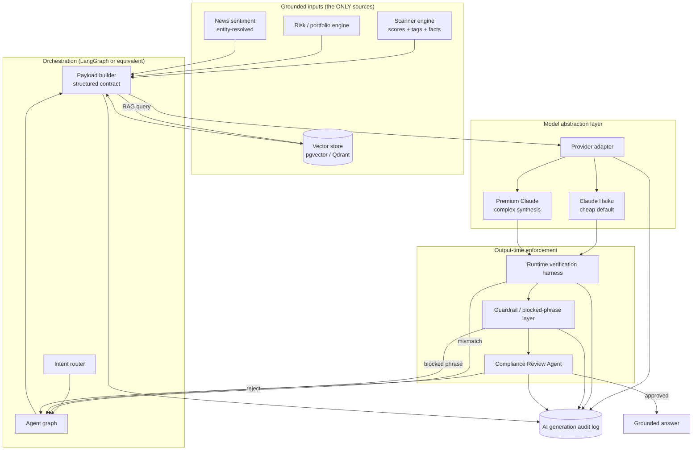
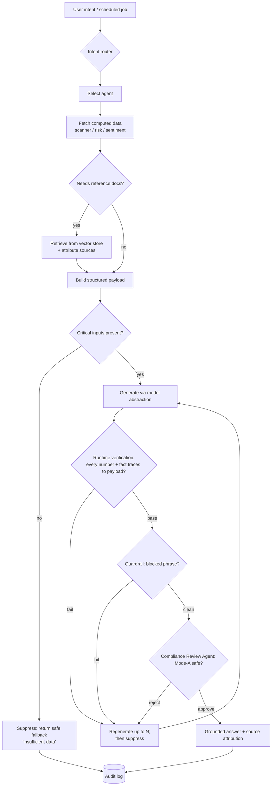
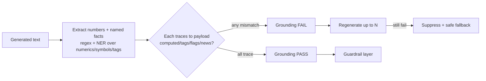
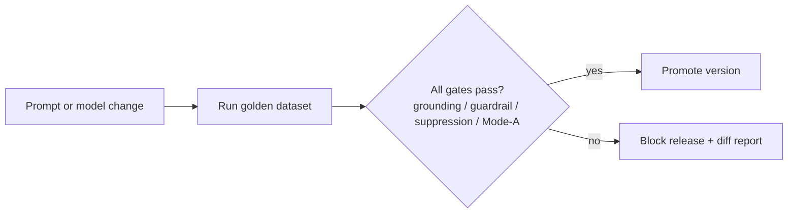
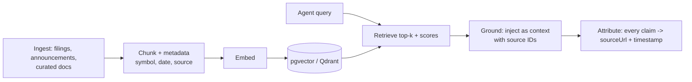

# 14 — AI / LLM Agent Architecture

The full AI/LLM/agentic layer: orchestration, RAG, model abstraction, per-agent contracts, the runtime verification harness, audit logging, and Mode-A guardrails. The AI **explains** grounded data; it never invents.

> Read first: [SPEC.md](../SPEC.md) (canonical source of truth).

---

## 0. First principles (non-negotiable)

1. **AI explains; it never invents** numbers, prices, news, targets, or returns ([SPEC.md §1, §6.6](../SPEC.md)). It operates only on a **structured payload contract**.
2. **Structured payload contract.** Every agent receives **only** computed metrics, scanner tags/sub-scores, news summaries (entity-resolved), and risk markers. It may reference **nothing else** ([SPEC.md §6.6](../SPEC.md)).
3. **Runtime verification at output time.** A validator extracts every number and named fact from each generation, confirms each traces to the payload, and **blocks or regenerates on mismatch** ([SPEC.md §6.6, §6.9](../SPEC.md)).
4. **Guardrails enforced at output time, not just in the prompt.** The versioned blocked-phrase list runs on the generated text ([SPEC.md §3.3, §6.9](../SPEC.md), [compliance](21-compliance-risk-and-guardrails.md)).
5. **Mode-A discipline.** No per-stock entry/target/stop, no "candidate" buy-leans, no ranked "what to buy" ([SPEC.md §3](../SPEC.md)).
6. **Suppress, don't guess.** Missing critical inputs → the summary is suppressed, not fabricated ([SPEC.md §6.2](../SPEC.md)).
7. **Provider abstraction + cost discipline.** Local-first MVP uses **Ollama** with **Gemma 4** (`gemma4:4b` cheap / `gemma4:12b` premium, requires Ollama ≥ 0.31) — zero cost, fully local (D-027, D-051). Cloud staging and production use **Claude Haiku** (`claude-haiku-4-5-20251001`) for repetitive summarization; a premium Claude model for complex synthesis ([SPEC.md §6.8, §9](../SPEC.md)). Provider is swapped via `SAAKSHYA_AI_PROVIDER` env var — no business-logic changes. Hard daily AI-call ceiling (configurable), regenerate-on-change cache, model tiering, latency budget.
8. **SEBI AI-use disclosure (Mode B).** Under RA, AI use must be disclosed; the registered analyst remains responsible ([SPEC.md §6.7](../SPEC.md)).

---

## 1. High-level architecture



- **Backend dependency:** scanner engine ([13](13-scanner-engine-and-scoring.md)), risk/portfolio engine ([16](16-portfolio-and-risk-engine.md)), news sentiment, vector store, model registry.
- **Acceptance criteria:** no agent output reaches the user without passing verification → guardrail → compliance review; every generation writes an audit record.

---

## 2. Agent-orchestration workflow



---

## 3. Model abstraction layer

A single `LLMProvider` interface decouples business logic from any vendor ([SPEC.md §9](../SPEC.md)).

```python
class LLMProvider(Protocol):
    def complete(self, *, prompt_id: str, prompt_version: str,
                 payload: dict, model_tier: str) -> LLMResult: ...
    # model_tier: "cheap" -> OllamaProvider (local) or claude-haiku-4-5-20251001 (cloud)
    #             "premium" -> OllamaProvider (same model locally) or premium Claude (cloud)
```

| Tier | Local-first (D-027, D-051) | Cloud staging / production | Use |
|---|---|---|---|
| **cheap (default)** | `gemma4:4b` via Ollama ≥ 0.31 (~3 GB, fast) | `claude-haiku-4-5-20251001` | Scanner explanations, per-stock summaries, repetitive daily passes |
| **premium** | `gemma4:12b` via Ollama ≥ 0.31 (~8 GB) | Premium Claude model | Market brief synthesis, multi-signal reasoning, complex synthesis |

Switch via `SAAKSHYA_AI_PROVIDER=anthropic` (requires `ANTHROPIC_API_KEY`). No code changes needed. (D-027, D-051)

**Cost / latency controls ([SPEC.md §6.8](../SPEC.md)):**
- **Regenerate-on-change:** re-summarize a stock only when its signal category changes; otherwise serve cached.
- **Daily AI-call ceiling** (`ai_daily_call_ceiling=500`, configurable) with graceful degradation to non-AI templated facts from permitted vocabulary.
- **Tiering:** full daily coverage for watched subset; on-demand + cached for the long tail (~2,000+ names).
- **Latency budget:** EOD generation finishes inside the overnight window; on-demand has a P95 target with a non-AI fallback.
- **Prompt caching** of the static system/contract prefix where the provider supports it.

---

## 4. The structured payload contract

Every agent receives one validated object. The model sees **only** this.

```json
{
  "payload": {
    "intent": "explain_scanner_result",
    "asOfDate": "2026-06-26",
    "asOfVersion": "ds-2026-06-26T20:15:00Z",
    "subject": { "type": "stock", "symbol": "TATAMOTORS.NS" },
    "computed": {
      "scanner": "momentum",
      "compositeScore": 87.4,
      "subScores": { "priceMomentum": 92.1, "maTrend": 88.0 },
      "facts": { "ret_3m_pct": 21.4, "close": 980.0, "sma50": 882.0, "vol_ratio": 2.4, "atr_pct": 3.4 }
    },
    "signalTags": ["MOMENTUM_STRONG", "ABOVE_50DMA"],
    "riskFlags": ["ELEVATED_VOLATILITY"],
    "newsSummaries": [
      { "headline": "...", "sentiment": "POSITIVE", "confidence": 0.82,
        "sourceUrl": "...", "publishedAt": "2026-06-25T11:00:00Z", "entityConfidence": 0.95 }
    ],
    "dataConfidence": "HIGH",
    "permittedVocabulary": "tag -> descriptive-phrase map (versioned)",
    "modeContext": "A"
  }
}
```

**Contract invariants:**
- The model may reference **only** values under `computed`, `signalTags`, `riskFlags`, `newsSummaries`.
- No field carries a forward price/target/stop/return — none exists upstream to pass.
- `dataConfidence == LOW` or missing critical field → **suppress** ([SPEC.md §6.2](../SPEC.md)).
- The payload is what the runtime harness validates against (§6) and what the audit log stores (§7).

---

## 5. The agents

Each agent: **purpose · input data · tools · output JSON schema · guardrails · failure behavior.** All inherit §0 principles.

### 5.1 Market Brief Agent
- **Purpose:** descriptive daily market summary — indices, breadth, sector leaders/laggards, scanner movers. **Never** a ranked "what to buy" ([SPEC.md §4 brief row](../SPEC.md)).
- **Input data:** index OHLC + breadth, sector strength scores, counts of stocks entering/exiting scanners.
- **Tools:** `get_market_breadth`, `get_sector_scores`, `get_scanner_deltas`. **Model tier:** premium (synthesis).
- **Output schema:**
  ```json
  { "asOfDate":"2026-06-26", "headline":"string (descriptive)",
    "indices":[{"name":"NIFTY 50","change_pct":0.6}],
    "breadth":{"advances":1100,"declines":820},
    "sectorLeaders":["NIFTY_AUTO"], "sectorLaggards":["NIFTY_IT"],
    "scannerActivity":[{"scanner":"momentum","entered":14,"exited":9}],
    "toMonitor":["string (event-framed)"], "disclaimer":"Not investment advice." }
  ```
- **Guardrails:** no ranked picks; "to monitor" is event-framed, never "to buy". **Failure:** suppress sections with missing inputs; never invent breadth numbers.

### 5.2 Stock Research Agent
- **Purpose:** grounded plain-language stock summary from structured signals only ([SPEC.md §4 §7.10 row, §5 worked example](../SPEC.md)).
- **Input data:** scanner result, indicators, risk flags, entity-resolved news summaries.
- **Tools:** `get_stock_signals`, `get_news_for_symbol`. **Model tier:** cheap (Haiku).
- **Output schema:**
  ```json
  { "symbol":"TATAMOTORS.NS","asOfDate":"2026-06-26",
    "summary":"string (descriptive, traceable)",
    "citedFacts":["ret_3m_pct","sma50","vol_ratio"],
    "riskNotes":["ELEVATED_VOLATILITY"],
    "sources":[{"url":"...","publishedAt":"..."}],
    "disclaimer":"Not investment advice." }
  ```
- **Guardrails:** drop directive tails ("before fresh action" → "is a level to watch"); no entry/target/stop. **Failure:** if `dataConfidence` LOW → suppress with "insufficient data to summarize".

### 5.3 Portfolio Risk Agent
- **Purpose:** factual portfolio-level and holding-level risk narration ([16](16-portfolio-and-risk-engine.md), [SPEC.md §4 portfolio row](../SPEC.md)).
- **Input data:** portfolio_risk scanner output (concentration, portfolio vol, per-holding flags).
- **Tools:** `get_portfolio_risk`. **Model tier:** cheap, premium for multi-factor synthesis.
- **Output schema:**
  ```json
  { "portfolioId":"u-8842","asOfDate":"2026-06-26",
    "portfolioNotes":["string (factual)"],
    "holdingNotes":[{"symbol":"ICICIBANK.NS","note":"closed below its 50-DMA","flags":["BROKE_50DMA"]}],
    "disclaimer":"Not investment advice." }
  ```
- **Guardrails:** never "sell/reduce/rebalance"; state events only. **Failure:** suppress per-holding note when its facts are missing.

### 5.4 News Impact Agent
- **Purpose:** summarize entity-resolved news + finance-tuned sentiment, with sources ([SPEC.md §6.4](../SPEC.md)).
- **Input data:** news items with symbol-link confidence, sentiment label + confidence, timestamps.
- **Tools:** `get_resolved_news`. **Model tier:** cheap.
- **Output schema:**
  ```json
  { "symbol":"INFY.NS","asOfDate":"2026-06-26",
    "items":[{"headline":"...","sentiment":"NEGATIVE","confidence":0.78,"source":"...","publishedAt":"..."}],
    "netSentiment":"MIXED","disclaimer":"Not investment advice." }
  ```
- **Guardrails:** below entity-confidence threshold → item dropped, not surfaced; no price-impact prediction. **Failure:** no resolved news → "no high-confidence news".

### 5.5 Scanner Explanation Agent
- **Purpose:** explain why a stock appears in a scanner, using the [scanner explanation payload](13-scanner-engine-and-scoring.md) only.
- **Input data:** scanner explanation payload (facts, sub-scores, tags, flags).
- **Tools:** `get_scanner_explanation_payload`. **Model tier:** cheap (highest volume path).
- **Output schema:**
  ```json
  { "symbol":"TATAMOTORS.NS","scanner":"momentum","asOfDate":"2026-06-26",
    "explanation":"appears in the momentum scanner; 3-month return +21.4%, trading above its 50-DMA, volume 2.4x its 20-day average; RSI elevated so risk is higher",
    "citedFacts":["ret_3m_pct","sma50","vol_ratio"], "riskFlags":["ELEVATED_VOLATILITY"],
    "disclaimer":"Not investment advice." }
  ```
- **Guardrails:** membership language only ("appears in / matches this filter"); never "buy the breakout". **Failure:** suppress if any cited fact absent from payload.

### 5.6 Strategy Builder Agent
- **Purpose:** translate a user's natural-language filter idea into a **scanner rule spec** (a list-producing filter), not calls ([SPEC.md §4 strategy row](../SPEC.md)). Phase 4.
- **Input data:** available indicators/fields catalog; user phrasing.
- **Tools:** `get_field_catalog`, `validate_rule_spec`. **Model tier:** premium.
- **Output schema:**
  ```json
  { "ruleSpec":{ "all":[{"field":"rsi_14","op":"<","value":30},
                        {"field":"vol_ratio","op":">=","value":1.5}] },
    "outputType":"list", "explanation":"string", "disclaimer":"Outputs a list, not recommendations." }
  ```
- **Guardrails:** output is a filter producing a **list**; rejects requests for target/stop fields (RA-gated). **Failure:** invalid field → ask user to clarify; never fabricate a field.

### 5.7 Backtest Interpreter Agent
- **Purpose:** narrate backtest results with honest framing ([SPEC.md §6.3](../SPEC.md)). Phase 4; only with integrity controls.
- **Input data:** backtest metrics (computed by the [backtesting engine](15-machine-learning-and-data-science.md)); assumptions; survivorship/look-ahead audit status.
- **Tools:** `get_backtest_result`. **Model tier:** premium.
- **Output schema:**
  ```json
  { "strategyId":"...","period":"2018-2025","metrics":{"hitRate":0.54,"avgSignalReturn_pct":3.1,"maxDrawdown_pct":22.0},
    "assumptions":["slippage included","delisted names retained"],
    "framing":"Past performance does not indicate future results.",
    "disclaimer":"Not investment advice." }
  ```
- **Guardrails:** must restate assumptions and the past-performance caveat; no extrapolation to future returns. **Failure:** if integrity audit not passed → refuse to narrate.

### 5.8 Compliance Review Agent
- **Purpose:** **infrastructure, required** ([SPEC.md §4 agentic row](../SPEC.md)). Final Mode-A gate on every user-visible AI output.
- **Input data:** candidate output text + payload + intent + mode context.
- **Tools:** `check_blocked_phrases`, `check_directive_language`, `check_grounding_report`. **Model tier:** cheap + deterministic rule pass.
- **Output schema:**
  ```json
  { "decision":"APPROVE|REJECT", "reasons":["..."],
    "blockedPhrases":[], "directiveLanguageHits":[], "ungroundedClaims":[] }
  ```
- **Guardrails:** is itself the guardrail; rejection routes back for regeneration, then suppression. **Failure (fail-closed):** on error → REJECT (never publish unreviewed AI text).

---

## 6. Runtime verification harness (hallucination prevention)

Runs on **every** generation, before guardrail/compliance ([SPEC.md §6.6](../SPEC.md)).



**Algorithm:**
1. **Extract** every numeric token, percentage, price, symbol, scanner tag, and named fact from the output.
2. **Match** each against the payload: numbers must equal a value under `computed`/`subScores`/`facts` (within float tolerance); tags/flags must be in `signalTags`/`riskFlags`; named entities in `newsSummaries`.
3. **On any unmatched item → FAIL.** Regenerate up to `N` (e.g. 2). Persisting failure → **suppress** with a safe fallback ("insufficient verified data").
4. **Record** a grounding report (matched/unmatched items) in the audit log.

**Acceptance criteria:** golden-dataset regression (§8) proves the harness blocks injected fabricated numbers/targets; no output with an unmatched number ever reaches the user.

---

## 7. AI generation audit log

Every generation (published or suppressed) writes an immutable record ([SPEC.md §6.6, §9](../SPEC.md), [database](11-database-architecture.md)).

```json
{
  "auditId":"gen-...","timestamp":"2026-06-26T20:31:00Z",
  "intent":"explain_scanner_result","agent":"scanner_explanation",
  "promptId":"scanner_explain","promptVersion":"v7",
  "modelTier":"cheap","modelId":"claude-haiku-4-5-20251001",
  "payloadHash":"sha256:...","payload":{"...":"as sent"},
  "rawOutput":"...","groundingReport":{"matched":[...],"unmatched":[]},
  "guardrailReport":{"blockedPhrases":[]},
  "complianceDecision":"APPROVE",
  "userVisibleOutput":"...","suppressed":false,
  "asOfVersion":"ds-2026-06-26T20:15:00Z","tokensIn":812,"tokensOut":140,"costUsd":0.0009
}
```

- **Stored:** prompt (id+version), input payload, model version, raw + user-visible output ([SPEC.md §6.6](../SPEC.md)).
- Enables incident replay, SEBI AI-use accountability (Mode B), and cost attribution.

---

## 8. Prompt versioning & golden-dataset evaluation

- **Prompt registry:** every prompt has `promptId` + `promptVersion`; changes are reviewed and stamped into every audit record.
- **Golden dataset:** curated payload→expected-properties cases (grounded facts present, fabricated facts blocked, directive phrasing rejected, suppression on missing inputs).
- **Regression on every prompt/model change** ([SPEC.md §6.6](../SPEC.md)): a prompt or model version cannot ship unless the golden suite passes (grounding, guardrail, suppression, Mode-A language). Metrics: grounding pass-rate, fabrication block-rate, false-suppression rate, directive-leak rate.



---

## 9. RAG flow (ingest → chunk → embed → retrieve → ground → attribute)

Used where reference context helps (e.g. corporate-announcement explanation, definitions). RAG content is **reference**, never a source of market numbers — numbers come from `computed`.



- **Stack:** LlamaIndex for RAG; pgvector (or Qdrant) for embeddings ([SPEC.md §9](../SPEC.md)).
- **Attribution:** retrieved facts carry source URL + timestamp; the runtime harness still verifies any number against `computed`, not against RAG prose.
- **Backend dependency:** vector store, document ingestion. **Acceptance criteria:** every RAG-derived claim is source-attributed; no market metric originates from RAG text.

---

## 10. Prohibited language → safe alternatives

Enforced at **output time** by the guardrail layer ([SPEC.md §3.3, §5, §6.9](../SPEC.md), [compliance](21-compliance-risk-and-guardrails.md)).

| Prohibited (blocked, every mode) | Safe alternative |
|---|---|
| "guaranteed", "assured/confirmed target", "risk-free", "sure-shot", "multibagger", "buy now", "best stock for you" | **Blocked** — regenerate/suppress |
| "momentum candidate" (buy-lean) | "appears in the momentum scanner" |
| "stop-loss / target / entry zone" | **Not shown in Mode A** (RA-gated) |
| "support / resistance zone" | "historically a resistance zone" |
| "Sell X" / "exit this holding" | "X broke below its 50-DMA" |
| "what to buy/sell next session" | "stocks that entered/exited the momentum scanner today" |
| "…before fresh action" | "…is a level to watch" |

---

## 11. SEBI AI-use disclosure (Mode B)

When operating under **RA (Mode B)** ([SPEC.md §6.7](../SPEC.md)): the registered analyst **must disclose AI use** to clients and remains fully responsible for AI-assisted output. Build into onboarding + terms; the audit log (§7) is the evidence trail. Not applicable to Mode-A descriptive analytics, but the disclosure and audit plumbing ships now so Mode B is turnkey.

---

## 12. Failure behavior summary

| Condition | Behavior |
|---|---|
| Missing critical input / `dataConfidence == LOW` | **Suppress**, safe fallback ([SPEC.md §6.2](../SPEC.md)) |
| Number/fact not in payload | Verification FAIL → regenerate → suppress |
| Blocked phrase in output | Guardrail block → regenerate → suppress |
| Compliance Review REJECT | Regenerate → suppress (fail-closed) |
| Provider/timeout error | Non-AI templated fact fallback; over budget → graceful degradation ([SPEC.md §6.8](../SPEC.md)) |

---

## 13. Related documents

- [10 — API contracts](10-api-contracts.md)
- [11 — Database architecture](11-database-architecture.md)
- [13 — Scanner engine and scoring](13-scanner-engine-and-scoring.md)
- [15 — Machine learning and data science](15-machine-learning-and-data-science.md)
- [16 — Portfolio and risk engine](16-portfolio-and-risk-engine.md)
- [21 — Compliance, risk and guardrails](21-compliance-risk-and-guardrails.md)
- [29 — Glossary](29-glossary.md)
- [30 — Decision log](30-decision-log.md)
