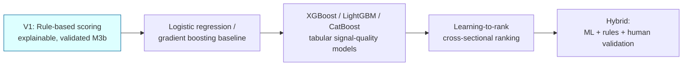
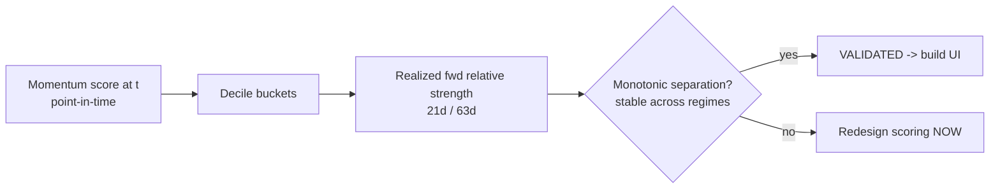
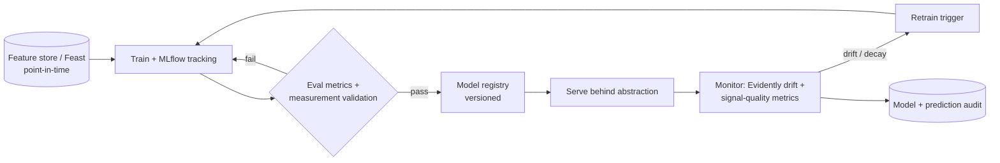

# 15 — Machine Learning and Data Science

The ML/data-science layer and its disciplined evolution from rule-based scoring to ML-assisted ranking — framed as **measurement and validation, never performance promises**.

> Read first: [SPEC.md](../SPEC.md) (canonical source of truth).

---

## 0. First principles (non-negotiable)

1. **V1 is rule-based, not ML.** Scanner scoring is rule-based and explainable in v1 ([13](13-scanner-engine-and-scoring.md)). ML ranking is a **later phase** (Phase 4–5; [SPEC.md §4, §10](../SPEC.md)). This document is mostly forward-looking; nothing here weakens the v1 rule-based core.
2. **Measurement, not promises.** Every model outputs **probability bands / measured separation**, never exact-price or return guarantees. **Probability bands never become return promises** ([SPEC.md §3.3, §4 ML row](../SPEC.md)).
3. **The M3b spike comes first.** Before any ML, prove that the **rule-based** momentum score tracks realized relative strength ([SPEC.md §6.5, §12](../SPEC.md)). If the deterministic score is noise, ML on top of bad features is wasted ([13 §7.1](13-scanner-engine-and-scoring.md)).
4. **Corp-action-adjusted, point-in-time, no look-ahead.** All features and labels use adjusted series and only data available at each decision point ([SPEC.md §6.1–6.3](../SPEC.md)).
5. **Human validation stays in the loop.** The end state is **hybrid ML + rules + human validation**, not autonomous ML.
6. **Mode-A discipline holds.** ML ranking still produces **descriptive lists / probability bands**, never per-stock entry/target/stop or "what to buy" ([SPEC.md §3](../SPEC.md)).

---

## 1. The evolution path

| Stage | What it adds | Ships | Guardrail |
|---|---|---|---|
| **V1 rule-based** | Transparent weighted score ([13](13-scanner-engine-and-scoring.md)) | v1 | Validated (M3b) before UI |
| **LogReg / GBM baseline** | First learned signal-quality probability | Phase 4 | Probability band, not a call |
| **XGBoost/LightGBM/CatBoost** | Stronger tabular models, feature importance | Phase 4 | Explainability retained (SHAP) |
| **Learning-to-rank** | Cross-sectional relative ranking | Phase 4–5 | Output is a ranked **list**, descriptive |
| **Hybrid + human validation** | Rules guard ML; humans validate before exposure | Phase 5 | Measurement-framed; no return promise |

> **Rule:** ML never replaces the explainable rule layer outright — it **augments** it. The composite remains decomposable; ML outputs are added as **separately labelled** probability bands, gated on the same validation discipline.

---

## 2. Models and their features

Each model: **purpose · features · output (measurement-framed) · guardrail.**

### 2.1 Momentum / signal-quality model
- **Purpose:** estimate probability that a momentum signal is "high quality" (separates from universe by realized forward relative strength). Augments [13 §4.1](13-scanner-engine-and-scoring.md).
- **Features:** `ret_1m/3m/6m`, `rs_3m` vs Nifty, `momentum_raw`, `maTrend` sub-score, `vol_ratio`, `atr_pct`, `pct_above_50dma`, sector strength, slope_50.
- **Output:** `signalQualityProb` (probability band, e.g. 0.6–0.7), never a price/return.
- **Guardrail:** band displayed as measurement; never "expected to return X%".

### 2.2 Clustering (regime / behavior grouping)
- **Purpose:** group stocks by behavioral similarity (volatility/momentum/liquidity profile) for context, not selection.
- **Features:** volatility, beta, momentum, liquidity, sector.
- **Output:** cluster label + descriptive profile. **Guardrail:** descriptive only; no "buy the cluster".

### 2.3 Anomaly detection (volume)
- **Purpose:** flag abnormal volume/delivery beyond simple ratio thresholds ([13 §4.2](13-scanner-engine-and-scoring.md)).
- **Features:** `vol_ratio`, `delivery_z`, rolling volume distribution, price-volume divergence.
- **Output:** `VOLUME_ANOMALY` flag + anomaly score. **Guardrail:** event flag, not a call; feeds risk flags.

### 2.4 Volatility classification
- **Purpose:** classify volatility regime (low/medium/high) for risk tiering and the low-/high-risk scanners ([13 §4.8–4.9](13-scanner-engine-and-scoring.md)).
- **Features:** `atr_pct`, realized vol, gap frequency, drawdown, beta.
- **Output:** `volatilityClass`. **Guardrail:** drives the `ELEVATED_VOLATILITY` risk flag.

### 2.5 Probability bands (signal outcome)
- **Purpose:** express likelihood ranges of relative-strength persistence over a horizon — **measurement**.
- **Features:** signal-quality features + regime + sector rotation state.
- **Output:** banded probability (e.g. "55–65% historically persisted 21d"). **Guardrail:** **never** a return promise ([SPEC.md §4 ML row](../SPEC.md)); always with horizon and sample framing.

### 2.6 News sentiment model (finance-tuned)
- **Purpose:** finance-tuned sentiment/impact, evaluated on a **labelled Indian-market set** ([SPEC.md §6.4](../SPEC.md)) (a general model fails on "misses estimates, stock rallies").
- **Features:** finance-tuned embeddings, entity-resolution confidence, headline/body, event type.
- **Output:** sentiment label + confidence + source link. **Guardrail:** below entity-confidence threshold → not surfaced; no price-impact prediction.

### 2.7 Sector rotation model
- **Purpose:** model relative sector momentum/rotation state for the sector dashboard ([13 §4.7](13-scanner-engine-and-scoring.md)).
- **Features:** sector RS, breadth, flows proxy, cross-sector correlation.
- **Output:** rotation state + leading/lagging ranks. **Guardrail:** comparative/descriptive, not directive.

### 2.8 Portfolio risk model
- **Purpose:** portfolio-level risk measurement ([16](16-portfolio-and-risk-engine.md), [13 §4.13](13-scanner-engine-and-scoring.md)).
- **Features:** holding weights, covariance, concentration, sector exposure, per-holding volatility.
- **Output:** portfolio vol, concentration flags, risk score. **Guardrail:** factual flags only; never "sell/reduce".

---

## 3. Evaluation metrics

Models are judged on measurement quality and downstream signal characteristics — **not** on implied returns.

| Metric | Applies to | Meaning |
|---|---|---|
| Precision / Recall / F1 | classifiers (sentiment, anomaly, vol class) | classification correctness |
| AUC | probability models | rank-separation quality |
| Hit rate | signal-quality / ranking | fraction of signals meeting the measured criterion |
| Signal return (measured) | ranking / probability | realized relative strength after signal — **reported as measurement**, framed past-performance |
| Drawdown after signal | signal-quality | adverse excursion characterization |
| False-positive rate | anomaly / signal | spurious-signal rate |
| Sector-wise performance | all | per-sector stability |
| Market-regime performance | all | bull / bear / sideways robustness |

> "Signal return" and "drawdown after signal" are **descriptive characterizations of historical behavior**, governed by the same honest-framing rules as backtesting ([SPEC.md §6.3](../SPEC.md)). They are never presented as expected future returns.

---

## 4. The M3b score-validation spike (gates the product)

The foundational data-science task — **before** any ML and before UI ([SPEC.md §6.5, §12](../SPEC.md), [13 §7.1](13-scanner-engine-and-scoring.md)).

- **Question:** does the **rule-based** momentum score track **realized relative strength**?
- **Method:**
  1. On historical adjusted data, compute the momentum sub-score for each eligible name at time *t* (point-in-time, no look-ahead).
  2. Bucket into deciles by score.
  3. Measure realized forward relative strength vs Nifty over 21d / 63d per decile.
  4. Test for **monotonic separation** across deciles (and stability across regimes/sectors).
- **Outcome:** signal → `validationStatus = VALIDATED`, build UI on the composite. Noise → **redesign scoring now** ([13 §3.3](13-scanner-engine-and-scoring.md)). Record in [decision log](30-decision-log.md).
- **Framing:** measurement validation, **not** a performance claim. The output is "the score separates realized relative strength," never "the score predicts returns."

---

## 5. MLOps

| Concern | Tool | Use |
|---|---|---|
| Experiment tracking | **MLflow** | params, metrics, artifacts per run |
| Feature store | **Feast** | consistent point-in-time features (train == serve), no leakage |
| Model registry | **MLflow Registry** | versioned models; stage gating (staging → prod) |
| Drift monitoring | **Evidently** | feature + prediction drift; alerting |
| Retraining cadence | scheduled | periodic + drift-triggered; validation gate before promotion |

- **Backend dependency:** feature store, model registry, monitoring; integrates with the AI audit log ([14 §7](14-ai-llm-agent-architecture.md)).
- **Acceptance criteria:** train-time and serve-time features are identical (point-in-time via Feast); no model reaches production without passing eval **and** measurement validation; drift alerts trigger retraining; every prediction is attributable to a model version.

---

## 6. Model monitoring (production)

- **Feature drift / prediction drift** (Evidently) with thresholds + alerting.
- **Signal-quality decay:** track hit rate / separation over time; degraded separation → revalidate or retire.
- **Regime-aware monitoring:** report metrics per market regime; a model strong only in bull markets is flagged.
- **Sector-wise monitoring:** detect localized degradation.
- **Fail-safe:** on validation failure or drift breach, **fall back to the rule-based score** (the explainable v1 path is always available).

---

## 7. Compliance summary for this module

- ML is **Phase 4–5**, augmenting — never replacing — the v1 explainable rule-based core ([SPEC.md §4](../SPEC.md)).
- All outputs are **probability bands / measured separation**, **never** return promises ([SPEC.md §3.3](../SPEC.md)).
- M3b proves measurement, not performance, and gates the product ([SPEC.md §6.5](../SPEC.md)).
- ML ranking still yields **descriptive lists** under Mode A — no entry/target/stop, no "what to buy" ([SPEC.md §3](../SPEC.md)).
- "Signal return" / "drawdown after signal" obey backtesting honesty rules ([SPEC.md §6.3](../SPEC.md), [compliance](21-compliance-risk-and-guardrails.md)).

---

## 8. Related documents

- [10 — API contracts](10-api-contracts.md)
- [11 — Database architecture](11-database-architecture.md)
- [13 — Scanner engine and scoring](13-scanner-engine-and-scoring.md)
- [14 — AI/LLM agent architecture](14-ai-llm-agent-architecture.md)
- [16 — Portfolio and risk engine](16-portfolio-and-risk-engine.md)
- [21 — Compliance, risk and guardrails](21-compliance-risk-and-guardrails.md)
- [30 — Decision log](30-decision-log.md)
