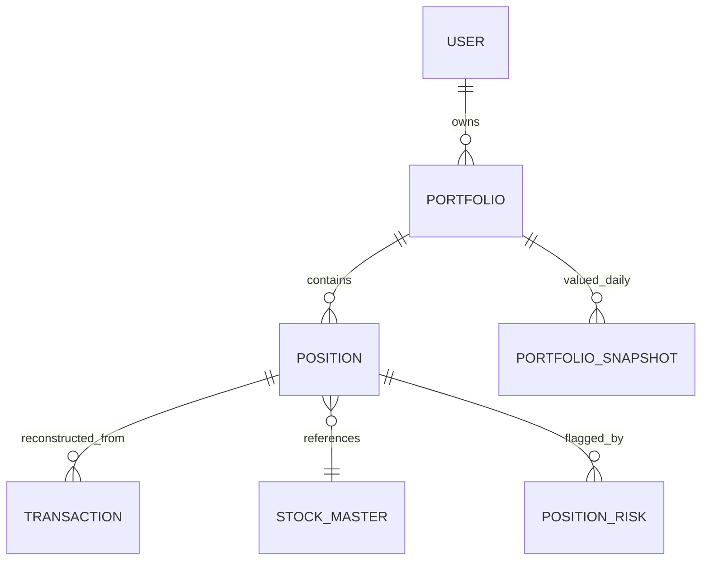
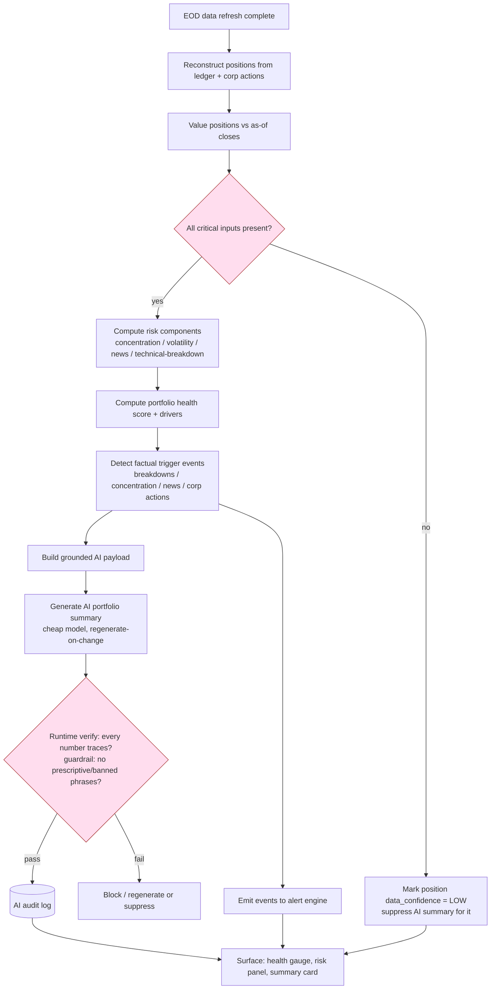

# 16 — Portfolio and Risk Engine

Portfolio tracking, holdings analytics, and the risk engine — including the Mode-A boundary that keeps factual risk flags legal while RA-gated stop-loss / target zones are deferred.

> Read first: [SPEC.md](../SPEC.md) (canonical source of truth).

---

## 0. Scope and the Mode-A boundary (read before everything else)

This module covers two things that must be kept conceptually separate:

1. **Portfolio tracking** — holdings, cost basis, P&L, allocation, exposure. Pure accounting and analytics. Mode-A safe.
2. **Risk monitoring** — concentration, volatility, news, technical-breakdown risk; a portfolio health score; AI portfolio summaries; and portfolio alerts.

The single hardest rule in this document, from [SPEC.md §4](../SPEC.md) and [SPEC.md §5](../SPEC.md):

> **In Mode A, portfolio risk output is FACTUAL EVENT REPORTING, never prescription.**
> Permitted: *"You hold TATAMOTORS; it closed below its 50-DMA today."*
> Prohibited: *"Sell TATAMOTORS."* / *"Reduce your TATAMOTORS position."* / *"Book profit."*

| Concept | Mode-A behaviour (v1) | RA-gated (Mode B, Phase 5) |
|---|---|---|
| Technical breakdown | **Factual flag**: "broke below 50-DMA" | — |
| Stop-loss zone monitoring | **NOT shown.** Defined here for Mode-B build only | Per-stock SL level + breach alert ([SPEC.md 5.21](../SPEC.md)) |
| Target zone monitoring | **NOT shown.** Defined here for Mode-B build only | Per-stock target level + approach alert ([SPEC.md 5.21](../SPEC.md)) |
| Support / resistance | **Descriptive only**: "historically a resistance zone" | — |
| AI portfolio summary | Describes facts + signals; recommends nothing | May discuss positioning |
| Risk flags | Report the **event**; user decides | May suggest action |

Everything below is written for **Mode A v1** unless a section is explicitly labelled **[RA-GATED / Mode B]**. RA-gated logic is documented so the data model and engine are forward-compatible, but **it is not built or surfaced in v1** — building it locally would create the substance-over-form exposure [SPEC.md §12](../SPEC.md) warns against.

Cross-links: [database](11-database-architecture.md) · [API](10-api-contracts.md) · [AI](14-ai-llm-agent-architecture.md) · [compliance](21-compliance-risk-and-guardrails.md) · [scanner](13-scanner-engine-and-scoring.md) · [alerts](17-alerts-and-notifications.md) · [news/sentiment](18-news-sentiment-and-corporate-actions.md).

---

## 1. Portfolio data model

### 1.1 Entities

A user holds **positions**. Positions are reconstructed from **transactions** (the source of truth for cost basis and realized P&L). EOD valuation is derived from the as-of-versioned price store.



### 1.2 Transaction (source of truth)

```json
{
  "transaction_id": "txn_01HX...",
  "portfolio_id": "pf_01HX...",
  "symbol": "TATAMOTORS",
  "exchange": "NSE",
  "type": "BUY",
  "quantity": 50,
  "price": 612.40,
  "trade_date": "2026-03-11",
  "charges": 18.55,
  "source": "MANUAL",
  "corp_action_adjusted": false,
  "as_of_version": "2026-03-11T18:30:00Z"
}
```

- `type`: `BUY` | `SELL` | `BONUS` | `SPLIT` | `DIVIDEND` | `RIGHTS` | `MERGER_IN` | `MERGER_OUT`.
- Corporate-action transactions are **synthesized** from the `corporate_actions` master ([data ingestion](12-data-ingestion-and-market-data.md), [SPEC.md §6.1](../SPEC.md)) so cost basis and quantity stay correct through splits/bonuses. A 1:1 bonus doubles quantity and halves average cost; it must never read as a 50% loss.

### 1.3 Position (derived holding)

```json
{
  "position_id": "pos_01HX...",
  "portfolio_id": "pf_01HX...",
  "symbol": "TATAMOTORS",
  "exchange": "NSE",
  "quantity": 50,
  "avg_buy_price": 612.77,
  "invested_value": 30638.50,
  "last_close": 698.20,
  "current_value": 34910.00,
  "unrealized_pnl": 4271.50,
  "unrealized_pnl_pct": 13.94,
  "realized_pnl": 0.00,
  "day_change_pct": -1.82,
  "sector": "Automobile",
  "market_cap_band": "LARGE",
  "as_of_date": "2026-06-26",
  "data_confidence": "HIGH"
}
```

### 1.4 Field definitions and formulas

| Field | Definition / formula |
|---|---|
| `quantity` | Σ buy qty − Σ sell qty (corp-action adjusted) |
| `avg_buy_price` | (Σ buy notional + buy charges) ÷ Σ buy qty, recomputed on corp actions |
| `invested_value` | `quantity × avg_buy_price` |
| `current_value` | `quantity × last_close` (last as-of EOD close) |
| `unrealized_pnl` | `current_value − invested_value` |
| `unrealized_pnl_pct` | `unrealized_pnl ÷ invested_value × 100` |
| `realized_pnl` | Σ over sells of `(sell_price − avg_buy_price_at_sale) × sold_qty − charges` (FIFO; see 1.5) |
| `day_change_pct` | `(last_close − prev_close) ÷ prev_close × 100` |
| `market_cap_band` | LARGE / MID / SMALL / MICRO from stock master |

All monetary values display as-of a stated EOD date. If the latest close is missing or quarantined, the position carries `data_confidence: LOW` and AI summaries over it are **suppressed, not guessed** ([SPEC.md §6.2](../SPEC.md)).

### 1.5 Cost-basis method

Default **FIFO** (first-in-first-out) for realized P&L, matching common Indian retail tax treatment. Method is a portfolio-level setting (`FIFO` | `WEIGHTED_AVG`) so the displayed P&L stays consistent. Saakshya does **not** compute tax liability — realized P&L is informational; this is stated in the UI.

**Backend dependency:** transaction ledger, FIFO/WAVG reducer, corp-action transaction synthesizer, as-of price join.
**Frontend dependency:** holdings table, transaction entry/import, per-position drill-down.
**Data dependency:** `corporate_actions` master, as-of-versioned EOD closes, stock master (sector, market-cap band).
**Acceptance criteria:** (a) a 1:2 split and a 1:1 bonus on a test symbol leave `invested_value` unchanged and `quantity`/`avg_buy_price` correct; (b) realized P&L matches a hand-computed FIFO worked example to the paisa; (c) a missing close yields `data_confidence: LOW` and suppresses the AI summary, never a guessed value.

---

## 2. Portfolio-level analytics

### 2.1 Aggregate metrics

```json
{
  "portfolio_id": "pf_01HX...",
  "as_of_date": "2026-06-26",
  "total_invested": 482300.00,
  "total_current_value": 531870.00,
  "total_unrealized_pnl": 49570.00,
  "total_unrealized_pnl_pct": 10.28,
  "total_realized_pnl_ytd": 12840.00,
  "day_change_value": -6120.00,
  "day_change_pct": -1.14,
  "holdings_count": 11,
  "data_confidence": "HIGH"
}
```

### 2.2 Allocation views

| View | Definition |
|---|---|
| **Stock allocation** | each position `current_value ÷ total_current_value` |
| **Sector allocation** | Σ position value by `sector` ÷ total |
| **Market-cap exposure** | Σ position value by `market_cap_band` ÷ total |

```json
{
  "sector_allocation": [
    {"sector": "Banking", "weight_pct": 31.4, "value": 167007.18},
    {"sector": "Automobile", "weight_pct": 19.2, "value": 102119.04},
    {"sector": "IT", "weight_pct": 14.0, "value": 74461.80}
  ],
  "market_cap_exposure": [
    {"band": "LARGE", "weight_pct": 58.0},
    {"band": "MID", "weight_pct": 31.0},
    {"band": "SMALL", "weight_pct": 11.0}
  ]
}
```

**Backend dependency:** aggregation over positions joined to stock master.
**Frontend dependency:** donut/treemap for sector & cap allocation, sortable holdings table.
**Data dependency:** stock master sector + cap band, as-of closes.
**Acceptance criteria:** allocation weights sum to 100% (±0.1 rounding); a single-stock portfolio shows 100% concentration in that stock and its sector.

---

## 3. Risk engine

The risk engine computes per-position and portfolio-level risk **components**, each derived from visible data so every flag is traceable ([SPEC.md §6](../SPEC.md), [scanner](13-scanner-engine-and-scoring.md) shares the indicator layer). Risk scoring is called out in [SPEC.md §4](../SPEC.md) as "defensible and differentiating" — it is a core Mode-A feature, **not** advice.

### 3.1 Risk components (per position)

| Component | What it measures | Inputs | Output |
|---|---|---|---|
| **Concentration risk** | Over-exposure to one stock | position weight | 0–100 |
| **Sector concentration** | Over-exposure to one sector | sector weight | 0–100 |
| **Market-cap exposure risk** | Tilt to small/micro-caps | cap-band weights | 0–100 |
| **Volatility risk** | Short-term price instability | 20-day ATR%, realized vol | 0–100 |
| **News risk** | Recent negative/elevated news | finance-tuned sentiment, impact ([news](18-news-sentiment-and-corporate-actions.md)) | 0–100 |
| **Technical-breakdown risk** | Loss of technical support | MA breaks, breakdown scanner ([scanner](13-scanner-engine-and-scoring.md)) | 0–100 |

Each component is **deterministic and explainable**: it ships with the data points that produced it (e.g. "ATR% = 4.1, 88th percentile vs its 1-year range").

### 3.2 Component formulas

**Concentration risk (per position):**

```
concentration_risk = clamp( (weight_pct / SINGLE_STOCK_SOFT_CAP) * 50 , 0, 100 )
# SINGLE_STOCK_SOFT_CAP = 20%  -> a 20% position scores 50; a 40%+ position saturates at 100
```

**Volatility risk:**

```
atr_pct        = ATR(14) / last_close * 100
vol_percentile = percentile_rank(atr_pct, trailing_1y_atr_pct_distribution)   # 0..1
volatility_risk = round(vol_percentile * 100)
```

**Technical-breakdown risk** (sum of breached conditions, capped):

```
score = 0
if close < SMA50:  score += 30
if close < SMA200: score += 30
if breakdown_scanner_hit: score += 25
if close < recent_swing_low: score += 15
technical_breakdown_risk = clamp(score, 0, 100)
```

**News risk:**

```
news_risk = clamp( max_negative_impact_last_7d * 100 , 0, 100 )
# impact in [0,1] from the finance-tuned classifier; only links above the
# surfacing confidence threshold count (see news doc 18, SPEC 6.4)
```

All thresholds (`SINGLE_STOCK_SOFT_CAP`, windows, weights) are versioned config in the admin console, mirroring scanner-score governance ([SPEC.md §6.5](../SPEC.md)).

### 3.3 [RA-GATED / Mode B] Stop-loss & target zone monitoring

> **NOT shown in Mode A.** Per-stock stop-loss / target / entry zones are advisory-in-substance ([SPEC.md 5.21](../SPEC.md), [SPEC.md §5](../SPEC.md)) and ship **only** under RA registration (Phase 5). Documented here so the engine and schema are forward-compatible.

When (and only when) RA is in force, the engine may compute and monitor:

```json
{
  "ra_gated": true,
  "mode_required": "B",
  "symbol": "TATAMOTORS",
  "stop_loss_zone": {"low": 642.0, "high": 651.0, "basis": "below 50-DMA + 1xATR"},
  "target_zone": {"low": 760.0, "high": 775.0, "basis": "prior swing high"},
  "monitoring": {"sl_breached": false, "target_approached": false}
}
```

In Mode A these objects are **never populated and never returned by the API**. The equivalent *factual* signal a Mode-A user sees is the technical-breakdown flag ("closed below its 50-DMA") — the event, not a level to act on. See [compliance](21-compliance-risk-and-guardrails.md) and [alerts §stop-loss-zone](17-alerts-and-notifications.md).

**Backend dependency:** risk-component calculators sharing the indicator layer; RA-gating feature flag that hard-excludes SL/target objects in Mode A.
**Frontend dependency:** per-position risk panel showing components + evidence; **no** SL/target UI in Mode A.
**Data dependency:** indicators, breakdown scanner, news sentiment/impact, allocation weights.
**Acceptance criteria:** (a) every component returns with its underlying evidence; (b) in Mode A, no API response contains `stop_loss_zone` / `target_zone`; a contract test asserts their absence; (c) technical-breakdown flags are phrased as events, validated against the blocked-phrase list at output time.

---

## 4. Portfolio health score

A single 0–100 score summarizing portfolio **risk posture** (higher = healthier / lower aggregate risk). It is a **diagnostic measurement, not a grade of "good/bad investing"** and never implies a buy/sell action — the UI states this.

### 4.1 Components and weights

| Component | Weight | Direction | Source |
|---|---|---|---|
| Diversification (inverse concentration) | **25%** | higher diversification → higher | stock + sector concentration |
| Sector balance | **15%** | more balanced → higher | sector allocation entropy |
| Volatility profile | **20%** | lower portfolio vol → higher | weighted volatility risk |
| Technical health | **20%** | fewer breakdowns → higher | weighted technical-breakdown risk |
| News risk profile | **10%** | less negative news → higher | weighted news risk |
| Market-cap balance | **10%** | less micro/small tilt → higher | cap-band exposure |

Weights are **versioned config** and, like scanner weights ([SPEC.md §6.5](../SPEC.md)), are treated as arbitrary-until-validated: they describe a risk posture, they do **not** claim to predict returns.

### 4.2 Formula

```
# Each sub_health in [0,100], where 100 = lowest risk for that dimension.
diversification_health = 100 - clamp(weighted_concentration_risk, 0, 100)
sector_balance_health  = sector_entropy_norm * 100        # Shannon entropy of sector weights, normalized
volatility_health      = 100 - weighted(volatility_risk)
technical_health       = 100 - weighted(technical_breakdown_risk)
news_health            = 100 - weighted(news_risk)
cap_balance_health     = 100 - micro_small_tilt_penalty

portfolio_health_score = round(
    0.25*diversification_health +
    0.15*sector_balance_health  +
    0.20*volatility_health      +
    0.20*technical_health       +
    0.10*news_health            +
    0.10*cap_balance_health
)

# weighted(x) = Σ_i (position_weight_i * x_i)
```

Bands (descriptive labels only): **80–100 Resilient · 60–79 Balanced · 40–59 Elevated risk · 0–39 High risk**. Labels describe the measurement; they are **not** instructions.

```json
{
  "portfolio_health_score": 64,
  "band": "Balanced",
  "components": {
    "diversification_health": 58,
    "sector_balance_health": 61,
    "volatility_health": 70,
    "technical_health": 66,
    "news_health": 80,
    "cap_balance_health": 55
  },
  "drivers": [
    "Banking is 31.4% of the portfolio (above the 25% balance reference).",
    "2 of 11 holdings closed below their 50-DMA today."
  ],
  "as_of_date": "2026-06-26"
}
```

**Backend dependency:** component calculators, entropy + tilt helpers, weight config service.
**Frontend dependency:** health gauge + component breakdown + drivers list (each driver traceable).
**Data dependency:** allocation, indicators, sentiment.
**Acceptance criteria:** (a) score is reproducible from the components and versioned weights; (b) a concentrated single-sector portfolio scores materially lower on diversification + sector balance; (c) every driver line names the data point behind it; (d) no band label or driver contains prescriptive language.

---

## 5. AI portfolio summary

### 5.1 Grounding contract

The AI portfolio summary is generated under the **structured payload contract** ([SPEC.md §6.6](../SPEC.md), [AI](14-ai-llm-agent-architecture.md)). The agent receives **only**: aggregate metrics, allocation views, per-position risk components + evidence, health score + drivers, and surfaced news summaries. It may reference **nothing else** and **invents nothing**.

```json
{
  "payload_type": "portfolio_summary_v1",
  "as_of_date": "2026-06-26",
  "aggregate": { "total_unrealized_pnl_pct": 10.28, "day_change_pct": -1.14, "holdings_count": 11 },
  "health": { "score": 64, "band": "Balanced", "drivers": ["Banking 31.4%", "2 holdings below 50-DMA"] },
  "concentration": { "top_stock": {"symbol": "HDFCBANK", "weight_pct": 14.0},
                     "top_sector": {"sector": "Banking", "weight_pct": 31.4} },
  "events": [
    {"symbol": "TATAMOTORS", "event": "closed below 50-DMA", "value": 698.2, "sma50": 705.6},
    {"symbol": "INFY", "event": "news sentiment classified negative", "impact": 0.42,
     "headline": "Q1 revenue guidance trimmed", "source": "exchange_filing", "ts": "2026-06-26T11:20:00Z"}
  ],
  "guardrail_mode": "A"
}
```

Every number in the output must trace to this payload; the **runtime validator blocks or regenerates on mismatch** ([SPEC.md §6.6](../SPEC.md)). Output is checked against the blocked-phrase list ([SPEC.md §6.9](../SPEC.md), [compliance](21-compliance-risk-and-guardrails.md)) before display, and the full generation is written to the AI audit log.

### 5.2 Mode-A wording rules

| Allowed (factual / descriptive) | Prohibited (prescriptive / promise) |
|---|---|
| "2 of your 11 holdings closed below their 50-DMA today." | "Sell the holdings below their 50-DMA." |
| "Banking is your largest sector at 31.4%." | "Reduce your banking exposure." |
| "INFY news sentiment was classified negative today." | "Exit INFY before it falls further." |
| "Portfolio volatility profile is elevated this week." | "Move to safer stocks." |
| "This is a level to watch." | "…should be monitored **before fresh action**." |

The AI **reports events and what to monitor**; the user draws conclusions. No guarantee / assured / sure-shot / risk-free / multibagger / buy-now / best-stock language, in any mode ([SPEC.md §3.3](../SPEC.md)).

### 5.3 Example — Mode-A-compliant AI portfolio summary

> **Portfolio snapshot — as of 26 Jun 2026.** Your portfolio is up **10.3%** on invested value and fell **1.1%** today. The portfolio health score is **64 (Balanced)**.
>
> Two factual observations from today's data: **Banking** is your largest sector at **31.4%**, above the 25% balance reference used by the health score; and **2 of your 11 holdings — TATAMOTORS and AXISBANK — closed below their 50-day moving average**. TATAMOTORS closed at ₹698.2 versus its 50-DMA of ₹705.6.
>
> One news item was flagged: **INFY** news sentiment was classified **negative** today following a trimmed Q1 revenue-guidance headline (exchange filing, 26 Jun 11:20). Short-term volatility across the portfolio is **elevated** this week.
>
> These are observations to be aware of, not recommendations. *(Not investment advice.)*

Note what is absent: no "sell", no "reduce", no target, no stop-loss, no return promise. Every figure traces to the payload.

**Backend dependency:** payload builder, provider-abstracted LLM call (cheap model for routine summaries, [SPEC.md §6.8](../SPEC.md)), runtime verifier, guardrail filter, audit logger.
**Frontend dependency:** summary card with "as-of" stamp + data-confidence badge + "Not investment advice" footer.
**Data dependency:** everything in §1–§4 plus surfaced news ([news](18-news-sentiment-and-corporate-actions.md)).
**Acceptance criteria:** (a) a fabricated figure in a regression prompt is blocked by the verifier; (b) injecting "sell"/"target" into the model output is caught by the guardrail filter; (c) when any holding has `data_confidence: LOW`, the summary is suppressed for that holding, not guessed; (d) every generation has an audit-log row.

---

## 6. Portfolio alert triggers

Portfolio alerts are **event-reporting** ([SPEC.md 5.15](../SPEC.md)); full alert mechanics live in [alerts](17-alerts-and-notifications.md). The portfolio engine **emits trigger events** after the EOD refresh; the alert engine debounces, dedups, templates, and delivers them.

| Trigger | Condition (Mode A) | Emits |
|---|---|---|
| Holding technical breakdown | a held stock closes below 50-DMA / 200-DMA / swing low | factual event |
| Holding in breakdown scanner | a held stock enters the breakdown scanner | scanner-membership event |
| Sector concentration breach | a sector weight crosses a user threshold (e.g. >30%) | factual event |
| Single-stock concentration breach | a position weight crosses a user threshold (e.g. >20%) | factual event |
| Holding negative news | surfaced negative news (above confidence threshold) on a held stock | news event |
| Holding corporate action | dividend / split / bonus / buyback on a held stock | corporate-action event |
| Volatility spike | a holding's ATR% crosses its high percentile | factual event |
| Health-score band change | portfolio health crosses a band boundary | factual event |
| [RA-GATED] SL/target breach | **not emitted in Mode A** | — |

**Backend dependency:** post-refresh trigger evaluator over positions; emits to the alert engine.
**Frontend dependency:** alert preferences (thresholds) on the portfolio; in-app alert feed.
**Data dependency:** §3 risk components, scanner outputs, news, corp-action master.
**Acceptance criteria:** (a) every emitted alert maps to a non-prescriptive template; (b) RA-gated SL/target triggers are unreachable in Mode A (covered by a contract test); (c) no duplicate alert for the same event within the dedup window.

---

## 7. Portfolio-risk workflow



---

## 8. API surface (summary)

Full contracts in [API](10-api-contracts.md). Mode-A responses **never** contain SL/target objects.

| Endpoint | Returns |
|---|---|
| `GET /portfolio/{id}/overview` | aggregate metrics + allocations |
| `GET /portfolio/{id}/positions` | positions with P&L + risk components |
| `GET /portfolio/{id}/health` | health score + components + drivers |
| `GET /portfolio/{id}/ai-summary` | grounded, verified summary (cached; regenerate-on-change) |
| `POST /portfolio/{id}/transactions` | add/import transactions |
| `GET /portfolio/{id}/risk/{symbol}` | per-position risk components + evidence |

**Acceptance criteria (module-level):** a contract test asserts no Mode-A endpoint returns `stop_loss_zone`, `target_zone`, or any field under `ra_gated`; all AI responses carry an audit-log id and an "as-of" date.

---

## 9. Related documents

- [10 — API contracts](10-api-contracts.md)
- [11 — Database architecture](11-database-architecture.md)
- [12 — Data ingestion and market data](12-data-ingestion-and-market-data.md)
- [13 — Scanner engine and scoring](13-scanner-engine-and-scoring.md)
- [14 — AI/LLM agent architecture](14-ai-llm-agent-architecture.md)
- [17 — Alerts and notifications](17-alerts-and-notifications.md)
- [18 — News sentiment and corporate actions](18-news-sentiment-and-corporate-actions.md)
- [21 — Compliance, risk and guardrails](21-compliance-risk-and-guardrails.md)
