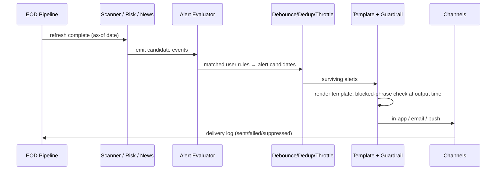
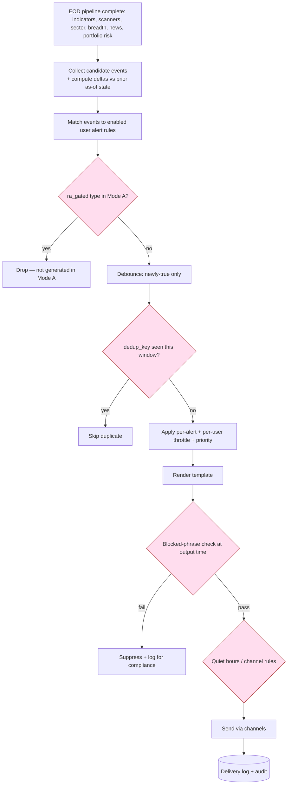

# 17 — Alerts and Notifications

Every alert type, its trigger condition, channel, and notification template — all event-reporting and Mode-A safe, with EOD-batch behaviour for v1 and a forward path to licensed live alerts.

> Read first: [SPEC.md](../SPEC.md) (canonical source of truth).

---

## 0. The one rule for every alert (read first)

From [SPEC.md 5.15](../SPEC.md) and [SPEC.md §5](../SPEC.md):

> **Alerts are EVENT-REPORTING ONLY, never prescriptive.**
> Permitted: *"RELIANCE entered the momentum scanner today."* / *"TATAMOTORS closed below its 50-DMA."*
> Prohibited: *"Buy RELIANCE at open."* / *"Sell TATAMOTORS."* / *"Target hit, book profit."*

Every template below is written as a **statement of a fact that occurred**, with a "Not investment advice" footer and a link back to the evidence. Templates are validated against the blocked-phrase list **at output time** ([SPEC.md §6.9](../SPEC.md), [compliance](21-compliance-risk-and-guardrails.md)), not just at authoring time.

Cross-links: [scanner](13-scanner-engine-and-scoring.md) · [portfolio/risk](16-portfolio-and-risk-engine.md) · [news/sentiment](18-news-sentiment-and-corporate-actions.md) · [AI](14-ai-llm-agent-architecture.md) · [API](10-api-contracts.md) · [database](11-database-architecture.md) · [compliance](21-compliance-risk-and-guardrails.md).

---

## 1. Delivery model: EOD batch in v1, live later

### 1.1 V1 — EOD batch alerts

Saakshya v1 is **EOD-first (T+1)** ([SPEC.md §8](../SPEC.md)). Alerts are **generated after the nightly refresh completes** — ingestion → corp-action adjustment → indicators → scanners → news → portfolio risk — and **delivered with the morning brief window**, not intraday. There is **no "buy at open"** semantics; a price-cross alert reports *"closed above ₹X"*, not *"is crossing ₹X now"*.



### 1.2 Future — live / near-real-time alerts

[SPEC.md §4 (live data row)](../SPEC.md) / Phase 5: once **licensed live data** is in place, a near-real-time tier evaluates the same alert types intraday over a WebSocket feed. Content stays Mode-A-safe (still event-reporting); only **latency and cadence** change. Live alerts are a separately-licensed premium feature and are **out of scope for v1** ([SPEC.md §12 "Out of local-first"](../SPEC.md)). The alert schema carries a `cadence` field (`EOD` | `LIVE`) so the same definitions forward-port without redesign.

**Backend dependency:** post-refresh evaluator hook; (future) streaming evaluator behind a `cadence` flag.
**Frontend dependency:** alert cadence indicator; v1 shows "EOD" everywhere.
**Data dependency:** as-of EOD outputs (v1); licensed live feed (future).
**Acceptance criteria:** (a) no v1 alert implies an intraday action; (b) every v1 alert states the as-of date and uses past-tense, event-reporting wording.

---

## 2. Alert types — trigger → channel → template

Channels: **in-app** (always), **email**, **push**; **WhatsApp future** (gated on Business API + opt-in). `{{...}}` are payload fields; every template ends with the evidence link + "Not investment advice".

| Alert type | Trigger condition (EOD v1) | Default channels | Template (event-reporting) |
|---|---|---|---|
| **Price above** | `close ≥ user_price` | in-app, push | "{{symbol}} closed at ₹{{close}}, above your level of ₹{{level}} (as of {{date}})." |
| **Price below** | `close ≤ user_price` | in-app, push | "{{symbol}} closed at ₹{{close}}, below your level of ₹{{level}} ({{date}})." |
| **Percentage movement** | `|day_change_pct| ≥ user_pct` | in-app, push | "{{symbol}} moved {{day_change_pct}}% today, closing at ₹{{close}} ({{date}})." |
| **Volume breakout** | `volume ≥ k × avg_vol_20` (default k=2) | in-app, email | "{{symbol}} traded {{vol_ratio}}× its 20-day average volume today ({{date}})." |
| **RSI threshold** | `RSI(14)` crosses user level (e.g. ≥70 / ≤30) | in-app | "{{symbol}} RSI(14) closed at {{rsi}}, crossing your {{direction}} level of {{level}} ({{date}})." |
| **MA crossover** | `SMA_fast` crosses `SMA_slow` (e.g. 50/200) | in-app, email | "{{symbol}}: {{fast}}-DMA crossed {{cross_dir}} its {{slow}}-DMA on {{date}}." |
| **Scanner entry** | symbol newly enters a scanner | in-app, push | "{{symbol}} entered the {{scanner}} scanner today ({{date}}). Score {{score}}." |
| **Scanner exit** | symbol leaves a scanner | in-app | "{{symbol}} exited the {{scanner}} scanner today ({{date}})." |
| **Watchlist positive news** | surfaced positive news on a watched stock | in-app, email | "Positive-classified news on {{symbol}}: '{{headline}}' ({{source}}, {{ts}})." |
| **Watchlist negative news** | surfaced negative news on a watched stock | in-app, email, push | "Negative-classified news on {{symbol}}: '{{headline}}' ({{source}}, {{ts}})." |
| **Portfolio risk** | a held stock triggers a risk event ([portfolio](16-portfolio-and-risk-engine.md)) | in-app, email | "You hold {{symbol}}; it {{event}} today ({{date}})." |
| **News sentiment** | aggregate sentiment shift on a tracked entity | in-app | "{{symbol}} news sentiment shifted to {{sentiment}} over the last {{window}} ({{date}})." |
| **Corporate action** | dividend / split / bonus / buyback / rights record-date upcoming or announced | in-app, email | "{{symbol}} announced a {{action_type}} ({{detail}}); record date {{record_date}}." |
| **Stop-loss zone** | **[RA-GATED] not generated in Mode A** | — | *Mode-B only; see §3* |
| **Target zone** | **[RA-GATED] not generated in Mode A** | — | *Mode-B only; see §3* |
| **Resistance/support zone** | close approaches a historical level | in-app | "{{symbol}} closed near {{level}}, historically a {{level_type}} zone ({{date}})." |
| **Daily brief** | nightly market brief ready | in-app, email, push | "Your daily market brief for {{date}} is ready: {{n}} scanner entries, {{m}} portfolio notes." |
| **Sector weakness** | sector strength score drops below threshold / N-day low | in-app, email | "The {{sector}} sector's strength score fell to {{score}} ({{date}}), a {{window}} low." |
| **Market breadth** | advance/decline or %above-200-DMA crosses a threshold | in-app | "Market breadth: {{adv}} advancing vs {{dec}} declining; {{pct_above_200dma}}% of names above their 200-DMA ({{date}})." |

**Backend dependency:** per-type evaluator reading the relevant engine output; template renderer.
**Frontend dependency:** alert-rule creation UI per type; channel selection; alert feed.
**Data dependency:** indicators, scanner membership deltas, sector scores, breadth metrics, news sentiment/impact, corp-action master, portfolio risk events.
**Acceptance criteria:** every type renders a past-tense, event-reporting template; a contract test feeds each template through the blocked-phrase validator and asserts pass.

---

## 3. Stop-loss / target zone alerts — RA-gated note

> **[RA-GATED / Mode B — NOT in v1].** A **stop-loss zone** alert reports a per-stock advisory floor being breached/approached; a **target zone** alert reports a per-stock advisory level being reached (the matching §2 row, parallel to stop-loss). Both report per-stock advisory levels being breached/approached. Per-stock SL/target levels are advisory-in-substance ([SPEC.md 5.21](../SPEC.md), [SPEC.md §5](../SPEC.md)) and are **only** generated under RA registration (Phase 5).

In Mode A, the **factual equivalent** a user receives is the **portfolio risk**, **MA crossover**, or descriptive **resistance/support zone** alert — e.g. *"You hold TATAMOTORS; it closed below its 50-DMA today."* or *"{{symbol}} closed near {{level}}, historically a resistance zone."* — the **event**, not a stop-loss or target instruction (never *"target hit, book profit"*). The alert engine carries an `ra_gated` flag on both the stop-loss-zone and target-zone types; in Mode A these evaluators are disabled and a contract test asserts they emit nothing. See [portfolio §3.3](16-portfolio-and-risk-engine.md) and [compliance](21-compliance-risk-and-guardrails.md).

---

## 4. Alert definition schema

```json
{
  "alert_id": "al_01HX...",
  "user_id": "usr_01HX...",
  "type": "scanner_entry",
  "scope": {"symbol": "RELIANCE", "scanner": "momentum"},
  "condition": {"event": "enters_scanner"},
  "cadence": "EOD",
  "channels": ["in_app", "push"],
  "throttle": {"max_per_day": 3, "cooldown_minutes": 720},
  "ra_gated": false,
  "enabled": true,
  "created_at": "2026-06-20T09:00:00Z"
}
```

A fired alert (instance):

```json
{
  "fired_id": "fa_01HX...",
  "alert_id": "al_01HX...",
  "as_of_date": "2026-06-26",
  "payload": {"symbol": "RELIANCE", "scanner": "momentum", "score": 78},
  "dedup_key": "scanner_entry:RELIANCE:momentum:2026-06-26",
  "rendered_text": "RELIANCE entered the momentum scanner today (2026-06-26). Score 78.",
  "channels_targeted": ["in_app", "push"],
  "guardrail_status": "passed",
  "delivery": [
    {"channel": "in_app", "status": "delivered", "ts": "2026-06-27T06:05:00Z"},
    {"channel": "push", "status": "delivered", "ts": "2026-06-27T06:05:02Z"}
  ]
}
```

---

## 5. Throttling, debounce, dedup

| Control | Rule | Purpose |
|---|---|---|
| **Dedup** | drop if `dedup_key` already fired within the dedup window (default same as-of date) | one alert per real event |
| **Debounce** | for oscillating conditions (price hovering at a level), require the condition to **newly become true** vs the prior as-of state, not merely remain true | no repeat-firing on unchanged state |
| **Throttle (per-alert)** | `max_per_day` + `cooldown_minutes` per alert definition | bound noise per rule |
| **Throttle (per-user)** | global per-user/day cap with priority ordering (portfolio-risk + negative-news > scanner > breadth) | protect against alert flooding |
| **Quiet hours** | no push between user-set quiet hours; queued to next window | UX / consent |
| **Channel collapse** | identical event across multiple watched scopes collapses into one digest line | avoid duplicates |

`dedup_key` convention: `{type}:{symbol|sector|market}:{discriminator}:{as_of_date}`. State carries **prior-day membership/threshold state** so "newly true" transitions are detectable (mirrors scanner entry/exit deltas, [scanner](13-scanner-engine-and-scoring.md)).

**Backend dependency:** dedup store keyed on `dedup_key`; prior-state snapshot per alert; per-user rate limiter.
**Frontend dependency:** per-alert throttle settings; quiet hours; digest preference.
**Data dependency:** prior as-of state for transition detection.
**Acceptance criteria:** (a) the same event on the same as-of date fires at most once; (b) a price oscillating around a level fires only on the first crossing, not each refresh; (c) a flooding scenario respects the per-user cap with correct priority ordering.

---

## 6. Channels and delivery logging

| Channel | v1 | Notes |
|---|---|---|
| **In-app** | yes | Source of truth; every alert lands in the feed even if other channels fail |
| **Email** | yes | Batched into the morning window; digest-capable |
| **Push** | yes | Mobile/web push; respects quiet hours |
| **WhatsApp** | **future** | Requires WhatsApp Business API, template approval, explicit opt-in; gated |

**Delivery logging:** every targeted channel writes a row — `delivered` | `failed` | `suppressed` (guardrail/quiet-hours/throttle) — with timestamp and reason. Logs feed deliverability monitoring and an audit trail; guardrail-suppressed alerts are logged with the failing phrase/rule for compliance review ([compliance](21-compliance-risk-and-guardrails.md)).

**Backend dependency:** channel adapters (in-app, email, push); delivery-log writer; retry with backoff for transient failures.
**Frontend dependency:** alert feed with read/unread; per-channel preferences; delivery status surfaced for support.
**Data dependency:** user channel identities + consent state.
**Acceptance criteria:** (a) a failed email still shows the alert in-app; (b) every send attempt writes a delivery-log row with status + reason; (c) a guardrail-suppressed alert is logged, not silently dropped.

---

## 7. Alert-evaluation flow (after scanner run)



**Acceptance criteria (flow-level):** evaluation runs only after the refresh completes; RA-gated types are dropped in Mode A; nothing reaches a channel without passing the output-time guardrail.

---

## 8. Related documents

- [10 — API contracts](10-api-contracts.md)
- [11 — Database architecture](11-database-architecture.md)
- [13 — Scanner engine and scoring](13-scanner-engine-and-scoring.md)
- [14 — AI/LLM agent architecture](14-ai-llm-agent-architecture.md)
- [16 — Portfolio and risk engine](16-portfolio-and-risk-engine.md)
- [18 — News sentiment and corporate actions](18-news-sentiment-and-corporate-actions.md)
- [21 — Compliance, risk and guardrails](21-compliance-risk-and-guardrails.md)
