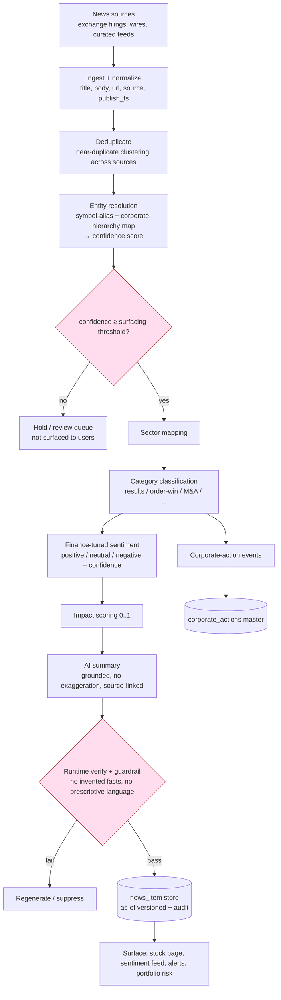

# 18 — News Sentiment and Corporate Actions

News ingestion, entity resolution with confidence scoring, finance-tuned sentiment, impact scoring, and corporate-announcement intelligence — summarized without exaggeration and always traceable to source.

> Read first: [SPEC.md](../SPEC.md) (canonical source of truth).

---

## 0. Why this is a hard problem (read first)

[SPEC.md §6.4](../SPEC.md) flags two non-trivial requirements that gate this whole module:

1. **News-to-symbol resolution** — "Tata Motors", "TATAMOTORS", "Tata Motors DVR", "the Tata Group auto arm" must all resolve to the right listed entity, with a **confidence score** and a **surfacing threshold** below which a link is not shown.
2. **Finance-tuned sentiment** — a general sentiment model fails on finance: *"misses estimates, stock rallies"* is not negative for the trade. The classifier must be **evaluated against a labelled Indian-market set**.

Mode-A constraints that bind every output here ([SPEC.md 5.8/5.9](../SPEC.md), [SPEC.md §5](../SPEC.md)):

- AI **summarizes without exaggerating impact** — "may affect" not "will surge".
- Every item retains **source links + timestamps**; the AI **invents nothing** ([SPEC.md §6.6](../SPEC.md)).
- Sentiment is a **classification**, never a buy/sell signal. "classified positive" is allowed; "buy on this news" is not.

Cross-links: [data ingestion](12-data-ingestion-and-market-data.md) · [scanner](13-scanner-engine-and-scoring.md) · [portfolio/risk](16-portfolio-and-risk-engine.md) · [alerts](17-alerts-and-notifications.md) · [AI](14-ai-llm-agent-architecture.md) · [API](10-api-contracts.md) · [database](11-database-architecture.md) · [compliance](21-compliance-risk-and-guardrails.md).

---

## 1. News pipeline



**Backend dependency:** ingestion workers, dedup clustering, entity resolver, classifiers, summarizer, verifier, store writer.
**Frontend dependency:** sentiment feed, per-stock news panel, source/timestamp display, confidence badge.
**Data dependency:** source registry with reliability scores, symbol-alias + hierarchy map, sector map, labelled evaluation set.
**Acceptance criteria:** an item below the surfacing threshold never reaches a user surface; every surfaced item shows source link + publish timestamp.

---

## 2. Ingestion and source mapping

### 2.1 Source registry

```json
{
  "source_id": "src_nse_filings",
  "name": "NSE Corporate Filings",
  "type": "exchange_filing",
  "reliability": 0.98,
  "redistribution_reviewed": true,
  "ingest_method": "api"
}
```

Source types: `exchange_filing` (highest reliability — NSE/BSE announcements), `wire`, `curated_feed`, `aggregator`. Reliability scores live in the admin console ([SPEC.md §9 compliance row](../SPEC.md)) and weight dedup-cluster canonical selection and impact. Redistribution rights are reviewed per source, mirroring the market-data licensing posture ([SPEC.md §8](../SPEC.md)).

### 2.2 Normalized news item

```json
{
  "news_id": "nw_01HX...",
  "title": "Tata Motors Q1 net profit rises 8% YoY",
  "body": "...",
  "url": "https://nseindia.com/...",
  "source_id": "src_nse_filings",
  "publish_ts": "2026-06-26T11:20:00Z",
  "ingest_ts": "2026-06-26T11:24:10Z",
  "as_of_version": "2026-06-26T11:24:10Z"
}
```

---

## 3. Deduplication

The same event arrives from many sources. Near-duplicate clustering groups items by **title/body similarity + entity + time window**; one **canonical** item per cluster is chosen by source reliability and earliest credible timestamp. Members retain their own source links so a user can see corroboration. Dedup runs **before** entity resolution and classification so the AI summarizes the event once.

**Acceptance criteria:** three wire reports of one earnings release collapse into one cluster with three retained source links and a single canonical summary.

---

## 4. Entity resolution (the hard part)

### 4.1 Symbol-alias + corporate-hierarchy map

```json
{
  "entity_id": "ent_tatamotors",
  "primary_symbol": "TATAMOTORS",
  "exchange": "NSE",
  "legal_name": "Tata Motors Limited",
  "aliases": ["Tata Motors", "Tata Motors Ltd", "TaMo", "Tata Motors DVR"],
  "listed_instruments": [
    {"symbol": "TATAMOTORS", "type": "equity"}
  ],
  "parent": {"group": "Tata Group"},
  "subsidiaries": ["Jaguar Land Rover", "Tata Motors Finance"],
  "sector": "Automobile"
}
```

The map is **curated** ([SPEC.md §6.4](../SPEC.md)): aliases, ticker history (symbol changes), DVR/dual listings, group hierarchy (so "JLR posts record sales" can attribute to the listed parent at a **lower** confidence), and ambiguous-name disambiguation.

### 4.2 Confidence scoring and surfacing threshold

Each news→symbol link carries a confidence in `[0,1]` from matched signals:

| Signal | Effect on confidence |
|---|---|
| Exact ticker / exchange code in text | strong + |
| Exact legal name | strong + |
| Curated alias match | + |
| Subsidiary/brand mapped to listed parent | partial + (lower) |
| Ambiguous name shared by multiple entities | − until disambiguated |
| Sector/context corroboration | small + |

```
link_confidence = clamp(weighted_signal_sum, 0, 1)
surfaced = link_confidence >= SURFACING_THRESHOLD   # versioned, e.g. 0.75
```

Below threshold → held in a **review queue**, never surfaced or alerted on. Above → surfaced with the confidence available for display/debug. Threshold is versioned config; [SPEC.md §10 Phase 3 exit gate](../SPEC.md) requires news-to-symbol precision above target before broad rollout.

### 4.3 Entity-resolution example

> Headline: **"JLR posts record quarterly retail sales, lifting parent's outlook"**
>
> - No ticker or legal name "Tata Motors Limited" in text.
> - "JLR" → subsidiary alias of `ent_tatamotors` (curated hierarchy) → **partial** signal.
> - Context "parent's outlook" + Automobile sector corroboration → small +.
> - `link_confidence = 0.71`. With `SURFACING_THRESHOLD = 0.75` → **held in review queue**, not surfaced to TATAMOTORS holders or watchers.
>
> Contrast: **"Tata Motors Q1 net profit rises 8% YoY"** → exact alias "Tata Motors" + earnings context → `link_confidence = 0.93` → **surfaced** to TATAMOTORS, classified `results`, sentiment evaluated below.

**Backend dependency:** resolver with weighted-signal scoring; review-queue store; alias/hierarchy admin tooling.
**Frontend dependency:** confidence badge; admin review-queue UI.
**Data dependency:** curated alias + hierarchy map; ticker-change history.
**Acceptance criteria:** (a) a subsidiary-only headline resolves below threshold and is not surfaced; (b) an exact-name headline resolves above threshold; (c) an ambiguous shared name is held until disambiguated.

---

## 5. Sector mapping

Each surfaced item inherits the **sector** of its resolved entity (stock master), plus optional **macro/policy** tagging for items with no single issuer ("RBI holds repo rate") so they feed the **sector update** / **macro event** categories and the sector-weakness alert ([alerts](17-alerts-and-notifications.md), [scanner](13-scanner-engine-and-scoring.md) sector dashboard).

---

## 6. Category classification

Every surfaced item is tagged with one or more categories. Categories drive impact priors, corporate-action feeds, and alert routing.

| Category | Example trigger | Feeds corp_actions? |
|---|---|---|
| **results** | quarterly/annual earnings | no |
| **order win** | contract/order award | no |
| **management change** | CEO/CFO/board change | no |
| **policy update** | regulator/govt policy | no |
| **sector update** | sector-wide development | no |
| **M&A** | merger/acquisition/stake | yes (merger) |
| **fundraising** | QIP, debt, preferential issue | partial |
| **dividend** | dividend declaration | **yes** |
| **bonus** | bonus issue | **yes** |
| **split** | stock split / face-value change | **yes** |
| **buyback** | share buyback | **yes** |
| **regulatory issue** | SEBI/exchange action | no |
| **rating action** | credit-rating change (CRISIL/ICRA/CARE etc.) | no |
| **broker commentary** | analyst / brokerage research note, target/rating revision in a published report | no |
| **litigation** | legal case / order | no |
| **governance issue** | audit/board governance | no |
| **macro event** | rates, inflation, currency | no |

**`broker commentary` vs `rating action`.** These are **distinct** categories. `rating action` is a **credit**-rating change by a rating agency (CRISIL/ICRA/CARE/etc.) on an instrument's debt. `broker commentary` is an **equity** analyst / brokerage **research note** — a "buy/hold/sell" call or price-target revision in a published report. Broker commentary is handled **descriptively and source-linked, with no exaggeration**: the broker's own view is **reported as a third-party opinion attributed to its source** ("Broker X reiterated its rating; price target revised to ₹Y per its note, {{source}}, {{ts}}"), **never restated as Saakshya's own recommendation** and never surfaced as a buy/sell directive ([SPEC.md 5.9](../SPEC.md), [SPEC.md §5](../SPEC.md), §8). The broker's target/rating is treated as an external claim, summarized without amplification, and run through the same blocked-phrase guardrail at output time as every other item.

**Backend dependency:** multi-label classifier with category priors; routing to corp-action feed.
**Acceptance criteria:** (a) a bonus-issue announcement is tagged `bonus` and emitted to the corporate-action feed (§9); (b) a brokerage research note is tagged `broker commentary` (not `rating action`) and its target/rating is summarized as a source-attributed third-party opinion, never as Saakshya's own buy/sell call.

---

## 7. Finance-tuned sentiment

### 7.1 Classifier

Sentiment ∈ `{positive, neutral, negative}` with a confidence, produced by a **finance-tuned** classifier — **not** a general model ([SPEC.md §6.4](../SPEC.md)). It is **evaluated against a labelled Indian-market set** with a golden dataset + regression suite ([SPEC.md §6.6](../SPEC.md)), and must handle finance-specific framing:

| Headline | General model | Finance-tuned (correct) |
|---|---|---|
| "Misses estimates, stock rallies" | negative | the *result* is a miss (negative fundamental) but framing is nuanced → low-confidence / neutral, flagged |
| "Profit doubles but guidance cut" | positive | mixed → neutral/negative with explanation |
| "Promoter pledges additional shares" | neutral | negative (governance/risk signal) |

```json
{
  "news_id": "nw_01HX...",
  "symbol": "TATAMOTORS",
  "sentiment": "positive",
  "sentiment_confidence": 0.81,
  "category": ["results"],
  "rationale_tokens": ["net profit rises 8% YoY"]
}
```

### 7.2 Impact scoring

A separate `impact ∈ [0,1]` estimates **how material** the event is (not direction): category prior × source reliability × magnitude cues × entity confidence. Impact feeds **news risk** in the [portfolio risk engine](16-portfolio-and-risk-engine.md) and news-based alerts. Impact is a **measurement**, never a return prediction ([SPEC.md §3.3](../SPEC.md)).

```
impact = clamp(category_prior * source_reliability * magnitude_factor * link_confidence, 0, 1)
```

**Backend dependency:** finance-tuned sentiment + impact models; evaluation harness on the labelled set.
**Frontend dependency:** sentiment chip (with confidence), rationale on hover, impact indicator.
**Data dependency:** labelled Indian-market training/eval set; category priors; source reliability.
**Acceptance criteria:** (a) the classifier beats a general-model baseline on the labelled set per [SPEC.md §6.4](../SPEC.md); (b) "misses estimates, stock rallies" is **not** auto-tagged a clean signal; (c) low-confidence sentiment is shown as neutral/uncertain, not forced.

---

## 8. AI summarization without exaggeration

The summarizer runs under the **payload contract** ([SPEC.md §6.6](../SPEC.md), [AI](14-ai-llm-agent-architecture.md)): it receives the canonical item text, category, sentiment, impact, and source metadata, and **may add no facts**. It must:

- **Not exaggerate impact** ([SPEC.md 5.9](../SPEC.md)): "may affect near-term sentiment" not "set to skyrocket".
- Retain **source link + publish timestamp** in the output.
- Use **classification language**, never directives: "classified positive", never "buy on this".
- Be **runtime-verified** (every named fact traces to the payload) and pass the blocked-phrase guardrail at output time.

| Allowed | Prohibited |
|---|---|
| "Q1 net profit rose 8% YoY; sentiment classified positive (NSE filing, 26 Jun)." | "Profit surge — multibagger in the making." |
| "A bonus issue was announced; record date 14 Jul." | "Buy before the bonus for guaranteed gains." |
| "Rating downgraded one notch; this is a development to monitor." | "Sell immediately on the downgrade." |

**Example — compliant summary:**

> **TATAMOTORS — results (positive).** Tata Motors reported Q1 net profit up 8% year-on-year. News sentiment was classified **positive** (confidence 0.81). Source: NSE corporate filing, 26 Jun 2026 11:20. *This is information, not investment advice.*

**Acceptance criteria:** (a) injecting an exaggeration ("set to surge") is caught by the guardrail; (b) every summary carries source link + timestamp; (c) a summary referencing a number not in the payload is blocked/regenerated.

---

## 9. Corporate-announcement intelligence and the corporate_actions master

Items classified as **dividend / split / bonus / buyback / M&A** (and rights from filings) are emitted as **structured corporate-action events** into the **`corporate_actions` master** used by price adjustment ([data ingestion](12-data-ingestion-and-market-data.md), [SPEC.md §6.1](../SPEC.md)). This closes the loop: news intelligence both **informs users** and **feeds the adjustment engine** that keeps every indicator, scanner, and backtest correct.

```json
{
  "corp_action_id": "ca_01HX...",
  "symbol": "TATAMOTORS",
  "action_type": "BONUS",
  "ratio": "1:1",
  "announce_date": "2026-06-26",
  "record_date": "2026-07-14",
  "ex_date": "2026-07-13",
  "source_news_id": "nw_01HX...",
  "confidence": 0.93,
  "reconciled": false
}
```

A corporate-action event from news is **provisional** until **reconciled against a second source** ([SPEC.md §6.1](../SPEC.md)) before it drives back-adjustment. Until reconciled, it surfaces as a news item but does **not** alter the adjusted price series. Reconciled events generate the corporate-action alert ([alerts](17-alerts-and-notifications.md)) and the portfolio corporate-action transaction ([portfolio §1.2](16-portfolio-and-risk-engine.md)).

**Backend dependency:** category→corp-action extractor; reconciliation against a second source; master writer.
**Frontend dependency:** corporate-actions panel on the stock page; upcoming-record-date display.
**Data dependency:** `corporate_actions` master; second reconciliation source.
**Acceptance criteria:** (a) a bonus/split/dividend news item produces a structured corp-action record linked to its source; (b) an unreconciled event does **not** adjust the price series; (c) a reconciled split correctly triggers back-adjustment downstream.

---

## 10. Related documents

- [10 — API contracts](10-api-contracts.md)
- [11 — Database architecture](11-database-architecture.md)
- [12 — Data ingestion and market data](12-data-ingestion-and-market-data.md)
- [13 — Scanner engine and scoring](13-scanner-engine-and-scoring.md)
- [14 — AI/LLM agent architecture](14-ai-llm-agent-architecture.md)
- [16 — Portfolio and risk engine](16-portfolio-and-risk-engine.md)
- [17 — Alerts and notifications](17-alerts-and-notifications.md)
- [21 — Compliance, risk and guardrails](21-compliance-risk-and-guardrails.md)
