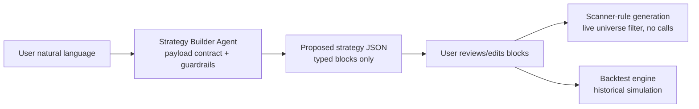
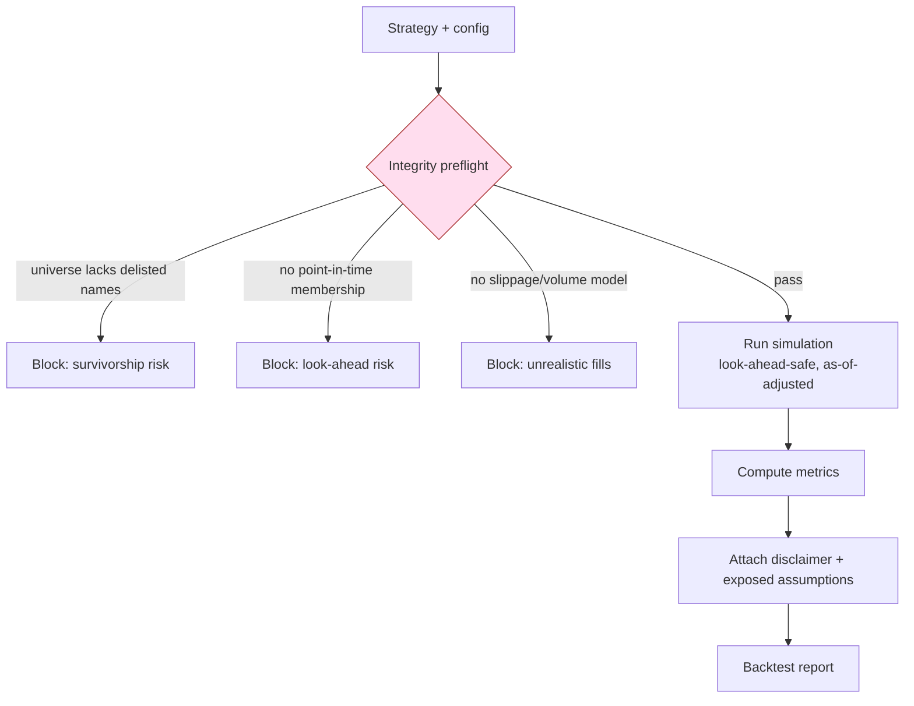

# 19 — Backtesting and Strategy Builder

No-code strategy builder and historical simulation engine — shippable only with the mandatory integrity controls that keep a backtest honest and out of implied-performance territory.

> Read first: [SPEC.md](../SPEC.md) (canonical source of truth).

---

## 0. The gating rule (read first)

From [SPEC.md §6.3](../SPEC.md) and [SPEC.md 5.18–5.19 / §4](../SPEC.md):

> **Backtesting ships ONLY with integrity controls. An inflated backtest is an implied-performance claim — a compliance risk.**

Five controls are **mandatory before this module ships** (Phase 4): survivorship-bias control, look-ahead control, point-in-time index membership, realistic fills, and honest framing. Every result carries: **"Past performance does not indicate future results"** with assumptions exposed.

Mode-A boundaries that bind the builder ([SPEC.md 5.17 / §4](../SPEC.md)):

- Strategy outputs are **lists / scanner rules**, never buy/sell calls.
- Entry/exit/stop-loss/target inside a **backtest** are **simulation parameters of a historical test**, not live per-stock advice — they are descriptive test configuration, not RA-gated recommendations. They are **never surfaced as live signals** in Mode A (that would be [SPEC.md 5.21](../SPEC.md), RA-gated).
- The natural-language → strategy step uses the **Strategy Builder Agent** under the standard payload contract + guardrails ([AI](14-ai-llm-agent-architecture.md), [SPEC.md §6.6](../SPEC.md)).

Cross-links: [scanner](13-scanner-engine-and-scoring.md) · [data ingestion](12-data-ingestion-and-market-data.md) · [AI](14-ai-llm-agent-architecture.md) · [API](10-api-contracts.md) · [database](11-database-architecture.md) · [compliance](21-compliance-risk-and-guardrails.md).

---

## 1. Strategy condition builder (no-code)

A strategy is a **condition tree**: entry rules, exit rules, and position management, all expressed over the same indicators the scanners use ([scanner](13-scanner-engine-and-scoring.md)). No code; the UI composes typed condition blocks combined with AND/OR.

| Block type | Examples |
|---|---|
| **Indicator condition** | `RSI(14) < 30`, `close > SMA(50)`, `MACD_hist crosses_above 0` |
| **Price/volume condition** | `close > prior_high(20)`, `volume > 2 × avg_vol(20)` |
| **Scanner membership** | `in_scanner('momentum')`, `score('momentum') > 70` |
| **Fundamental band** (Phase 3+) | `pe_band == 'below_sector_median'` (descriptive) |
| **Universe filter** | market-cap band, sector, index membership (point-in-time) |

### 1.1 Entry rules / exit rules / holding / stops

| Parameter | Meaning |
|---|---|
| **Entry rules** | condition tree that opens a simulated position |
| **Exit rules** | condition tree that closes it (indicator/price/time) |
| **Holding period** | optional max bars in trade (time-based exit) |
| **Stop-loss** | simulated protective exit (e.g. `−ATR×k` or fixed %) — **test parameter only** |
| **Target** | simulated profit exit — **test parameter only** |
| **Trailing stop** | ratchets with favorable move (e.g. trail by `1×ATR`) |

> These stop/target fields configure a **historical simulation**; they are **not** displayed as live, per-stock SL/target levels for a current holding ([SPEC.md 5.21](../SPEC.md), [portfolio §3.3](16-portfolio-and-risk-engine.md)). The UI labels them "backtest parameters".

**Backend dependency:** condition-tree evaluator over the indicator layer; universe resolver with point-in-time membership.
**Frontend dependency:** drag-and-drop block builder; AND/OR grouping; parameter forms.
**Data dependency:** adjusted historical OHLCV, indicators, point-in-time index membership.
**Acceptance criteria:** a built strategy round-trips to JSON (§7) and back; an invalid tree (e.g. exit with no entry) is rejected with a clear error.

---

## 2. Natural-language → strategy (Strategy Builder Agent)

A user types *"Buy oversold large-caps that reclaim their 50-DMA, exit on RSI above 70 or a 8% stop."* The **Strategy Builder Agent** converts this into a structured strategy JSON under the payload contract:

- It **only** emits valid condition blocks over **known indicators/fields**; it cannot invent data sources ([SPEC.md §6.6](../SPEC.md)).
- Output is **shown back to the user for confirmation** as editable blocks — the AI proposes structure, it does not auto-run trades.
- The word "buy" in the user's phrasing maps to **entry rule**, not a live recommendation; the generated artifact is a **backtest/scanner definition**, and the guardrail strips any directive framing from agent prose ([compliance](21-compliance-risk-and-guardrails.md)).



### 2.1 Scanner-rule generation

The same strategy's **entry conditions** can generate a **live scanner rule** ([scanner](13-scanner-engine-and-scoring.md)) — producing a **list** of current matches, never a buy call ([SPEC.md 5.17](../SPEC.md)). Exit/stop/target are backtest-only and are dropped from the live scanner form.

**Backend dependency:** Strategy Builder Agent; NL→blocks validator; scanner-rule compiler.
**Frontend dependency:** NL input; agent-proposed editable blocks; confirm step.
**Data dependency:** indicator/field catalog the agent is allowed to reference.
**Acceptance criteria:** (a) the agent only emits known fields; an unknown field is rejected, not invented; (b) directive language in the user prompt does not produce a recommendation; (c) the live scanner form contains no exit/stop/target.

---

## 3. Historical simulation engine

### 3.1 Simulation loop

For each bar, in chronological order, using **only data available as of that bar** (look-ahead control, §4):

1. Resolve the **point-in-time universe** (index membership / cap band as of the date).
2. Evaluate **exit** rules on open positions (stop, target, trailing, time, condition).
3. Evaluate **entry** rules on eligible symbols.
4. Apply **fills** with slippage + volume caps (§4).
5. Apply **transaction costs**; update equity, cash, open positions.
6. Record trades and the equity point.

### 3.2 Costs and fills

| Setting | Default |
|---|---|
| **Transaction cost** | configurable bps per side (brokerage + STT + charges proxy) |
| **Slippage** | configurable bps; larger for small/mid-caps |
| **Volume cap** | a trade may take at most X% of that bar's volume; excess is unfilled |
| **Benchmark** | NIFTY 50 / sector index for comparison |

**Backend dependency:** event-driven simulator; cost/slippage/volume-cap model; benchmark series.
**Data dependency:** adjusted OHLCV (as-of), delivery/volume, point-in-time membership, benchmark.
**Acceptance criteria:** a fill is rejected/partial when the order exceeds the volume cap; costs and slippage reduce returns versus a frictionless run.

---

## 4. Mandatory integrity controls (ship-blocking)

Per [SPEC.md §6.3](../SPEC.md) — **all five required before this module ships**:

| Control | What it enforces | Failure it prevents |
|---|---|---|
| **Survivorship-bias control** | universe **includes delisted/merged names** for each historical period | over-stated returns from quietly dropping losers |
| **Look-ahead control** | decisions use **only data available at that point**, incl. **corp-action-adjusted prices as-of that date** | "knowing" a split/earnings before it was public |
| **Point-in-time index membership** | a stock is in NIFTY/sector index only on dates it actually was | testing today's winners on yesterday's dates |
| **Realistic fills** | **slippage + liquidity/volume caps**, esp. small/mid-caps | unfillable, frictionless backtest profits |
| **Honest framing** | mandatory disclaimer + **assumptions exposed** on every result | implied-performance claim ([SPEC.md §6.3](../SPEC.md)) |



**Acceptance criteria (module ship-gate):** the engine **refuses to run** if the dataset lacks delisted names, point-in-time membership, or a fills model; every report renders the disclaimer and the full assumption set; a look-ahead unit test (using post-date data) fails the run.

---

## 5. Metrics and reporting

| Metric | Definition |
|---|---|
| **Total return** | final/initial equity − 1 |
| **Annualized return** | CAGR over the test window |
| **Win rate** | winning trades ÷ total trades |
| **Average win / average loss** | mean P&L of winners / losers |
| **Profit factor** | gross profit ÷ gross loss |
| **Max drawdown** | largest peak-to-trough equity decline |
| **Sharpe** | (mean excess return) ÷ stdev, annualized |
| **Sortino** | downside-deviation-adjusted Sharpe |
| **Calmar** | annualized return ÷ max drawdown |
| **Trade count** | number of closed trades |
| **Avg holding period** | mean bars in trade |
| **Signal decay** | edge vs delay between signal and entry (robustness) |

**Visual outputs:** equity curve (vs benchmark), drawdown chart, trade log (entry/exit/P&L/holding), per-metric table.

**Backend dependency:** metric calculators; signal-decay sweep; chart-data serializers.
**Frontend dependency:** equity/drawdown charts, trade-log table, metric cards, benchmark overlay.
**Acceptance criteria:** metrics reconcile against a hand-checked toy strategy; equity curve and trade log are mutually consistent; signal-decay sweep runs across configured delays.

---

## 6. Disclaimer and honest-framing rules

Every backtest result, export, and shared view **must** display:

> **Past performance does not indicate future results.** This is a historical simulation under stated assumptions, not a recommendation or a performance promise.

Plus an **exposed assumptions** block: data window, universe (with delisted inclusion noted), costs, slippage, volume cap, fill model, and any survivorship/look-ahead caveats. Results **may not** be framed as expected/likely future returns; the guardrail blocks "would have made you", "guaranteed", "assured", and similar at output time ([SPEC.md §6.9](../SPEC.md), [SPEC.md §3.3](../SPEC.md)). An inflated or selectively-framed backtest is treated as a **compliance incident** ([compliance](21-compliance-risk-and-guardrails.md)).

**Acceptance criteria:** no result view (incl. exports) renders without the disclaimer + assumptions; a guardrail test blocks return-promise phrasing in any AI-generated backtest commentary.

---

## 7. Example strategy JSON

```json
{
  "strategy_id": "st_01HX...",
  "name": "Oversold large-cap 50-DMA reclaim",
  "version": 1,
  "universe": {
    "index_membership": "NIFTY100",
    "membership_mode": "point_in_time",
    "market_cap_band": ["LARGE"],
    "include_delisted": true
  },
  "entry_rules": {
    "op": "AND",
    "conditions": [
      {"type": "indicator", "expr": "RSI(14)", "cmp": "<", "value": 35},
      {"type": "cross", "fast": "close", "dir": "crosses_above", "slow": "SMA(50)"}
    ]
  },
  "exit_rules": {
    "op": "OR",
    "conditions": [
      {"type": "indicator", "expr": "RSI(14)", "cmp": ">", "value": 70},
      {"type": "stop_loss", "method": "atr", "k": 2.0},
      {"type": "target", "method": "pct", "value": 12.0},
      {"type": "trailing_stop", "method": "atr", "k": 1.5},
      {"type": "time", "max_holding_bars": 30}
    ]
  },
  "execution": {
    "transaction_cost_bps": 12,
    "slippage_bps": 15,
    "volume_cap_pct": 5,
    "fill_price": "next_open"
  },
  "backtest": {
    "start": "2018-01-01",
    "end": "2026-03-31",
    "benchmark": "NIFTY50",
    "initial_capital": 1000000
  },
  "integrity": {
    "survivorship_control": true,
    "look_ahead_control": true,
    "point_in_time_membership": true,
    "realistic_fills": true
  },
  "disclaimer": "Past performance does not indicate future results."
}
```

> `stop_loss` / `target` / `trailing_stop` here are **historical exit simulation parameters**, not live per-stock recommendations. The live scanner derived from this strategy uses only `entry_rules` and produces a **list**, never a call.

**Acceptance criteria:** this JSON validates against the strategy schema, drives a run that satisfies the §4 preflight, and yields a report carrying the §6 disclaimer + assumptions.

---

## 8. Related documents

- [10 — API contracts](10-api-contracts.md)
- [11 — Database architecture](11-database-architecture.md)
- [12 — Data ingestion and market data](12-data-ingestion-and-market-data.md)
- [13 — Scanner engine and scoring](13-scanner-engine-and-scoring.md)
- [14 — AI/LLM agent architecture](14-ai-llm-agent-architecture.md)
- [21 — Compliance, risk and guardrails](21-compliance-risk-and-guardrails.md)
