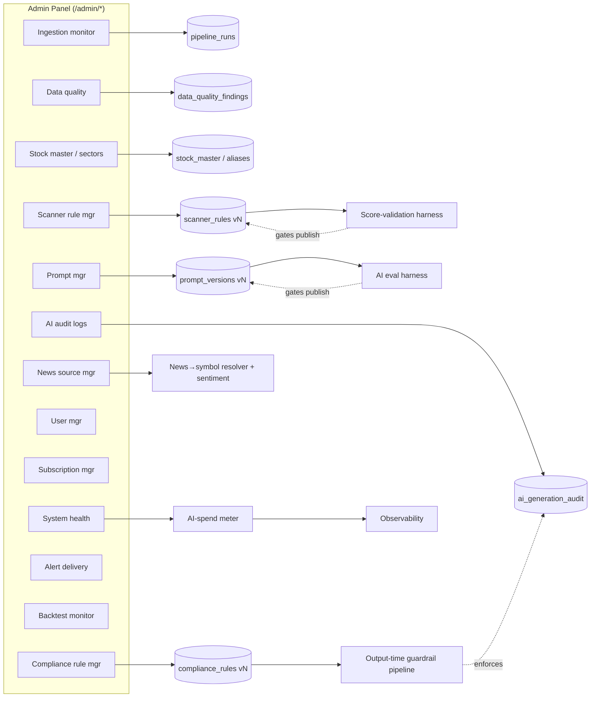

# 20 — Admin Panel

> One-line purpose: The internal operator console for Saakshya — every admin module (ingestion, data quality, stock master, scanners, prompts, AI audit, compliance rules, users, subscriptions, news sources, alerts, backtests, system health), its RBAC, and per-module backend dependencies and acceptance criteria.
> Read first: [SPEC.md](../SPEC.md)

Related: [Compliance & Guardrails](21-compliance-risk-and-guardrails.md) · [AI/LLM Agent Architecture](14-ai-llm-agent-architecture.md) · [Data Ingestion & Market Data](12-data-ingestion-and-market-data.md) · [Information Architecture](05-information-architecture-and-url-paths.md) · [Security, Auth & Privacy](23-security-auth-and-privacy.md) · [Scanner Engine & Scoring](13-scanner-engine-and-scoring.md)

---

## 0. Principles (read before building admin)

The admin panel is **operational control + the compliance enforcement surface**. Three SPEC constraints shape every module:

1. **Guardrails and prompts are versioned in the admin console** (SPEC §6.6, §6.9). The blocked-phrase/pattern list and prompt templates are *data*, not code — editable here, version-pinned, and every generated output references the active version. The admin console is the source of record for *which* guardrail/prompt version produced any user-visible output.
2. **Scanner-logic changes and AI-prompt changes are auditable, second-person-approved changes** (SPEC §6.5, §6.6). A scoring-weight edit is a material change to product behavior and an implied-performance surface — it is logged, requires a separate approver, and re-validates against the golden/score-validation harness.
3. **Separation of duties.** No single role can both author a compliance rule and approve it, or both edit a prompt and ship it to production. The `compliance-officer` role gates anything user-facing that carries regulatory substance.

All `/admin/*` routes are `admin` access, `disallow` SEO posture (blocked in `robots.txt`), and sit behind the admin WAF rule and admin-activity logging (see [Security](23-security-auth-and-privacy.md)). Every state-changing admin action writes an **immutable admin activity log** entry (actor, role, action, before/after, timestamp, request ID).

---

## 1. RBAC — roles & permissions

Five roles. Permissions are **additive per role** (a user holds exactly one role in v1; multi-role is a Phase-4 enhancement). The matrix below is the authority for the authz middleware in [Security §3](23-security-auth-and-privacy.md).

### 1.1 Role definitions

| Role | Purpose | Trust level |
|---|---|---|
| **super-admin** | Platform owner / SRE-lead. Full access incl. role assignment, secret rotation triggers, feature flags. | Highest; 2 humans max, hardware-MFA enforced |
| **data-admin** | Owns ingestion, data quality, stock master, sector mapping, scanner rule authoring (not approval). | High |
| **compliance-officer** | Owns compliance rule list, prompt approval, AI audit review, scanner-change approval. The regulatory gate. | High; independent of data-admin |
| **support** | User/subscription operations, alert-delivery troubleshooting, read-only data health. | Medium; no rule/prompt edit |
| **read-only** | Auditors, analysts, counsel. Sees everything; changes nothing. | Read-only everywhere |

### 1.2 Permission matrix

Legend: **F** = full (view + edit + execute) · **A** = approve (cannot author) · **E** = author/edit (cannot approve/publish) · **V** = view only · **—** = no access.

| Module | super-admin | data-admin | compliance-officer | support | read-only |
|---|---|---|---|---|---|
| Data ingestion monitor | F | F | V | V | V |
| Data quality dashboard | F | F | V | V | V |
| Stock master management | F | F | V | — | V |
| Sector mapping | F | F | V | — | V |
| Scanner rule manager (author) | F | E | V | — | V |
| Scanner rule manager (approve/publish) | F | — | A | — | V |
| Prompt manager (author) | F | E | V | — | V |
| Prompt manager (approve/publish) | F | — | A | — | V |
| AI audit logs | F | V | F | V | V |
| Compliance rule manager (author) | F | — | E | — | V |
| Compliance rule manager (approve/publish) | F | — | A | — | V |
| User management | F | — | V | E | V |
| Subscription management | F | — | V | E | V |
| News source manager | F | F | V | — | V |
| Alert delivery logs | F | V | V | V | V |
| Backtest job monitor | F | F | V | V | V |
| System health dashboard | F | F | V | V | V |
| Admin activity / audit log (the log itself) | V | V | V | V | V |
| RBAC / role assignment | F | — | — | — | — |
| Feature flags | F | E | A | — | V |
| Secret rotation trigger | F | — | — | — | — |

**Critical separation-of-duties invariant:** for scanner rules, prompts, and compliance rules, the **author role (E) and approver role (A) are different roles**, and the authz layer additionally enforces **actor(author) ≠ actor(approver)** even where super-admin holds both — a super-admin cannot self-approve a compliance rule they authored; a second super-admin or a compliance-officer must approve.

**Backend dependency:** an RBAC service exposing `can(actor, action, resource)` backed by the matrix above as data (not hardcoded); a four-eyes enforcement check on publish endpoints; JWT carrying `role` claim validated server-side per request (see [Security §3](23-security-auth-and-privacy.md)).

**Acceptance criteria:**
- A `support` user calling any `*/publish` or rule-edit endpoint receives `403` and the attempt is logged.
- A self-approval attempt (author == approver) on a compliance/prompt/scanner publish returns `409 self_approval_forbidden`.
- Every permission decision is derived from the matrix table at runtime; changing the table changes behavior with no code deploy.

---

## 2. Admin module catalog

Each module: **purpose · key views/actions · backend dependency · acceptance criteria.** Routes extend the IA admin tree ([IA §1](05-information-architecture-and-url-paths.md)).

### 2.1 Data ingestion monitor — `/admin/data-health/ingestion`

**Purpose.** Real-time and historical view of every EOD ingestion run (bhavcopy, delivery file, vendor feed, news) behind the single `DataSource` adapter (SPEC §8). Answers "did last night's pipeline complete, on time, for all symbols?"

**Key views/actions.**
- Per-run timeline: source, started/finished, duration vs overnight latency budget (SPEC §6.8), rows ingested, symbols covered, status (`success` / `partial` / `failed` / `quarantined`).
- Stage breakdown (ingest → normalize → corp-action adjust → indicators → scanners → news → AI summaries → brief) with per-stage status, mirroring the SPEC §8 pipeline.
- Actions: **re-run** a stage/run, **retry** a single source, **quarantine** a run, **mark resolved**, view raw vendor payload (redacted), download run log.
- Source-health badges per adapter; staleness clock per symbol (last-good as-of date).

**Backend dependency.** Pipeline orchestrator emits structured run/stage events to a `pipeline_runs` table keyed by trading date + as-of version; EventBridge/SQS run events (see [Infra §EOD batch](22-infrastructure-devops-and-observability.md)); `DataSource` adapter exposes per-source health.

**Acceptance criteria.**
- A failed or late (> overnight budget) run raises an alert visible here and in [system health](#212-system-health-dashboard--adminsystem-health) before market-open users see stale data.
- Re-running a stage re-emits all dependent downstream artifacts (indicators, scanner results, AI summaries) for the affected symbols — never a partial-state leak (SPEC §6.2 correction workflow).
- Every run is reproducible: clicking a historical run shows the exact as-of version and source versions used.

### 2.2 Data quality dashboard — `/admin/data-health/quality`

**Purpose.** Surfaces the SPEC §6.2 automated checks (missing candles, abnormal jumps, duplicate symbols, delisted securities, inconsistent volume) and drives the **detect → quarantine → correct → re-emit** correction workflow.

**Key views/actions.**
- Check grid: per-check pass/fail counts for the latest run, drill into offending symbols.
- Corporate-action reconciliation panel (SPEC §6.1): split/bonus/dividend events detected, raw-vs-adjusted divergence, **second-source reconciliation status** (matched / mismatch / pending).
- Data-confidence indicator per symbol (the same one users see) with the reason it's downgraded.
- Correction workflow board: items in `detected → quarantined → corrected → re-emitted`, with the operator who advanced each.
- Action: quarantine a symbol/series (suppresses dependent AI summaries — never guesses, SPEC §6.2), trigger re-emit, attach correction note.

**Backend dependency.** Quality-check engine writing to `data_quality_findings`; corp-action master + second-source reconciler ([Data Ingestion](12-data-ingestion-and-market-data.md), SPEC §6.1); as-of versioning so corrections create a new version rather than mutating history.

**Acceptance criteria.**
- A split/bonus on the test set is detected, flagged, and back-adjusted consistently across the full history used by any indicator/backtest (SPEC §6.1).
- Quarantining a symbol **suppresses** its AI summary and lowers its on-screen data-confidence indicator within the same publish cycle — it does not display a guessed value.
- A correction creates a new as-of version; the prior displayed value remains reproducible.

### 2.3 Stock master management — `/admin/stock-master`

**Purpose.** Authoritative registry of tradable instruments: symbol, ISIN, exchange (NSE/BSE), name, lot/face value, listing status (`listed` / `suspended` / `delisted`), symbol-change history, and corporate-hierarchy links used by news resolution (SPEC §6.4).

**Key views/actions.**
- Searchable master table; per-symbol detail with alias list, ISIN, sector mapping, listing/delisting dates, symbol-change chain.
- Actions: add/edit instrument, manage **symbol-alias map** (feeds news→symbol resolution, SPEC §6.4), mark delisted (must preserve history for survivorship-bias control, SPEC §6.3), merge duplicate symbols.

**Backend dependency.** `stock_master` + `symbol_alias` tables; referential integrity to time-series, scanner, portfolio, and news tables; delisted-name retention for backtesting survivorship control (SPEC §6.3).

**Acceptance criteria.**
- Delisting a symbol never deletes its history; backtests over prior periods still include it (SPEC §6.3 survivorship).
- An alias edit immediately improves news→symbol link precision in the next news run with no code deploy.
- Duplicate-symbol merges are reversible via the admin activity log (before/after captured).

### 2.4 Sector mapping — `/admin/stock-master/sectors`

**Purpose.** Maps each symbol to sector/industry/theme taxonomy powering the sector strength dashboard (SPEC §4) and thematic baskets ("bucket views, not model portfolios", SPEC §4).

**Key views/actions.**
- Taxonomy editor (sector → industry → sub-industry); symbol→sector assignment grid; theme/basket membership editor.
- Bulk reassignment; effective-dated changes so historical sector scores remain reproducible.
- Validation: every listed symbol has exactly one primary sector; orphan report.

**Backend dependency.** `sector_taxonomy`, `symbol_sector` (effective-dated) tables; recompute trigger for sector strength on change.

**Acceptance criteria.**
- No listed symbol is sector-orphaned (validation blocks publish).
- A sector reassignment is effective-dated; historical sector-strength values are not retroactively altered.
- Theme baskets render as **bucket views**, never as model portfolios or weighted allocations (SPEC §4 / [Compliance](21-compliance-risk-and-guardrails.md)).

### 2.5 Scanner rule manager — `/admin/scanners`

**Purpose.** Author, version, validate, and publish scanner definitions and **scoring weights** (e.g. 25% momentum, 20% volume — SPEC §6.5). This is a material-behavior + implied-performance surface, so it is **change-controlled and four-eyes approved.**

**Key views/actions.**
- Rule list with version, status (`draft` / `in-review` / `published` / `archived`), author, approver, last validation result.
- Rule editor: filters, thresholds, sub-score weights, plain-language reason templates, risk-flag definitions. Reason/label templates pass the same language guardrails as AI output (no buy-lean wording — SPEC §3, §5).
- **Score-validation gate (SPEC §6.5 / M3b):** publishing requires a passing validation run proving the score tracks realized relative strength (signal, not noise) — *framed as measurement validation, never a performance claim.*
- Diff view between versions; approve/reject (compliance-officer or super-admin, ≠ author); rollback to a prior published version.

**Backend dependency.** `scanner_rules` versioned table; the score-validation harness (SPEC §6.5) callable from the publish flow; scanner engine reads the *published* version pinned by ID ([Scanner Engine](13-scanner-engine-and-scoring.md)).

**Acceptance criteria.**
- A weight/threshold change cannot reach `published` without (a) a passing validation run and (b) an approver distinct from the author.
- Every scanner result stored carries the scanner-rule version ID that produced it (reproducibility + audit).
- Reason/label templates are linted against the blocked-phrase list at save time; a buy-lean phrase ("candidate" used as buy-lean, "buy the breakout") blocks save (SPEC §5).
- Rollback restores the exact prior published behavior and is logged.

### 2.6 Prompt manager — `/admin/prompts`

**Purpose.** Versioned store of every AI prompt template (market-brief, stock-research, compliance-review agent, etc. — SPEC §6.6, [AI Architecture](14-ai-llm-agent-architecture.md)). Prompts are data, version-pinned; every generation records the prompt version used.

**Key views/actions.**
- Prompt list by agent/use, version, status, author, approver, model binding (cheap vs premium per SPEC §6.8 provider abstraction).
- Editor with the **payload-contract schema** the prompt is allowed to reference (SPEC §6.6) shown alongside, so authors cannot introduce ungrounded fields.
- **Eval gate (SPEC §6.6):** publish requires a passing run of the golden-dataset + regression evaluation harness; fabricated-number regressions block publish.
- Diff, approve/reject (≠ author), rollback. Cost/latency estimate per prompt version against the AI-spend budget (SPEC §6.8).

**Backend dependency.** `prompt_versions` table; the AI evaluation harness (SPEC §6.6) wired into publish; the AI runtime loads the *published* prompt version pinned by ID and writes that ID into the AI audit log.

**Acceptance criteria.**
- A prompt cannot be published without a passing eval-harness run; the run result is attached to the version.
- Author ≠ approver enforced on publish.
- Every AI generation's audit record references the exact prompt version + model version used (SPEC §6.6).
- Editing a prompt to reference a field absent from the payload contract is rejected at save (grounding-by-construction).

### 2.7 AI audit logs — `/admin/ai-audit`

**Purpose.** The SPEC §6.6 audit log of **prompt, input payload, model version, prompt version, guardrail version, and user-visible output for every generation** — the forensic record for grounding, verification, and compliance review.

**Key views/actions.**
- Searchable log (by symbol, user, date, agent, verdict). Each entry: input payload, output, prompt+model+guardrail versions, runtime-verification verdict (`passed` / `regenerated` / `blocked`), grounding mismatches if any, latency, token cost.
- Filter to **blocked / regenerated** generations for compliance review; flag an entry for escalation ([Compliance escalation](21-compliance-risk-and-guardrails.md)).
- Redaction-aware view: PII and raw prompts shown only to authorized roles per retention policy ([Security §AI logs](23-security-auth-and-privacy.md)).
- Export a date range for a regulator/counsel request.

**Backend dependency.** `ai_generation_audit` append-only store (SPEC §9 "AI-generation audit-log entity"); links to prompt/guardrail/model versions; retention + redaction policy from [Security](23-security-auth-and-privacy.md).

**Acceptance criteria.**
- Every user-visible AI output has exactly one corresponding immutable audit record (no output ships without one).
- A grounding mismatch (number/fact not in payload) is recorded with the offending span and the block/regenerate action taken (SPEC §6.6).
- The log is append-only; no role can edit or hard-delete an entry (retention-policy expiry only, logged).

### 2.8 Compliance rule manager — `/admin/compliance`

**Purpose.** The versioned **blocked-phrase / pattern list** (guarantee, assured, sure-shot, risk-free, target confirmed, buy now, multibagger, best stock for you, …) enforced **at output time** (SPEC §3.3, §6.9). The single most safety-critical admin module. Owned by `compliance-officer`.

**Key views/actions.**
- Rule list: literal phrases, regex/patterns, the language-neutralization swap table (SPEC §5), severity (`block` / `regenerate` / `warn`), scope (AI output, scanner labels, news summaries, all).
- Editor with **test console**: paste candidate text, see which rules fire, against which version. Mirrors the runtime guardrail (SPEC §6.9) so admins test exactly what production enforces.
- Version history, diff, approve/publish (≠ author), rollback. The active version ID is stamped on every guardrail decision and into the AI audit log.

**Backend dependency.** `compliance_rules` versioned table consumed by the **output-time guardrail pipeline** (regex/pattern + number-grounding + compliance-review agent — see [Compliance §guardrail pipeline](21-compliance-risk-and-guardrails.md)); rules loaded by version, hot-reloadable without deploy.

**Acceptance criteria.**
- The always-prohibited set (SPEC §3.3) cannot be deleted or downgraded below `block` severity by any role (hard-coded floor; edits to it are rejected).
- A published rule change takes effect at output time within one publish cycle, with the new version ID stamped on subsequent generations.
- The test console output is byte-identical to runtime guardrail behavior for the same input + version (parity test in CI).
- Author ≠ approver on publish; every change is in the admin activity log.

### 2.9 User management — `/admin/users`

**Purpose.** Account operations: lookup, status (active/suspended), role (for staff), email/MFA reset support, and **right-to-erasure** execution ([Security §data deletion](23-security-auth-and-privacy.md)).

**Key views/actions.**
- User search/detail (no plaintext secrets ever shown — tokens/passwords are never displayed). Watchlist/portfolio counts, tier, last login.
- Actions (role-gated): suspend/reactivate, trigger password/MFA reset, initiate **data-deletion request** (erasure with retained minimal compliance records), assign staff role (super-admin only).
- Impersonation is **disabled by default**; any read-only support view of user data is logged.

**Backend dependency.** `users` table; erasure workflow that deletes/anonymizes PII while preserving legally-required minimal records ([Security](23-security-auth-and-privacy.md)); admin activity log on every action.

**Acceptance criteria.**
- No admin view ever renders a password, JWT, broker token, or API secret in plaintext.
- An erasure request removes/anonymizes PII within the policy SLA and is itself logged (who requested, what was retained and why).
- Staff-role assignment is restricted to super-admin and four-eyes-logged.

### 2.10 Subscription management — `/admin/subscriptions`

**Purpose.** Plan/tier operations (Free / Premium / Pro / Enterprise — SPEC §11), billing status, manual grants/refunds, and the **SEBI fee-cap awareness** flag for any RA-operated tier (SPEC §11, ~₹1.51L/yr/family cap).

**Key views/actions.**
- Subscription list by tier/status; per-user billing history, current entitlements, payment-provider state.
- Actions: change tier, comp/grant, cancel, refund (support; super-admin for high-value), reconcile against payment provider.
- **Fee-cap guard:** if/when any tier operates under RA for individual clients, the console surfaces the per-family annual fee against the SEBI cap and warns/blocks on breach (SPEC §11).

**Backend dependency.** `subscriptions`, `entitlements` tables; payment-provider webhooks; entitlement gate consumed by feature-flag/tier checks ([Frontend tier gating](06-frontend-architecture.md)).

**Acceptance criteria.**
- A tier change updates entitlements immediately; the user's gated features unlock/lock without a deploy.
- For any RA-operated tier, aggregate annual fee per family is computed and checked against the SEBI cap; a breach is flagged before charging (SPEC §11).
- Refunds/grants over a threshold require super-admin and are logged.

### 2.11 News source manager — `/admin/news-sources`

**Purpose.** Manage news/announcement sources, their **reliability scores**, and the finance-tuned sentiment pipeline configuration (SPEC §6.4). Curates the symbol-alias + corporate-hierarchy inputs to news→symbol resolution.

**Key views/actions.**
- Source list: name, type (news / corporate announcement / exchange filing), reliability score, enabled, last-fetch status, dedup/clustering config.
- Sentiment-model panel: active finance-tuned classifier version, **confidence threshold for surfacing** a news→symbol link (SPEC §6.4), labelled-set evaluation result.
- Actions: enable/disable source, adjust reliability/threshold, view retained source links + timestamps (SPEC §6.4 traceability), reprocess a news batch.

**Backend dependency.** `news_sources` table; news→symbol resolver with confidence scoring + corporate-hierarchy map (SPEC §6.4); finance-tuned sentiment classifier with version pinning.

**Acceptance criteria.**
- Every surfaced news→symbol link carries a confidence score above the configured threshold; below-threshold links are not shown (SPEC §6.4).
- Each shown sentiment retains source link + timestamp so a user/admin sees *why* it was assigned (SPEC §6.4).
- Disabling a source stops its ingestion in the next run with no code deploy.
- Corporate announcements are simplified, **never exaggerated** in impact (SPEC §4) — output passes the same guardrails.

### 2.12 Alert delivery logs — `/admin/alerts/delivery`

**Purpose.** Observability for EOD-batch alert delivery (SPEC §4 — **event-reporting only**, e.g. "entered the scanner", never "buy at open"). Diagnoses non-delivery and confirms language safety.

**Key views/actions.**
- Delivery log: alert ID, user, channel (email/push/in-app), trigger event, status (`queued` / `sent` / `bounced` / `failed`), timestamp, retry count.
- Filter by failure; re-send; inspect rendered alert body (must be event-reporting, guardrail-checked).
- Per-channel delivery-rate metrics into [system health](#213-system-health-dashboard--adminsystem-health).

**Backend dependency.** Alert engine + delivery queue (SQS); `alert_deliveries` table; guardrail check on alert body at render (SPEC §6.9).

**Acceptance criteria.**
- Every alert body is event-reporting and passes the output-time guardrail before send; a prescriptive phrasing is blocked (SPEC §4, §5).
- Bounced/failed deliveries are visible with reason and are retried per policy.
- Alerts are EOD-batch in v1 (no intraday delivery path enabled).

### 2.13 Backtest job monitor — `/admin/backtests`

**Purpose.** Monitor backtesting jobs (Phase 4) and their **integrity controls** (SPEC §6.3) — an inflated backtest is an implied-performance claim and a compliance risk.

**Key views/actions.**
- Job list: status, runtime, dataset window, integrity-control checklist per job (survivorship, look-ahead, point-in-time index membership, realistic fills/slippage).
- Per-job result with the SPEC §6.3 assumptions exposed and the mandatory "past performance does not indicate future results" framing verified present.
- Actions: cancel, re-run, inspect logs; block publishing of a result whose integrity checklist is incomplete.

**Backend dependency.** Backtest engine with survivorship/look-ahead/point-in-time/fill controls (SPEC §6.3); delisted-name retention from stock master; job queue.

**Acceptance criteria.**
- No backtest result is publishable unless all four integrity controls pass and the honest-framing disclaimer is attached (SPEC §6.3).
- Results expose their assumptions (slippage, liquidity caps, index membership source).
- A job using only point-in-time-available data is verifiable from its log (no look-ahead).

### 2.14 System health dashboard — `/admin/system-health`

**Purpose.** Single operational pane: pipeline status, API/DB/cache/queue health, error rates, and the **hard AI-spend meter** (SPEC §6.8) wired into observability ([Infra §observability](22-infrastructure-devops-and-observability.md)).

**Key views/actions.**
- Service health tiles (API, DB/Timescale, Redis, queues, Lambda/EventBridge), error-rate and latency panels (Prometheus/Grafana, Sentry incident feed).
- **AI-spend meter:** month-to-date spend vs the hard monthly ceiling (SPEC §6.8), burn-rate, projection, and graceful-degradation state (non-AI fallback engaged?).
- Overnight-batch SLO panel: did EOD generation finish inside the window (SPEC §6.8)?
- Links into ingestion monitor, alert delivery, backtest monitor.

**Backend dependency.** Metrics/traces/logs from OpenTelemetry → Prometheus/Grafana + Sentry; the AI-spend meter aggregating `ai_generation_audit` token costs against the ceiling ([Infra](22-infrastructure-devops-and-observability.md)).

**Acceptance criteria.**
- Approaching the AI-spend ceiling raises an alert and the documented graceful-degradation (cached/non-AI fallback) is observable here before users are affected (SPEC §6.8).
- A missed overnight-batch SLO is alerted before market-open.
- All tiles trace to the same metric source as the production observability stack (no bespoke admin-only metrics).

---

## 3. Cross-cutting: admin activity / audit log

Every state-changing admin action — across **all** modules — writes an immutable record. This is the operator-side complement to the AI audit log and the compliance change record.

| Field | Example |
|---|---|
| `actor_id` / `role` | `u_0192` / `compliance-officer` |
| `action` | `compliance_rule.publish` |
| `resource` | `compliance_rules#v37` |
| `before` / `after` | redacted diff |
| `approver_id` | `u_0007` (four-eyes) |
| `request_id` | `req_a1b2…` |
| `timestamp` | `2026-06-29T19:04:11Z` |
| `ip` / `session` | per [Security](23-security-auth-and-privacy.md) |

**Backend dependency.** Append-only `admin_activity_log` (WORM/object-lock backed — see [Security audit logs](23-security-auth-and-privacy.md)); write occurs in the same transaction as the action (no action without a log).

**Acceptance criteria.**
- No state-changing admin endpoint succeeds without a corresponding activity-log write (enforced in middleware, tested).
- Compliance/scanner/prompt publishes record both author and approver IDs.
- The log is queryable for a regulator/counsel export covering any module and date range.

---

## 4. Admin module → backend → cross-doc map

Cross-links: ingestion/quality/stock-master/sectors/news → [Data Ingestion & Market Data](12-data-ingestion-and-market-data.md); prompt/AI-audit/news-sentiment → [AI/LLM Agent Architecture](14-ai-llm-agent-architecture.md); compliance/scanner-labels/guardrail → [Compliance & Guardrails](21-compliance-risk-and-guardrails.md); scanner rules/weights → [Scanner Engine & Scoring](13-scanner-engine-and-scoring.md); RBAC/audit/erasure → [Security, Auth & Privacy](23-security-auth-and-privacy.md); AI-spend meter/health → [Infrastructure, DevOps & Observability](22-infrastructure-devops-and-observability.md).

---

## 5. Related documents

- [12 — Data Ingestion & Market Data](12-data-ingestion-and-market-data.md)
- [13 — Scanner Engine & Scoring](13-scanner-engine-and-scoring.md)
- [14 — AI/LLM Agent Architecture](14-ai-llm-agent-architecture.md)
- [21 — Compliance, Risk & Guardrails](21-compliance-risk-and-guardrails.md)
- [22 — Infrastructure, DevOps & Observability](22-infrastructure-devops-and-observability.md)
- [23 — Security, Auth & Privacy](23-security-auth-and-privacy.md)
- [05 — Information Architecture & URL Paths](05-information-architecture-and-url-paths.md)
- [30 — Decision Log](30-decision-log.md)
