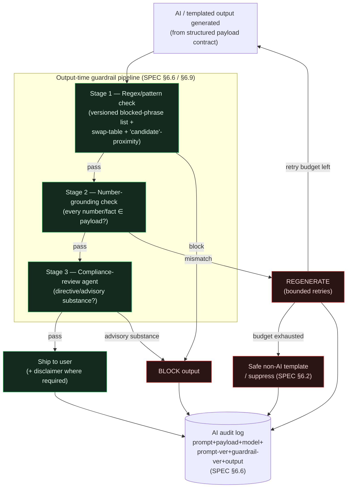

# 21 — Compliance, Risk & Guardrails

> One-line purpose: The compliance contract for Saakshya — the regulatory operating modes, the prohibited/safe-phrase lists, the language-neutralization swap table, the output-time guardrail enforcement pipeline, audit requirements, escalation rules, and the SEBI context every engineer must build against.
> Read first: [SPEC.md](../SPEC.md)

Related: [Product Overview](01-product-overview.md) · [Admin Panel](20-admin-panel.md) · [AI/LLM Agent Architecture](14-ai-llm-agent-architecture.md) · [Scanner Engine & Scoring](13-scanner-engine-and-scoring.md) · [Data Ingestion & Market Data](12-data-ingestion-and-market-data.md) · [Security, Auth & Privacy](23-security-auth-and-privacy.md) · [Information Architecture](05-information-architecture-and-url-paths.md)

---

> **THIS IS THE MOST SAFETY-CRITICAL DOCUMENT IN THE REPO.** It is the compliance contract. Where it appears to conflict with any other doc, **this doc and [SPEC.md](../SPEC.md) win** (SPEC §0 precedence rule). When in doubt, ship the *less* directive language and escalate (Section 11). **Disclaimers are necessary but not sufficient — SEBI reads substance over form** (SPEC §0). This document is product/engineering guidance, **not legal advice**; the active regime must be confirmed with qualified Indian securities counsel (SPEC §2, §14 regulatory note).

---

## 0. The one rule everything derives from

> A feature ships only when the **regulatory mode it requires** is in force, and every user-visible output is **descriptive, traceable to evidence, and free of directive/return language** — enforced at **output time**, not just in the prompt.

Compliance is a **product property, not a disclaimer** (SPEC §0, §1). The evidence-first architecture *is* the compliance posture: AI explains deterministic, data-grounded signals; it never invents numbers, prices, news, or targets, and never issues a buy/sell instruction in v1 (SPEC §1).

---

## 1. The three regulatory operating modes (A / B / C)

Saakshya's legal exposure is gated by which **mode** is in force. v1 ships **Mode A**. RA registration (Mode B) runs in parallel as a gating dependency (SPEC §2).

| Mode | What it unlocks | What it requires | Saakshya status |
|---|---|---|---|
| **A — Pure analytics tool** | Display data, indicators, charts, **scanners (score + reasons)**, sector/news/risk analytics, descriptive AI explanations. User draws their own conclusions. **No** per-stock entry/target/SL, **no** buy-lean "candidate", **no** ranked "what to buy". | No registration. Lowest legal risk. Value prop = "best screener + best explanations." | **In force — v1 scope, frozen.** |
| **B — Registered Research Analyst (RA)** | Stock-specific research & recommendations: **entry/target/SL levels (SPEC 5.21)** and the **"candidate" recommendation layer (SPEC 5.22)**. | NISM Series-XV cert; RAASB enlistment via BSE; FD lien scaled to client count; a formal research report behind each recommendation; record-keeping; per-client fee cap (~₹1.51L/yr/family); **mandatory disclosure that AI is used in producing research** (SPEC §6.7). | **Filing in parallel.** RA-gated features deferred to Phase 5; **not built locally** (SPEC §12). |
| **C — Registered Investment Adviser (IA)** | Personalized, client-specific advice ("given *your* portfolio, do X"); model portfolios; per-user allocation. | Strictest regime; IA registration. | **Out** until IA registration. Not for v1. |

**Gating principle (SPEC §2, §4):** no feature ships until the mode it requires is in force. RA-gated routes/widgets **do not exist in the v1 router** — they are added behind a feature flag in Phase 5 (SPEC §10; [IA §0](05-information-architecture-and-url-paths.md)).

### 1.1 Mode → feature gate (the lines that must never blur)

| Capability | Mode | Why |
|---|---|---|
| Scanner result = **score + reasons + risk flags** | A | Descriptive measurement, user concludes. |
| Descriptive support/resistance ("historically a resistance zone") | A | Historical framing is descriptive. |
| Per-stock **entry / target / stop-loss / invalidation zones** | **B (5.21)** | Advisory-in-substance. The single biggest divergence from the original vision. |
| **"Candidate" as a buy-lean** | **B (5.22)** | A label that functions as a buy-lean is advisory-in-substance. |
| Daily brief: "stocks that entered/exited the scanner" | A | Event report. |
| Daily brief: ranked "what to buy/sell next session" | **B** | Actionable picks = directive. |
| "Because you view banking, consider HDFC Bank" (per-stock, behaviour-derived) | **C** | Personalized advice. |
| Navigation personalization (layout, followed sectors, default filters) | A | Personalizes navigation, not recommendations (SPEC §7). |

---

## 2. Positioning

**Mode-A-safe positioning (SPEC §3):**
> "An AI-powered Indian stock **research and market scanner** that helps users discover technically strong setups, understand sector momentum, analyse news sentiment, and track portfolios — so they can make their own, better-informed decisions."

Saakshya is positioned as **research / analytics / scanner / portfolio-intelligence / education** — **not** advisory — unless and until RA/IA approvals are obtained.

**Do NOT position as (SPEC §3):** "AI stock tips," "guaranteed buy/sell calls," "assured target/stop-loss engine," "AI advisor that tells users where to invest."

---

## 3. Prohibited phrases — the full list

Two tiers. **Tier 1** is prohibited in **every mode, always**, and is a hard, non-removable floor in the compliance rule manager ([Admin §2.8](20-admin-panel.md)). **Tier 2** is prohibited in **Mode A** and unlocks only under RA (Mode B).

### 3.1 Tier 1 — always prohibited, every mode (SPEC §3.3)

These can never be displayed, regardless of registration, and cannot be downgraded below `block` severity by any admin role.

- `guarantee` / `guaranteed`
- `assured` / `assured returns`
- `confirmed target` / `target confirmed` / `confirmed profit`
- `sure-shot` / `sure shot`
- `risk-free` / `risk free`
- `multibagger`
- `buy now` / `sell now`
- `best stock for you` / `best stock to buy`
- `must invest` / `must buy`
- Any **implied or explicit return claim** ("will double", "X% guaranteed", "can't lose").

### 3.2 Tier 2 — prohibited in Mode A, RA-gated (SPEC §3.2, §5)

Blocked now; permitted **only** once Mode B (RA) is in force and behind the Phase-5 feature flag.

- Per-stock **entry zone / target zone / stop-loss zone / invalidation zone** (SPEC 5.21).
- **"Candidate"** used as a **buy-lean** (SPEC 5.22). *(Note the nuance in §5 below — "scanner candidate / watchlist candidate" in the scanner-membership sense is allowed; the buy-lean sense is not.)*
- Daily brief framed as **"what to buy/sell next session"** or ranked actionable picks.
- "Buy the breakout" / "buy the dip" / directive breakout phrasing.
- Behaviour-derived per-stock suggestions ("because you view banking, consider HDFC Bank") — that is Mode **C**.
- Directive tails on AI summaries: "…before fresh action", "time to enter", "good entry here".

---

## 4. Safe phrases — the full list

Descriptive, non-directive language Saakshya **can** use in Mode A (SPEC §3.1, §5). This is the affirmative vocabulary; reason templates, AI prompts, and copy should draw from it.

- "appearing in the momentum scanner" / "appears in the scanner" / "matches this filter"
- "trading above its 50-DMA" / "trading above its 20-DMA"
- "volume expanded 2× versus its 20-day average"
- "news sentiment classified positive" (with retained source + timestamp)
- "historically a resistance zone" / "a level that has acted as support"
- "elevated short-term volatility" / "risk is elevated"
- "evidence suggests"
- "should be monitored" / "is a level to watch"
- "X broke below its 50-DMA" (state the **event**, never "sell X")
- "watchlist candidate" — **scanner-membership sense only** (see §5 nuance)
- "not investment advice"

**Saakshya CAN say:** *"appears in scanner", "technical zone", "risk is elevated", "watchlist candidate" (scanner-membership only), "evidence suggests".*
**Saakshya must AVOID:** *"buy now", "guaranteed target", "sure-shot", "confirmed profit", "risk-free", and any direct, personalized allocation.*

---

## 5. Language-neutralization swap table (mirrors SPEC §5)

Build these swaps into the guardrail layer and the design review. Left = as written in the permissive vision; right = the Mode-A-safe form.

| Vision wording (as written) | Mode-A-safe replacement | Why |
|---|---|---|
| "momentum candidate" / "watchlist candidate" **(buy-lean)** | "appears in the momentum scanner" / "matches this filter" | "Candidate" as buy-lean = SPEC 5.22, RA-gated. |
| "stop-loss zone" / "target zone" / "entry zone" / "invalidation zone" | **Not shown in Mode A** (RA-gated, Phase 5) | Per-stock levels = SPEC 5.21, advisory-in-substance. |
| "support zone" / "resistance zone" | "historically a resistance zone" / "a level that has acted as support" | Descriptive/historical framing is permitted. |
| "Sell X" / "exit this holding" | "X broke below its 50-DMA" (state the event) | Factual event reporting vs. a prescriptive call. |
| Daily brief "what to buy/sell next session" | "stocks that entered/exited the momentum scanner today" | Event report, not actionable picks. |
| AI summary: "…should be monitored **before fresh action**" | "…is a level to watch" | Drop the implied trade decision; keep the observation. |
| "best stock for you" / "must invest" / "guaranteed" / "sure-shot" / "risk-free" / "multibagger" | **Blocked in every mode** | Always prohibited; enforce at output time. |

### 5.1 The "candidate" nuance — flag this explicitly

The word **"candidate" is overloaded** and is a frequent compliance trap:

- ✅ **Allowed (Mode A) — scanner-membership sense:** "watchlist candidate" / "scanner candidate" meaning *"this symbol currently matches the scanner's filter criteria."* It describes set membership, not a trade lean. Prefer the even-safer "appears in the scanner" / "matches this filter" to avoid ambiguity.
- ❌ **RA-gated (Mode B, SPEC 5.22) — buy-lean sense:** "candidate" used to imply *"a name to consider buying."* This functions as a recommendation and is advisory-in-substance.

**Design rule:** never use bare "candidate" near price targets, ranking-for-action, or "consider"/"opportunity" framing. When the membership sense is intended, write the membership sentence in full. The guardrail treats "candidate" within N tokens of buy-lean signals (target, entry, "consider buying", "top picks") as a `block`.

### 5.2 Worked example — neutralized AI stock summary (SPEC §5)

> "This stock is currently showing positive short-term momentum because it is trading above its 20-DMA and 50-DMA, and recent volume is higher than its 20-day average. Sector strength is supportive. However, RSI is elevated, so the risk of a short-term pullback is higher. The nearest resistance level is one to watch." *(Not investment advice.)*

Only the original's trailing "…should be monitored **before fresh action**" was removed — everything else was already evidence-backed and Mode-A safe.

---

## 6. AI guardrail rules

Every AI output is governed by the SPEC §6.6 grounding contract **and** the SPEC §6.9 output-time enforcement.

1. **Payload-contract grounding (SPEC §6.6).** The AI receives only computed metrics, scanner tags, news summaries, and risk markers, and **may reference nothing else.** No field outside the payload may appear in output.
2. **Runtime number/fact verification (SPEC §6.6).** A validator checks **every number and named fact** in the output against the payload and **blocks or regenerates on mismatch.** AI never invents prices, returns, news, or targets.
3. **Suppress, never guess (SPEC §6.2).** When critical inputs are missing, the AI summary is **suppressed**, not fabricated.
4. **Output-time language enforcement (SPEC §6.9).** The versioned blocked-phrase/pattern list runs on the generated text — not merely in the prompt — because a model can produce prohibited language even when told not to.
5. **Descriptive, not directive (SPEC §4, §5).** Market summaries and briefs report events and what to *monitor*; never a ranked "what to buy".
6. **Eval gate on change (SPEC §6.6).** Golden-dataset + regression tests run on every prompt/model change before publish ([Admin §2.6](20-admin-panel.md)).
7. **Full audit (SPEC §6.6).** Prompt, input payload, model version, prompt version, guardrail version, and user-visible output are logged for **every** generation.
8. **AI-use disclosure under RA (SPEC §6.7).** If/when operating under RA, AI use is disclosed to clients and the registered analyst remains fully responsible for AI-assisted output.

---

## 7. Recommendation-language rules

- In **Mode A**, Saakshya makes **no recommendations** — no buy/sell/hold, no per-stock levels, no ranked actionable picks (SPEC §3.2).
- Scanner output is **measurement**: score + reasons + risk flags. Scores are validated as *measurement*, **never framed as a return promise** (SPEC §6.5, §4 ML row).
- ML/probability outputs (Phase 4–5) predict **probability bands, never an exact price**, and are framed as measurement, **never a return promise** (SPEC §4).
- Backtests (Phase 4) are gated on integrity controls; an inflated backtest is an **implied-performance claim** and therefore a compliance risk (SPEC §6.3).
- The **RA-gated recommendation layer (5.21/5.22)** is the *only* path to directive output, ships in Phase 5, and only with RA in force.

---

## 8. Disclaimer rules — necessary but NOT sufficient

**SEBI reads substance over form (SPEC §0).** A disclaimer does **not** cure advisory substance — directive content with a "not investment advice" footer is still a recommendation.

- Disclaimers are **mandatory** on AI summaries, scanner pages, briefs, alerts, and research surfaces — and are **insufficient on their own.**
- "Not investment advice" never licenses directive language. If output needs a disclaimer *to be defensible*, the output is probably too directive — neutralize it (§5) first.
- Under RA (Mode B), the **AI-use disclosure** (SPEC §6.7) is a distinct, additional obligation, not satisfied by the generic disclaimer.
- Required legal surfaces (`/legal/disclaimer`, terms, privacy) are public and SSR'd ([IA](05-information-architecture-and-url-paths.md)).

**Engineering rule:** the guardrail pipeline (§9) is the substance control; the disclaimer is the form control. **Both** are required; the disclaimer alone is never sufficient.

---

## 9. Output-time guardrail enforcement pipeline

Every user-visible output that contains generated or templated language — AI summaries, briefs, alerts, scanner reason/label templates, news summaries — passes this pipeline **at output time** (SPEC §6.6, §6.9) before it reaches the user. Versions of the rules/prompts used are stamped into the AI audit log ([Admin §2.7](20-admin-panel.md)).

**Three enforcement stages:**

1. **Regex / pattern check** against the versioned blocked-phrase/pattern list ([Admin §2.8](20-admin-panel.md)) — Tier-1 (always) + Tier-2 (Mode-A) + the swap-table patterns + the "candidate"-proximity rule (§5.1). Verdict: `block` / `regenerate` / `warn`.
2. **Number-grounding check (SPEC §6.6)** — every number and named fact in the output must be present in the structured payload; any ungrounded value → block/regenerate.
3. **Compliance-review agent (SPEC §4, §6.6)** — an LLM-based reviewer (itself infrastructure, **required**) checks for directive/advisory *substance* that escapes literal patterns (implied buy-leans, allocation hints, exaggerated impact). Its output also passes stages 1–2 (no agent is above the guardrail).

A `block` at any stage **stops the output**; `regenerate` re-runs generation (bounded retries) then falls back to a safe non-AI template; `warn` ships but flags for compliance review.



**Backend dependency.** Rules and prompts loaded **by version** from the admin console ([Admin §2.6, §2.8](20-admin-panel.md)), hot-reloadable; the compliance-review agent prompt is itself versioned + eval-gated; verdicts written to the AI audit log.

**Acceptance criteria.**
- No user-visible generated/templated output reaches the client without passing all three stages (enforced in the output path, tested in CI).
- A Tier-1 phrase is `block`ed regardless of admin configuration (hard floor).
- An ungrounded number triggers regenerate/suppress — never ships (SPEC §6.6).
- The admin test console (§Admin 2.8) is byte-identical to Stage-1 runtime behavior for the same input + version (parity test).
- Every verdict (`pass`/`block`/`regenerate`/`warn`) is in the AI audit log with the rule + prompt + model version IDs.

---

## 10. Audit requirements

Two distinct, mandatory audit trails. Both are append-only and exportable for counsel/regulator review ([Admin §3](20-admin-panel.md), [Security audit logs](23-security-auth-and-privacy.md)).

### 10.1 AI output audit (SPEC §6.6)

| What is logged | Detail |
|---|---|
| Prompt + prompt version | exact template ID published in [Admin §2.6](20-admin-panel.md) |
| Input payload | the structured contract the AI was allowed to see |
| Model + model version | provider/model per the cost-tier abstraction (SPEC §6.8) |
| Guardrail version | the compliance-rule list version that enforced this output |
| User-visible output | the final shipped text (or block/suppress decision) |
| Verification verdict | passed / regenerated / blocked + grounding mismatches |

**Who/what:** generated automatically on every AI generation; no output ships without exactly one record. **Reviewed by** `compliance-officer` (full access); `read-only` auditors view.

### 10.2 Scanner-logic & compliance-change audit (SPEC §6.5, §6.9)

A scanner scoring-weight edit is a material change to product behavior and an implied-performance surface; a compliance-rule or prompt edit is a regulatory change. All are **four-eyes** controlled.

| Change type | Author role | Approver role (≠ author) | Gate before publish |
|---|---|---|---|
| Scanner rule / scoring weights | data-admin | compliance-officer (or super-admin) | Passing **score-validation** run (SPEC §6.5) |
| AI prompt template | data-admin | compliance-officer (or super-admin) | Passing **eval harness** run (SPEC §6.6) |
| Compliance rule (blocked-phrase list) | compliance-officer | super-admin (or 2nd compliance-officer) | Tier-1 floor preserved; test-console parity |

**What is logged (each change):** actor, role, approver, before/after diff, validation/eval result, version ID, timestamp ([Admin §3](20-admin-panel.md)). Author == approver is rejected (`self_approval_forbidden`).

---

## 11. Escalation rules

When in doubt, **ship the less directive language and escalate.** Escalation routes a decision to the `compliance-officer`, and where legal exposure is material, to counsel (SPEC §2 / §14 regulatory note).

| Trigger | Action | Escalate to |
|---|---|---|
| `warn` verdict from the guardrail pipeline | Output ships but is flagged for review queue | compliance-officer |
| Repeated `block`/`regenerate` on a prompt version | Pause that prompt; investigate; possibly roll back | compliance-officer → data-admin |
| Proposed feature/copy that *might* be directive or RA/IA-gated | **Do not ship**; design-review (§12) before any build | compliance-officer → counsel if material |
| New SEBI circular / enforcement order affecting language | Re-evaluate the blocked-phrase list + positioning; version-bump | compliance-officer → counsel |
| User-reported "this told me to buy" | Treat as a P1 compliance incident; pull the output via audit log; patch the guardrail | compliance-officer → super-admin |
| Any ambiguity between Mode A vs B vs C | Default to the **stricter** mode (don't ship) | compliance-officer → counsel |

**Default disposition:** ambiguity resolves toward **non-shipment of the directive form** and toward the **stricter mode** — never the reverse.

---

## 12. Design-review compliance checklist

Engineers run this on **every new user-facing output** (screen, AI prompt, scanner label, alert, brief, copy string) before merge. A "no" on any item blocks the change pending compliance-officer sign-off.

```text
[ ] 1. Is the output DESCRIPTIVE, not DIRECTIVE? (states events/measurements,
       never "buy/sell/hold", never "consider buying", never per-stock levels)
[ ] 2. Does every number/named fact trace to the structured payload? (SPEC §6.6)
[ ] 3. Does the text avoid ALL Tier-1 phrases (guarantee, sure-shot, risk-free,
       multibagger, buy now, best stock for you, confirmed target, …)? (SPEC §3.3)
[ ] 4. Does it avoid Mode-A Tier-2 (entry/target/SL zones, buy-lean "candidate",
       ranked what-to-buy)? If it contains them → RA-gated, do NOT ship in v1.
[ ] 5. Is "candidate" used ONLY in the scanner-membership sense, away from
       buy-lean/price-target framing? (§5.1) Prefer "appears in the scanner".
[ ] 6. Does it pass the output-time guardrail pipeline (regex + grounding +
       compliance-review agent) in the admin test console? (§9)
[ ] 7. Is missing/critical data handled by SUPPRESS, not guess? (SPEC §6.2)
[ ] 8. Is any personalization NAVIGATION-only (layout/followed sectors/filters),
       never per-stock behaviour-derived suggestion (that's Mode C)? (SPEC §7)
[ ] 9. Is a disclaimer present where required — AND is the substance still safe
       WITHOUT relying on the disclaimer? (necessary-not-sufficient, §8)
[ ] 10. Is the output written to the AI audit log with prompt/model/guardrail
        versions? (SPEC §6.6)
[ ] 11. For scanner/score/ML output: framed as MEASUREMENT, never a return
        promise? (SPEC §6.5, §4)
[ ] 12. If RA (Mode B): is AI-use disclosure satisfied? (SPEC §6.7)
[ ] 13. If ANY doubt: defaulted to the less directive language and escalated? (§11)
```

---

## 13. SEBI context (why this document exists)

Saakshya's posture is shaped by recent SEBI enforcement. This is product/engineering context, **not legal advice** — confirm the current regime with counsel (SPEC §2, §14).

- **Jan-2025 finfluencer circular.** SEBI restricted regulated entities' associations with unregistered "finfluencers" giving stock-specific advice/performance claims. Implication: unregistered stock-specific recommendations and return claims carry direct regulatory risk → Saakshya is **Mode A, non-directive**, until RA is in force.
- **Dec-2025 Avadhut Sathe substance-over-form order.** Reinforced that SEBI evaluates the **substance** of what is communicated, not the **form/labels** — a "research/education" label or a disclaimer does **not** cure advisory substance. Implication: the guardrail must catch *implied* recommendations, not just literal phrases (hence the §9 Stage-3 compliance-review agent), and **disclaimers are necessary-not-sufficient** (§8).
- **RA AI-use disclosure.** Registered Research Analysts must **disclose AI use** in producing research and remain fully responsible for AI-assisted output (SPEC §2, §6.7). Built into RA-mode onboarding + terms ([Admin subscription/onboarding], §6 rule 8).

**Net design consequence:** Saakshya enforces compliance in **substance** (evidence-first, grounding, output-time guardrails, the compliance-review agent) — because substance is what is examined — and treats disclaimers and labels as required-but-insufficient form.

---

## 14. Related documents

- [01 — Product Overview](01-product-overview.md)
- [05 — Information Architecture & URL Paths](05-information-architecture-and-url-paths.md)
- [13 — Scanner Engine & Scoring](13-scanner-engine-and-scoring.md)
- [14 — AI/LLM Agent Architecture](14-ai-llm-agent-architecture.md)
- [20 — Admin Panel](20-admin-panel.md)
- [23 — Security, Auth & Privacy](23-security-auth-and-privacy.md)
- [29 — Glossary](29-glossary.md)
- [30 — Decision Log](30-decision-log.md)
