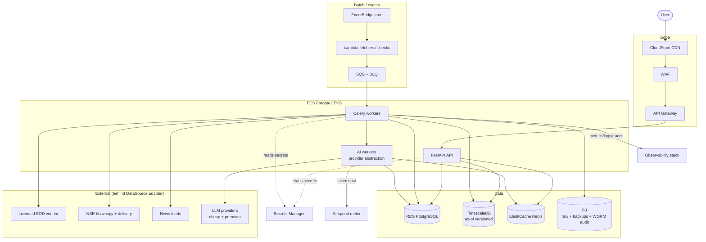
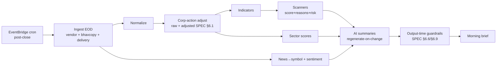

# 22 — Infrastructure, DevOps & Observability

> One-line purpose: The cloud infrastructure, IaC, CI/CD, deployment, EOD batch scheduling, observability (including the hard AI-spend meter), and disaster-recovery design that the local-first MVP graduates into.
> Read first: [SPEC.md](../SPEC.md)

Related: [Admin Panel](20-admin-panel.md) · [Compliance & Guardrails](21-compliance-risk-and-guardrails.md) · [Security, Auth & Privacy](23-security-auth-and-privacy.md) · [AI/LLM Agent Architecture](14-ai-llm-agent-architecture.md) · [Data Ingestion & Market Data](12-data-ingestion-and-market-data.md)

---

## 0. Principles

1. **Local-first graduates to cloud.** The Phase 0–1 MVP runs on one Apple-Silicon Mac with **DuckDB and no Docker day one** (SPEC §9, §12). This document is the **target** stack the local modules lift into once the three product-killing assumptions are retired (SPEC §12). Nothing here is built before then.
2. **EOD-batch shaped infra (SPEC §8, §6.8).** The product is end-of-day; the critical path is an **overnight batch** that must finish inside its window. Infra is optimized for a nightly pipeline + low-latency daytime reads, **not** a 24/7 real-time trading system (that is the Phase-5 live tier).
3. **AI spend is a first-class operational signal (SPEC §6.8).** A **hard monthly AI-spend ceiling** with alerting and graceful degradation is wired into observability, not bolted on.
4. **Provider abstraction preserved (SPEC §9, §6.8).** Cheap model for repetitive summarization, premium model for complex synthesis — behind one interface, so infra and cost controls don't depend on a single provider.
5. **AWS primary, GCP alternative.** Recommend **AWS**; the design maps cleanly to GCP equivalents (noted in §1.3) so the choice is not load-bearing.

---

## 1. Cloud architecture (AWS primary)

### 1.1 Service map

| Concern | AWS service | Role in Saakshya |
|---|---|---|
| Container orchestration | **ECS Fargate** (v1) → **EKS** (scale) | Run FastAPI API, Celery workers, AI workers. Start serverless-container (ECS) to avoid K8s ops cost; graduate to EKS when scale/multi-team warrants. |
| Relational DB | **RDS PostgreSQL** | Users, subscriptions, stock master, scanner rules, prompts, compliance rules, audit logs. |
| Time-series | **TimescaleDB** (on RDS/self-managed PG, or Timescale Cloud) | OHLCV, indicators, scanner results — **as-of versioned** (SPEC §9). |
| Cache / hot data | **ElastiCache Redis** | Cached AI summaries (regenerate-on-change, SPEC §6.8), scanner results, sessions, Celery broker. |
| Object storage | **S3** | Raw vendor payloads, bhavcopy/delivery archives, backups, exports, backtest artifacts. Object-lock for WORM audit data. |
| CDN | **CloudFront** | Frontend assets, public SSR cache, static charts. |
| Edge API | **API Gateway** | Public API surface, throttling/rate limits, request auth integration. |
| Serverless jobs | **Lambda** | Lightweight ingestion fetchers, quality checks, alert fan-out, AI-spend aggregation. |
| Scheduling / events | **EventBridge** | Cron for the EOD batch; pipeline-stage events to the [ingestion monitor](20-admin-panel.md). |
| Queues | **SQS** | Decouple pipeline stages, AI generation jobs, alert delivery. DLQs for failures. |
| Metrics/logs | **CloudWatch** | Baseline infra metrics/logs/alarms; feeds + complements Prometheus/Grafana. |
| Secrets | **Secrets Manager** | DB creds, API keys (`ANTHROPIC_API_KEY`, data-vendor keys), broker tokens (future). Rotation. See [Security](23-security-auth-and-privacy.md). |
| Edge protection | **WAF** | Protect API Gateway/CloudFront; the `/admin/*` and `/api/*` rules (SPEC §9; [Security](23-security-auth-and-privacy.md)). |

### 1.2 Architecture diagram



### 1.3 GCP alternative (mapping)

ECS/EKS → Cloud Run / GKE · RDS PostgreSQL → Cloud SQL · TimescaleDB → Cloud SQL + Timescale or AlloyDB · ElastiCache → Memorystore · S3 → GCS · CloudFront → Cloud CDN · API Gateway → API Gateway / Cloud Endpoints · Lambda → Cloud Functions · EventBridge → Cloud Scheduler + Pub/Sub · SQS → Pub/Sub · CloudWatch → Cloud Monitoring · Secrets Manager → Secret Manager · WAF → Cloud Armor.

---

## 2. Containers & orchestration

- **Docker** images per service (API, worker, AI worker), multi-stage builds, distroless/slim base, pinned digests, non-root user. ARM64-friendly (matches the M1 dev story; **no TA-Lib**, SPEC §9, §12).
- **Kubernetes (EKS)** at scale: deployments per service, HPA on CPU + queue-depth, separate node groups for batch (spot-friendly) vs API (on-demand). **ECS Fargate** for v1 to defer K8s ops.
- **Terraform (IaC)** is the single source of truth for all cloud resources — VPC, subnets, RDS/Timescale, Redis, ECS/EKS, S3, IAM, WAF, Secrets, EventBridge, SQS. State in S3 + DynamoDB lock. Per-environment workspaces.

```hcl
# Illustrative — module layout (not exhaustive)
module "network"   { source = "./modules/network"  env = var.env }
module "data"      { source = "./modules/data"      env = var.env }  # RDS, Timescale, Redis, S3
module "compute"   { source = "./modules/compute"   env = var.env }  # ECS/EKS, ALB
module "async"     { source = "./modules/async"     env = var.env }  # EventBridge, SQS, Lambda
module "security"  { source = "./modules/security"  env = var.env }  # WAF, Secrets, IAM
module "observe"   { source = "./modules/observe"   env = var.env }  # Prometheus, Grafana, alarms
```

**Backend dependency / Acceptance criteria.** All cloud resources are Terraform-managed (no console drift); `terraform plan` is clean post-apply; environments differ only by `tfvars`.

---

## 3. Environments

| Environment | Where | Data | Purpose |
|---|---|---|---|
| **local** | M1 Mac, DuckDB, no Docker (SPEC §12) | yfinance prototype + sample bhavcopy | Build/validate the Phase 0–1 core; retire the 3 product-killing assumptions. |
| **staging** | AWS, scaled-down mirror of prod | Licensed-vendor subset or sanitized | Pre-prod verification, eval/guardrail regression, EOD-batch dry runs. |
| **production** | AWS, full stack | Licensed vendor (commercial redistribution rights, SPEC §8) | Live product. |

Promotion is local → staging → production; **no RA-gated feature is built locally** (SPEC §12). Feature flags gate Phase-5/RA features out of v1 (SPEC §10; [IA](05-information-architecture-and-url-paths.md)).

---

## 4. CI/CD (GitHub Actions)

Pipeline stages: lint/type → unit tests (indicator correctness + verification logic, SPEC §12) → **AI eval-harness + guardrail-parity tests** (SPEC §6.6, §6.9) → build/scan image → push to ECR → Terraform plan (gated apply) → deploy to staging → smoke → **gated** prod deploy (blue-green/canary) → post-deploy verify.

```mermaid
flowchart LR
  PR[PR / push] --> LINT[Lint + typecheck]
  LINT --> UT[Unit tests\nindicators + verification]
  UT --> EVAL[AI eval harness +\nguardrail parity tests]
  EVAL --> SEC[Image build + SCA/secret scan]
  SEC --> ECR[Push to ECR]
  ECR --> TF[Terraform plan]
  TF -->|approve| STG[Deploy → staging]
  STG --> SMOKE[Smoke + e2e]
  SMOKE -->|manual gate| PROD[Deploy → production\nblue-green / canary]
  PROD --> VERIFY[Post-deploy verify\n+ auto-rollback on SLO breach]
```



**Compliance-critical gate (SPEC §6.6, §6.9):** a change to AI prompts, scanner scoring, or compliance rules cannot reach production unless the **eval harness** and **guardrail-parity** jobs pass — mirroring the four-eyes publish controls in [Admin §2.5–2.8](20-admin-panel.md) and [Compliance §10.2](21-compliance-risk-and-guardrails.md).

### 4.1 Deploy strategy, rollback, feature flags

- **Blue-green** for the API; **canary** (5% → 50% → 100%) for AI-worker changes so a bad prompt/model surfaces on a small slice.
- **Rollback:** automated on post-deploy SLO breach (error rate / latency / guardrail-block spike); one-click revert to the prior image + prior prompt/rule versions (versions are data, [Admin](20-admin-panel.md)).
- **Feature flags** gate Phase-5/RA features, tier entitlements, and risky rollouts. RA-gated routes/widgets stay **absent** from the v1 router and flag-on only when Mode B is in force (SPEC §10; [IA](05-information-architecture-and-url-paths.md); [Compliance §1](21-compliance-risk-and-guardrails.md)).

---

## 5. EOD batch scheduling

The nightly pipeline (SPEC §8): **ingest → normalize → corp-action adjust → indicators + sector scores → scanners → news → AI summaries → morning brief.** EventBridge cron triggers it after market close; stages are SQS-decoupled; progress streams to the [ingestion monitor](20-admin-panel.md).



**Latency budget (SPEC §6.8):** EOD generation must finish **inside the overnight window**; a missed SLO alerts before market-open ([Admin system-health](20-admin-panel.md)). On-demand AI has a **P95 target with a non-AI fallback.** Quarantined data **suppresses** dependent AI summaries (SPEC §6.2), it does not block the whole batch.

**Acceptance criteria.** Overnight batch completes within budget on full universe; a failed stage re-emits only its affected downstream artifacts (SPEC §6.2); every artifact carries its as-of version.

---

## 6. Observability

OpenTelemetry instrumentation across services → **traces, metrics, logs** unified; **Prometheus** (metrics) + **Grafana** (dashboards/alerts) + **Sentry** (errors/releases) + CloudWatch (infra baseline). Same metric source feeds the [admin system-health dashboard](20-admin-panel.md) (no admin-only bespoke metrics).

| Signal | Tooling | Key items |
|---|---|---|
| Traces | OpenTelemetry → (Tempo/X-Ray) | request → pipeline-stage → AI-generation spans |
| Metrics | OpenTelemetry → Prometheus → Grafana | API latency/error rate, queue depth, batch duration vs SLO, cache hit ratio, **AI tokens/cost** |
| Logs | OpenTelemetry → Loki/CloudWatch | structured, request-ID correlated, PII-redacted (SPEC §6.6; [Security](23-security-auth-and-privacy.md)) |
| Errors | Sentry | exceptions, release health, regression alerts |

### 6.1 Hard AI-spend meter (SPEC §6.8)

The **hard monthly AI-spend ceiling** is wired directly into observability — a first-class gauge, not a billing afterthought.

- **Source:** per-generation token cost from the AI audit log ([Admin §2.7](20-admin-panel.md)) aggregated by a Lambda into a Prometheus gauge `ai_spend_month_to_date` against `ai_spend_ceiling`.
- **Alerting:** thresholds at 70/85/100% of ceiling; burn-rate + month-end projection on the [system-health dashboard](20-admin-panel.md).
- **Graceful degradation (SPEC §6.8):** approaching the ceiling, the system shifts long-tail coverage to cached/on-demand-only and engages the **non-AI fallback** for new generations — observable in Grafana and admin before users are affected.
- **Levers it enforces:** regenerate-on-change, tiering (full daily for a watched subset; cached/on-demand for the long tail), cheap-vs-premium provider routing (SPEC §6.8).

**Acceptance criteria.** Crossing 85% raises an alert and crossing 100% engages documented graceful degradation (no silent overspend); the meter and the admin dashboard read the same gauge.

---

## 7. Disaster recovery & backups

| Asset | Strategy | Target |
|---|---|---|
| RDS PostgreSQL | Automated snapshots + PITR; cross-region copy | RPO ≤ 15 min, RTO ≤ 1 hr |
| TimescaleDB | Snapshots + WAL archive to S3 | Reproducible to as-of version (SPEC §9) |
| Redis | Cache-only — **rebuildable**, not source of truth | Repopulate from pipeline; no hard RPO |
| S3 (raw + audit) | Versioning + cross-region replication; **object-lock** on audit/WORM | Durable; immutable audit (SPEC §6.6) |
| Secrets | Secrets Manager replication; rotation runbook | See [Security](23-security-auth-and-privacy.md) |
| IaC | Terraform state in S3 (versioned) + DynamoDB lock | Full environment rebuildable from code |

- **Reproducibility, not just recovery:** because data is **as-of versioned** (SPEC §9), the source feeds + bhavcopy archives in S3 let the pipeline **re-derive** indicators/scanners/summaries for any date — DR doubles as a correctness guarantee (SPEC §6.2).
- **DR drill** runs in staging at least quarterly: restore RDS to PITR, replay a batch, verify reconciliation against a second source (SPEC §6.1).

**Acceptance criteria.** A region-loss drill restores core read paths within RTO; audit logs are provably immutable (object-lock); a restored environment reproduces a prior day's displayed values exactly.

---

## 8. Local-first → cloud graduation

The local stack (SPEC §9, §12) maps 1:1 into this infra so modules lift into services without rewrites:

| Local (M1, SPEC §12) | Cloud target |
|---|---|
| DuckDB single file | RDS PostgreSQL + TimescaleDB |
| Plain scripts / Makefile | Celery workers on ECS/EKS + EventBridge/SQS |
| `docker-compose.yml` (provided, not run) | ECS/EKS + Terraform |
| Anthropic SDK → Claude Haiku via env var | Provider abstraction; Secrets Manager for keys; cheap+premium routing (SPEC §6.8) |
| Prototype guardrail + grounding in the AI module | Output-time guardrail pipeline + AI audit log + eval gates ([Compliance](21-compliance-risk-and-guardrails.md), [Admin](20-admin-panel.md)) |
| No observability | OpenTelemetry + Prometheus/Grafana/Sentry + AI-spend meter |

**Graduation gate (SPEC §12):** only after M5 retires the three product-killing assumptions (legal-safe Mode-A output, data correctness, scanner-score signal) is the cloud build + RA track worth the spend.

---

## 9. Related documents

- [12 — Data Ingestion & Market Data](12-data-ingestion-and-market-data.md)
- [14 — AI/LLM Agent Architecture](14-ai-llm-agent-architecture.md)
- [20 — Admin Panel](20-admin-panel.md)
- [21 — Compliance, Risk & Guardrails](21-compliance-risk-and-guardrails.md)
- [23 — Security, Auth & Privacy](23-security-auth-and-privacy.md)
- [30 — Decision Log](30-decision-log.md)
