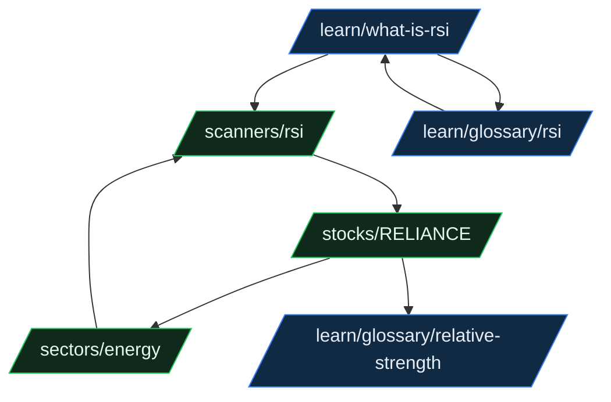

# 24 — Analytics, SEO & Growth

> One-line purpose: The product-analytics event schema, the **trust-first** launch KPIs, the public-page SEO architecture (Mode-A-safe), structured data, internal linking, gated-vs-public education, canonical rules, and the growth loops that compound them.
> Read first: [SPEC.md](../SPEC.md)

Related: [Product Overview](01-product-overview.md) · [Information Architecture & URL Paths](05-information-architecture-and-url-paths.md) · [Frontend Architecture](06-frontend-architecture.md) · [Compliance & Guardrails](21-compliance-risk-and-guardrails.md) · [Infrastructure & Observability](22-infrastructure-devops-and-observability.md) · [Glossary](29-glossary.md) · [Decision Log](30-decision-log.md)

---

## 0. Principles (read before instrumenting)

1. **Trust is the launch metric, not growth.** Saakshya's thesis is evidence-first (SPEC §1). The metrics that prove the thesis are **trust metrics**: incorrect-data reports, mark-insight-useful rate, disagree-with-AI rate. These are the **primary** KPIs at launch; signup/retention/conversion are secondary supporting metrics, **not** the headline. We optimize for "users trust the evidence", not "users spend more time".
2. **Analytics is itself evidence-first.** Every event must be reproducible: it carries the `trading_date` / `as_of` of the data the user saw (SPEC §6.2), the `model_version` + `audit_id` for any AI surface, and never invents a derived "score" the backend didn't emit.
3. **SEO copy obeys Mode A at output time.** Indexed pages are the highest-leverage compliance surface — a single buy-lean on a crawlable page is a public, archived, regulator-visible violation (SPEC §3.3, §6.9). **No buy-leans, targets, stop-losses, "candidate" buy-language, or return claims on any indexed page, ever.** Marketing/SEO copy passes the same guardrail + compliance-review-agent gate as AI output ([21](21-compliance-risk-and-guardrails.md)).
4. **No PII in analytics events.** User identity is a pseudonymous `user_id` (hashed). No email, no holdings values, no symbol-level portfolio amounts in event properties. See [Security & Privacy](23-security-auth-and-privacy.md).
5. **Public ≠ advisory.** Public SEO surfaces are the Mode-A acquisition layer ("best screener + best explanations"). They never host RA-gated content (entry/target/SL) — those routes do not exist in the v1 router (SPEC §4, [05](05-information-architecture-and-url-paths.md)).

---

## 1. Product analytics — event schema

### 1.1 Event envelope (every event)

All events share a common envelope. Properties below are **required on every event**; event-specific properties are layered on top (§1.3).

```jsonc
{
  "event_id": "uuid",            // idempotency key
  "event_name": "scanner_view",  // from the canonical catalog (§1.2)
  "ts": "2026-06-29T03:41:22Z",  // event time, UTC
  "user_id": "u_9f3a...",        // pseudonymous hashed id; null for anonymous
  "anon_id": "a_77c1...",        // cookie/device id, set pre-auth, stitched on signup
  "session_id": "s_22b8...",
  "tier": "free|premium|pro|enterprise|anon",
  "surface": "web",              // web | api | email | (future) mobile
  "route": "/scanners/momentum", // logical route, NOT the raw URL with query
  "referrer_kind": "organic|direct|email|internal|paid|social",
  "trading_date": "2026-06-26",  // as-of date of the data the user saw (SPEC §6.2); null if N/A
  "app_version": "web@1.4.0",
  "consent": { "analytics": true, "ads": false },  // honored; see §1.6
  "props": { /* event-specific, §1.3 */ }
}
```

### 1.2 Canonical event catalog

| Event name | Trigger | Category | Key props (`props.*`) | Primary KPI it feeds |
|---|---|---|---|---|
| `signup` | Account created | Acquisition | `method` (email/google), `referrer_kind`, `seed_sectors[]` | Activation funnel |
| `scanner_view` | Scanner results page rendered | Engagement | `scanner` (momentum/volume-breakout/rsi/...), `result_count`, `filters_applied` | Most-tracked scanners |
| `stock_detail_view` | `/stocks/[symbol]` rendered | Engagement | `symbol`, `sector`, `from` (search/scanner/watchlist/news) | Most-tracked stocks/sectors |
| `watchlist_add` | Symbol added to a watchlist | Activation | `symbol`, `sector`, `list_id`, `source` | Activation, retention |
| `portfolio_add` | Holding added/imported | Activation | `symbol`, `sector`, `method` (manual/import), `holdings_count_after` | Activation, premium intent |
| `alert_create` | Alert rule saved | Engagement | `alert_type` (scanner_entry/indicator_cross/news), `symbol_or_scanner`, `channel` | Retention |
| `ai_query` | User submits an AI assistant question | AI / Trust | `query_class` (explain/compare/define/blocked), `symbol?`, `grounded`, `model_version`, `audit_id`, `refused` | AI usage, refusal rate |
| `ai_summary_view` | AI stock/market summary rendered to user | AI / Trust | `surface_type` (stock/market/brief), `symbol?`, `grounded`, `model_version`, `audit_id`, `from_cache` | AI coverage, trust |
| `daily_brief_open` | Daily market brief opened (web or email) | Retention | `channel` (web/email), `event_count`, `sectors_covered[]` | Retention (D1/D7) |
| `premium_conversion` | Paid subscription activated | Monetization | `from_tier`, `to_tier`, `trigger_surface`, `trial` (bool) | Conversion |
| `retention_active` | First qualifying action of a user's day | Retention | `days_since_signup`, `dau_bucket` | DAU/WAU/MAU, retention curves |
| `churn_signal` | Subscription cancelled OR 30-day inactivity flip | Retention | `kind` (cancel/inactive), `tenure_days`, `last_tier` | Churn, win-back |
| `data_error_report` | User reports incorrect data ("Report a data issue") | **Trust (primary)** | `symbol?`, `field` (price/volume/rsi/corp_action/news/...), `trading_date`, `note_len`, `as_of` | **Incorrect-data reports** |
| `insight_useful` | User marks an AI insight / scanner reason useful | **Trust (primary)** | `surface_type`, `symbol?`, `audit_id?`, `value` (up) | **Mark-insight-useful** |
| `insight_disagree` | User marks "I disagree with this AI explanation" | **Trust (primary)** | `surface_type`, `symbol?`, `audit_id`, `reason_code?` (wrong/unclear/too-strong/missing-context) | **Disagree-with-AI** |

> **Most-tracked sectors / stocks / scanners** are *derived* from `stock_detail_view`, `watchlist_add`, `scanner_view`, and `alert_create` — not separate events. They roll up nightly into the analytics marts (§1.5).

### 1.3 Event-property contracts (selected)

- **AI surfaces** (`ai_query`, `ai_summary_view`) **must** carry `grounded`, `model_version`, and `audit_id` so any analytics row links back to the AI generation audit log (SPEC §6.6). If `grounded=false`, the surface served a **non-AI fallback** (SPEC §6.8) — analytics records this; it is a quality signal, not a failure to hide.
- **Trust events** (`data_error_report`, `insight_disagree`) **must** carry the `as_of` / `trading_date` so a report is reproducible against the exact data version shown.
- **`refused`** on `ai_query` is set when the guardrail blocked a "what should I buy" style ask. This is a **healthy** signal (compliance working), tracked deliberately.

### 1.4 Event lifecycle & transport

```mermaid
flowchart LR
  CLIENT[Client / SSR\nemit(event)] --> SDK[Analytics SDK\nbatch + retry + consent gate]
  SDK --> COLLECT[/POST /api/v1/analytics/collect/]
  COLLECT --> VAL{Schema valid?\n+ consent?}
  VAL -- no --> DLQ[(Dead-letter\n+ alert)]
  VAL -- yes --> QUEUE[(Event queue)]
  QUEUE --> RAW[(raw_events\nappend-only)]
  RAW --> DBT[Nightly transform\n(EOD-aligned)]
  DBT --> MARTS[(Analytics marts:\ntrust, engagement,\nfunnel, retention)]
  MARTS --> DASH[Internal dashboards\n+ admin /admin overview]
```

- Events are **schema-validated server-side** against the catalog (§1.2). Unknown `event_name` or missing required envelope fields → dead-letter + alert (no silent drops).
- Transport batches client-side; idempotent on `event_id`.
- Marts are rebuilt **EOD-aligned** so analytics shares the platform's T+1 cadence and `as_of` semantics.

### 1.5 Derived metrics & marts

| Mart | Grain | Feeds |
|---|---|---|
| `mart_trust_daily` | day × surface | Trust KPIs (§2) — the launch headline |
| `mart_engagement_daily` | day × scanner/sector/symbol | Most-tracked scanners/stocks/sectors |
| `mart_funnel` | user × step | Signup → activation → premium conversion |
| `mart_retention` | cohort × day-offset | D1/D7/D30 retention, churn, win-back |
| `mart_ai_quality` | day × surface | Grounding rate, refusal rate, fallback rate, disagree rate |

### 1.6 Consent, privacy, retention

- Analytics fires only when `consent.analytics=true`. Without consent, only **non-identifying, aggregate** counters (no `user_id`, no `anon_id`) are kept.
- No PII in `props` (§0.4). Free-text (e.g., `data_error_report.note`) is stored separately, access-controlled, and **never** put into an analytics property — only its `note_len` is.
- Raw events retained 13 months; marts retained indefinitely (aggregated). See [Security & Privacy](23-security-auth-and-privacy.md).

---

## 2. Launch KPIs — trust first, not vanity

These are the **original trust KPIs** and they are the **headline launch metrics**. They directly test the SPEC thesis: is the evidence correct, and do users find the explanations credible?

| # | KPI | Definition | Source | Target direction | Why it's not vanity |
|---|---|---|---|---|---|
| T1 | **Incorrect-data reports** | `data_error_report` per 1,000 `stock_detail_view` | `mart_trust_daily` | **↓ minimize** | Directly measures data correctness (SPEC §6.1–6.2). A rising rate halts feature work. |
| T2 | **Mark-insight-useful rate** | `insight_useful` ÷ `ai_summary_view` (+ scanner-reason impressions) | `mart_trust_daily` | **↑ maximize** | Measures whether explanations actually help — the core promise. |
| T3 | **Disagree-with-AI rate** | `insight_disagree` ÷ `ai_summary_view` | `mart_ai_quality` | **↓ minimize, investigate spikes** | A credible AI explanation should rarely be "wrong/too-strong". Spikes trigger prompt/grounding review. |
| T4 | **AI grounding rate** | share of AI surfaces with `grounded=true` | `mart_ai_quality` | **↑ near-100%** | Fabrication guard (SPEC §6.6). Drops ⇒ verification harness regression. |
| T5 | **Refusal correctness** | share of `ai_query.refused` that were genuinely out-of-scope ("what to buy") | manual sample + `mart_ai_quality` | **↑ high** | Confirms guardrails refuse the right things, not over-refuse. |

> **Operating rule:** if **T1 rises** or **T4 falls** beyond threshold, that is a **stop-the-line** event (SPEC §6 correctness gate) — it outranks any growth target. Growth KPIs (signup, activation, retention, conversion) are tracked in `mart_funnel`/`mart_retention` but are explicitly **subordinate** to T1–T5 at launch.

### 2.1 Supporting (secondary) metrics

Activation (watchlist_add or portfolio_add within 24h of signup), D1/D7/D30 retention, free→premium conversion, AI coverage (% of viewed stocks with a fresh grounded summary). Useful for the business — **never** allowed to override a trust regression.

---

## 3. SEO architecture

The public surface is the acquisition engine and the proof of the evidence-first positioning. It must rank for **investor-intent and education-intent** queries while staying strictly Mode-A.

### 3.1 Indexed public page types

| Page type | Route | Intent | Content (Mode-A-safe) | Render |
|---|---|---|---|---|
| Stock page | `/stocks/[symbol]` | "RELIANCE share analysis" | Facts, OHLC, indicators, **descriptive** S/R, scanner memberships, risk badge, news, grounded AI summary. **No entry/target/SL.** | SSG + ISR (EOD) |
| Sector page | `/sectors/[sector]` | "best performing sectors NSE" | Sector strength, constituents, breadth, leaders/laggards (descriptive) | SSG + ISR |
| Scanner page | `/scanners/momentum-stocks`, `/scanners/volume-breakout-stocks` | "momentum stocks NSE today" | Scanner result list with **score + reasons + risk flags**; "appears in the momentum scanner" framing | ISR (EOD) |
| Learn / education | `/learn/what-is-rsi`, `/learn/volume-breakout-meaning`, `/learn/how-to-read-moving-averages` | "what is RSI" | Evergreen explainer; defines the concept, links to live scanner/stock pages | SSG |
| Glossary | `/learn/glossary/[term]` (market glossary pages) | "what does delivery percentage mean" | One concept per page; cross-links to [29 — Glossary](29-glossary.md) source-of-truth definitions | SSG |

> **Slug note:** public scanner SEO slugs are the longer, query-shaped forms `/scanners/momentum-stocks` and `/scanners/volume-breakout-stocks`. The app router's canonical scanner paths are `/scanners/momentum` and `/scanners/volume-breakout` ([05](05-information-architecture-and-url-paths.md)). The SEO slug **301-redirects** to (or canonicalizes to) the app path so there is exactly one indexable URL per scanner (§3.4). Pick one as canonical at build time; do not index both.

### 3.2 Mode-A SEO copy rules (non-negotiable)

- **Titles/H1/meta descriptions are descriptive, never directive.** Good: *"Momentum Stocks Scanner — NSE/BSE (EOD) | Saakshya"*. Bad: *"Top Stocks to Buy Today"* (blocked).
- **No blocked phrases** anywhere in indexed copy (SPEC §3.3): guarantee, sure-shot, risk-free, multibagger, buy now, assured target, best stock to buy. Enforced by the same guardrail used at AI output time (SPEC §6.9), run over rendered HTML in CI ([25 — QA & Release](25-qa-testing-and-release-process.md)).
- **Scanner pages say "appears in / matches this filter", never "candidate / buy".**
- **No return claims** ("could 2x", "guaranteed gains").
- Every indexed analytical page carries a visible **"Not investment advice"** line and a **data `as_of` date** (SPEC §6.2).

### 3.3 Structured data (schema.org)

| Page type | schema.org type(s) | Notes |
|---|---|---|
| Stock page | `BreadcrumbList`; (optional) `Dataset` for the EOD series; `Organization` for the issuer | **Do not** use `Rating`/`Review`/`AggregateRating` — would imply a recommendation. No `price` markup that implies a target. |
| Learn / glossary | `Article` / `DefinedTerm` + `DefinedTermSet`; `FAQPage` for Q&A blocks; `BreadcrumbList` | `DefinedTerm` ties glossary pages to [29](29-glossary.md). |
| Scanner page | `CollectionPage` + `BreadcrumbList`; `ItemList` of constituent stocks (names/links only) | `ItemList` is a neutral membership list — no ranking-as-recommendation language in markup. |
| Sector page | `CollectionPage` + `BreadcrumbList` | — |
| Site-wide | `WebSite` + `SearchAction` (sitelinks search box) | — |

> **Compliance constraint on structured data:** never emit markup whose semantics assert an opinion/rating/recommendation. `Rating`, `Review`, `Recommendation`-shaped types are **prohibited** on Mode-A pages.

### 3.4 Canonical rules

- **One canonical per concept.** Scanner SEO-slug vs app-path: pick one, 301 the other.
- **Query params** (`?sort`, `?filter`, `?page`, `?as_of`) are **excluded** from canonical; canonical points to the clean entity/collection path ([05 §6](05-information-architecture-and-url-paths.md)).
- **Symbol case/suffix** variants 301 to the uppercase canonical (`/stocks/tcs` → `/stocks/TCS`).
- `noindex` on `/login`, `/signup`, all `auth`/`admin` routes; `disallow` on `/api/`, `/admin/`.
- Split **sitemaps** per type, only `indexed` routes included ([05 §6](05-information-architecture-and-url-paths.md)).

### 3.5 Internal linking



- **Education → live data → education** loop: explainers link to the live scanner/stock that demonstrates the concept; live pages link back to the explainer/glossary for any indicator they show.
- Every indicator chip on a stock/scanner page deep-links to its glossary page (`RSI` chip → `/learn/glossary/rsi`). This builds dense, topical internal linking automatically.
- Stock pages link to their sector page; sector pages link to relevant scanners.

### 3.6 Gated premium vs public education content

| Content | Public (indexed) | Gated (premium) |
|---|---|---|
| What an indicator means (RSI, MA, volume breakout) | ✅ full explainer | — |
| Today's scanner result list | ✅ visible (Mode-A list) | full filters, history, export gated inside the `auth` route (not a separate URL) |
| Glossary definitions | ✅ full | — |
| One grounded AI stock summary | ✅ (rate-limited) | unlimited + full-universe coverage |
| Backtesting / strategy builder | ❌ (upgrade gate, `noindex`) | ✅ Pro |

> **Gating is in-route, not URL-split** ([05 §0.2](05-information-architecture-and-url-paths.md)): crawlers see the public shell; interaction/depth requires auth. Never cloak — the public content must be genuinely present for crawlers and users alike.

---

## 4. Growth loops

```mermaid
flowchart LR
  subgraph SEO["Content/SEO loop"]
    A[Education + glossary + scanner pages\nindexed, Mode-A-safe] --> B[Organic search traffic]
    B --> C[Signup on free tier]
    C --> D[New followed sectors/symbols\n→ more internal-link demand]
    D --> A
  end
  subgraph BRIEF["Habit loop"]
    C --> E[Daily brief\n(event-reporting)]
    E --> F[daily_brief_open\n→ stock/scanner views]
    F --> G[watchlist_add / alert_create]
    G --> E
  end
  subgraph TRUST["Trust loop"]
    F --> H[insight_useful / data_error_report]
    H --> I[Better data + prompts\n(T1↓ T2↑)]
    I --> J[Higher-quality public pages]
    J --> A
  end
```

| Loop | Mechanism | Compounds via | Mode-A guard |
|---|---|---|---|
| **Content/SEO** | Indexed education + glossary + scanner pages rank, attract organic, convert to free signups | Each followed sector/symbol surfaces more internal links and fresher pages | All copy Mode-A; no buy-leans on indexed pages |
| **Habit (daily brief)** | EOD daily brief brings users back; opens drive watchlist/alert creation | Retention (T-secondary) feeds DAU; alerts create return triggers | Brief is **event-reporting** ("entered the momentum scanner"), never "what to buy" (SPEC §3.2, §4) |
| **Trust** | Useful-marks and data reports improve data + prompts; better evidence improves public pages | T2↑/T1↓ raises both conversion and SEO quality | The loop *is* the compliance posture — improving trust = improving safety |
| **Referral** | Share a (public, Mode-A) stock/scanner page | Shared links are indexable public pages → SEO + acquisition | Shared content carries the same Mode-A copy + "not advice" line |

> **Explicitly excluded growth tactics:** no "hot picks" emails, no "stocks to buy" push notifications, no streak-gamification that nudges trading, no per-user "because you viewed X, consider Y" (that is Mode C, SPEC §7). Growth must not manufacture advisory substance.

---

## 5. Acceptance criteria

- **Analytics:** every event validates against the §1.2 catalog; AI events carry `grounded`/`model_version`/`audit_id`; no PII in `props`; consent gating enforced.
- **Trust KPIs:** T1–T5 are computed nightly and shown on the admin overview ([05 §4](05-information-architecture-and-url-paths.md)); a T1-rise / T4-drop triggers a stop-the-line alert ([22](22-infrastructure-devops-and-observability.md)).
- **SEO compliance:** the blocked-phrase guardrail runs over rendered HTML of all indexed routes in CI; build fails on any violation ([25](25-qa-testing-and-release-process.md)).
- **Structured data:** no `Rating`/`Review`/`Recommendation` markup on Mode-A pages; valid JSON-LD for the allowed types.
- **Canonical/sitemaps:** exactly one canonical per concept; only `indexed` routes in sitemaps; scanner SEO-slug ↔ app-path resolves to a single indexable URL.
- **Gating:** premium depth is in-route (no cloaking); public education is genuinely crawlable.

---

## 6. Related documents

- [05 — Information Architecture & URL Paths](05-information-architecture-and-url-paths.md)
- [06 — Frontend Architecture](06-frontend-architecture.md)
- [21 — Compliance, Risk & Guardrails](21-compliance-risk-and-guardrails.md)
- [22 — Infrastructure, DevOps & Observability](22-infrastructure-devops-and-observability.md)
- [23 — Security, Auth & Privacy](23-security-auth-and-privacy.md)
- [25 — QA, Testing & Release Process](25-qa-testing-and-release-process.md)
- [29 — Glossary](29-glossary.md)
- [30 — Decision Log](30-decision-log.md)
