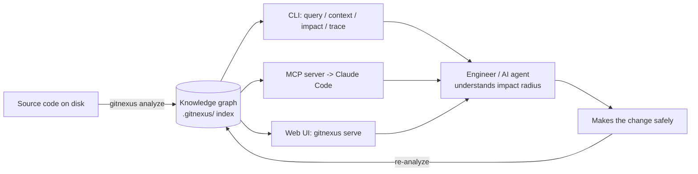
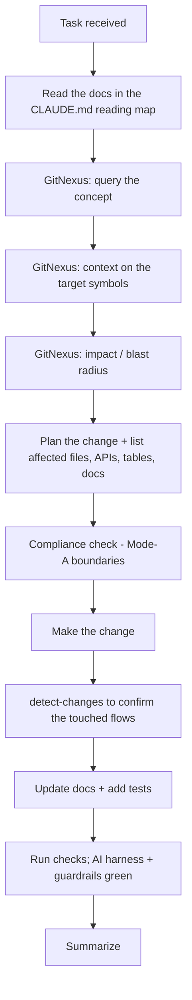

# 26 · GitNexus Knowledge Graph

How to install, configure, and use GitNexus as the local code-intelligence / knowledge-graph layer for the Saakshya repository.

> Read first: [SPEC.md](../SPEC.md) (canonical source of truth) · See also: [.gitnexus.md](../.gitnexus.md), [CLAUDE.md](../CLAUDE.md), [docs/28 agentic workflows](28-agentic-development-workflows.md)

---

## 1. Purpose

GitNexus builds a **local knowledge graph of the codebase** — symbols (functions, classes, modules), their call chains, dependency edges, and the execution flows they participate in. It runs entirely on the developer's machine (no source leaves the laptop) and exposes the graph through a CLI, an MCP server (for Claude Code / Cursor / Codex / OpenCode), and a web UI.

For Saakshya it is the **impact-analysis substrate**: before any non-trivial change, an engineer or AI agent queries the graph to learn *what calls this*, *what this calls*, and *what breaks if I change it* — instead of guessing from file names. This directly supports the agentic development workflow in [docs/28](28-agentic-development-workflows.md) and the GitNexus rule in [CLAUDE.md §6](../CLAUDE.md).



---

## 2. Prerequisites

- **Node.js** (v18+; this repo verified on v25) and **npx** — used to run GitNexus without a global install.
- A **git repository** (this repo is initialized). GitNexus indexes the working tree.
- No network is required for indexing or local embeddings (local ONNX backend).

Verify runtime capabilities at any time:

```bash
npx -y gitnexus@latest doctor
```

---

## 3. Setup & analysis commands

Run all commands from the repository root (`/Users/deepeshgupta/Projects/Saakshya`).

| Command | What it does |
|---|---|
| `npx -y gitnexus@latest setup` | One-time setup: registers the GitNexus **MCP server** with detected coding agents (Claude Code, Cursor, Codex, OpenCode) and installs the standard GitNexus skills under `.claude/skills/gitnexus/`. |
| `npx -y gitnexus@latest analyze` | Full repository index (builds the knowledge graph into `.gitnexus/`). By default also updates a managed GitNexus section in `CLAUDE.md`/`AGENTS.md`. |
| `npx -y gitnexus@latest analyze --skills` | Index **and** generate repo-specific skill files from detected code "communities" (clusters of related symbols). |
| `npx -y gitnexus@latest analyze --embeddings` | Index and generate vector embeddings for semantic search (optional; slower first run). |
| `npx -y gitnexus@latest analyze -f` | Force a full re-index even if the index looks up to date. |
| `npx -y gitnexus@latest status` | Show index status for the current repo (is it indexed, how stale). |
| `npx -y gitnexus@latest list` | List all repositories registered in the global GitNexus registry. |
| `npx -y gitnexus@latest serve` | Start the local HTTP server for the web-UI graph explorer. |
| `npx -y gitnexus@latest clean` | Delete the GitNexus index for the current repo. |
| `npx -y gitnexus@latest uninstall` | Reverse `setup` (remove MCP entries, skills, hooks). |

### Query / analysis commands (the day-to-day value)

| Command | What it answers |
|---|---|
| `npx -y gitnexus@latest query "<concept>"` | Find execution flows related to a concept (e.g. `"momentum scanner scoring"`). |
| `npx -y gitnexus@latest context <symbol>` | 360° view of a symbol: callers, callees, and the processes it participates in. |
| `npx -y gitnexus@latest impact <symbol>` | **Blast-radius** analysis: what breaks if you change this symbol. |
| `npx -y gitnexus@latest trace <from> <to>` | Shortest call/member path between two symbols. |
| `npx -y gitnexus@latest detect-changes` | Map the current `git diff` hunks to indexed symbols and affected execution flows. |
| `npx -y gitnexus@latest check` | Run structural checks against the indexed graph. |
| `npx -y gitnexus@latest cypher "<query>"` | Raw Cypher query against the graph (advanced). |

In a Claude Code session these are also available as **MCP tools** (`mcp__gitnexus__context`, `mcp__gitnexus__impact`, `mcp__gitnexus__query`, `mcp__gitnexus__detect_changes`, …) and as **skills** (`gitnexus-exploring`, `gitnexus-impact-analysis`, `gitnexus-debugging`, `gitnexus-refactoring`, `gitnexus-pr-review`). Prefer the skills/MCP tools inside a session; use the CLI for setup, re-indexing, and shell workflows.

---

## 4. Re-indexing policy

The graph is only as good as its freshness. Re-run `analyze` when the code has changed materially:

- After merging a feature branch or a refactor that moves/renames symbols.
- Before starting a large change, so impact analysis reflects current reality.
- As a fast incremental step (GitNexus skips work that is already up to date; use `-f` to force).

`.gitnexus/` is **regenerated** from source, so it is safe to `clean` and re-`analyze` at any time.

---

## 5. What to commit vs ignore

- **Commit:** all documentation (this file and the rest of `/docs`), `CLAUDE.md`, `.gitnexus.md`, and any repo-specific skill files you choose to share with the team.
- **Ignore:** the generated index directory **`.gitnexus/`** (local, machine-specific, regenerable). It is listed in [.gitignore](../.gitignore).

If GitNexus appends a managed stats section to `CLAUDE.md`/`AGENTS.md` during `analyze`, that section *is* committed (it is small and informational); use `--skip-agents-md` if you prefer to keep `CLAUDE.md` fully hand-authored.

---

## 6. How Claude must use GitNexus before complex changes

This is the mandatory loop for any non-trivial change (multi-file, refactor, new feature, backend/DB/AI/pipeline change). It expands [CLAUDE.md §6 and §12](../CLAUDE.md).



### Per-change-type GitNexus workflow

| Change type | GitNexus steps before editing |
|---|---|
| **New feature** | `query` the nearest existing concept → `context` on the integration points → `impact` on shared utilities you'll touch. |
| **Refactoring** | `context` + `impact` on every symbol you rename/move; `trace` to confirm call paths; re-`analyze` after. Prefer the `gitnexus-refactoring` skill. |
| **Debugging** | `query` the failing flow → `trace` from entrypoint to the suspected fault → `context` on the implicated symbols. Use `gitnexus-debugging`. |
| **Backend change** | `context` on the service method + `impact` to see which API routes / Celery tasks / other services depend on it (see [docs/09](09-backend-architecture.md)). |
| **Frontend change** | `query`/`context` on the component and its data hooks; confirm which screens consume it ([docs/08](08-screen-by-screen-documentation.md)). |
| **AI pipeline change** | `impact` on the grounding/verification + guardrail symbols — never weaken these without seeing every caller ([docs/14](14-ai-llm-agent-architecture.md), [docs/21](21-compliance-risk-and-guardrails.md)). |
| **Database change** | `impact` on the repository/model symbols and every query that reads the changed table ([docs/11](11-database-architecture.md)); pair with migration rules in [docs/27](27-coding-standards.md). |
| **Scanner logic change** | `context` on the scorer + `impact` on the AI-explanation payload and scanner-result consumers ([docs/13](13-scanner-engine-and-scoring.md)); these are compliance-sensitive (audited). |

---

## 7. Repository setup status

> This section records the actual GitNexus state for this repo and is updated whenever setup/analysis is re-run.

- **GitNexus version:** 1.6.8 · **Runtime:** darwin/arm64, Node v25.9.0 · graph store, full-text search, and local vector embeddings all available (`doctor` verified).
- **Setup performed (2026-06-29):** `setup` configured the GitNexus **MCP server** for Claude Code, Antigravity, and Codex and installed 9 skills per editor (`~/.claude/skills/`, etc.). `analyze --skills` indexed the repo in ~6s: **31 files → 729 nodes, 1,024 edges, 0 clusters / 0 flows**. Skill generation was **skipped (no code communities detected — expected for a docs-only tree)**. `status` reports the index **✅ up-to-date**; `list` shows `Saakshya` registered in the global registry.
- **Known caveats:** (1) the offline runtime exposes the full-text-search extension as *load-only*, so FTS-backed search is limited until that extension is present — graph queries (`context` / `impact` / `trace`) are unaffected; (2) the repo is at a detached HEAD with no commits yet, so GitNexus indexed the working tree directly.
- **Important:** at first analysis the repository contains **documentation only** (no application code yet), so the graph is sparse and clusters/flows are empty. **Re-run `npx -y gitnexus@latest analyze --skills` after the first code lands** (local-first milestone M0, see [SPEC.md §12](../SPEC.md)) so the graph reflects real symbols, call chains, and communities (skills will then generate).

### Pending local setup (run on each developer's machine)

GitNexus configures *per-machine* MCP entries, so every developer/clone should run:

```bash
cd /path/to/Saakshya
npx -y gitnexus@latest setup            # register MCP + skills for your editor
npx -y gitnexus@latest analyze --skills # build the local knowledge graph
npx -y gitnexus@latest status           # confirm it indexed
```

Then restart the editor so the GitNexus MCP server is picked up.
