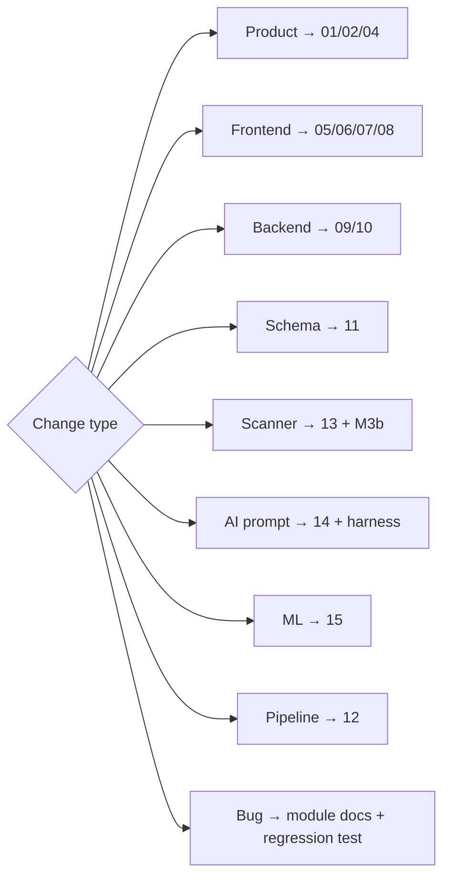

# 28 — Agentic Development Workflows

> One-line purpose: How Claude and future AI coding agents work inside this repo — the mandatory read→context→plan→change→doc→test→check→summarize loop, the GitNexus-grounded impact analysis step, and concrete per-change-type checklists.
> Read first: [SPEC.md](../SPEC.md)

Related: [GitNexus Knowledge Graph](26-gitnexus-knowledge-graph.md) · [Coding Standards](27-coding-standards.md) · [QA & Release](25-qa-testing-and-release-process.md) · [Compliance & Guardrails](21-compliance-risk-and-guardrails.md) · root [CLAUDE.md](../CLAUDE.md) · [Decision Log](30-decision-log.md)

---

## 0. Principles (read before any change)

1. **No code before reading the relevant docs.** Every agent follows the **CLAUDE.md mandatory reading map** for the change type *before* editing. SPEC.md is always read for any change touching scope, AI, scanners, data, or compliance.
2. **Ground in GitNexus, not assumptions.** Before editing, query [GitNexus](26-gitnexus-knowledge-graph.md) for affected modules, the dependency graph, call chains, and impact radius. The graph is the source of truth for "what does this touch".
3. **Behavior change ⇒ doc change ⇒ test change.** If behavior changes, the relevant `docs/NN-*.md` and the tests change in the **same** PR ([27 §8.3](27-coding-standards.md), [25](25-qa-testing-and-release-process.md)).
4. **Mode-A and grounding are guardrails on the agent too.** An agent never introduces buy-leans, entry/target/SL, return claims, or ungrounded AI behavior (SPEC §3, §6.6, §6.9).
5. **Stop-the-line beats throughput.** If a change would regress a correctness/compliance/trust gate ([25 §6](25-qa-testing-and-release-process.md)), the agent stops and surfaces it rather than working around it.

---

## 1. The core agent loop

```mermaid
flowchart TB
  S1[1. Read docs\nper CLAUDE.md reading map\n(+ SPEC.md)] --> S2[2. Check GitNexus context\nmodules · deps · call chains · impact radius]
  S2 --> S3[3. Identify affected files]
  S3 --> S4[4. Create implementation plan]
  S4 --> S5[5. Make the change\n(coding standards §27)]
  S5 --> S6[6. Update docs when behavior changes]
  S6 --> S7[7. Add/update tests\n(critical logic MUST be covered)]
  S7 --> S8[8. Run checks\nlint · types · tests · harness · guardrails]
  S8 --> DEC{All gates green?}
  DEC -- no --> S5
  DEC -- yes --> S9[9. Summarize\nwhat changed · why · risks · docs/tests touched]
```

| Step | What the agent does | Tooling / reference |
|---|---|---|
| 1 | Read the docs the CLAUDE.md map names for this change type; always SPEC.md when scope/AI/data/compliance is involved | [CLAUDE.md](../CLAUDE.md), SPEC.md |
| 2 | Query GitNexus: affected modules, dependency graph, call chains, **impact radius** | [26 — GitNexus](26-gitnexus-knowledge-graph.md), `mcp__gitnexus__impact` / `context` / `query` |
| 3 | Enumerate concrete files to touch (source + tests + docs) | GitNexus results + repo |
| 4 | Write a short implementation plan (steps, files, gates) | — |
| 5 | Make the change per [27](27-coding-standards.md) | Edit/Write |
| 6 | Update `docs/NN-*.md` if behavior changed | docs/ |
| 7 | Add/update tests; critical logic (scoring/corp-action/AI grounding+guardrails) **must** be covered | [25](25-qa-testing-and-release-process.md) |
| 8 | Run lint, strict types, tests, AI harness, guardrail suite | [25](25-qa-testing-and-release-process.md) |
| 9 | Summarize: what/why/risk/impact-radius/docs+tests touched | — |

---

## 2. GitNexus context step (step 2, expanded)

Before touching code, establish the **impact radius** so the change is scoped correctly and nothing downstream silently breaks ([26](26-gitnexus-knowledge-graph.md)):

- **Affected modules** — what package/module owns the symbol being changed.
- **Dependency graph** — what this module imports and what imports it.
- **Call chains** — who calls the function/route/model being changed, transitively.
- **Impact radius** — the full set of files/tests/docs that a change could affect; this becomes the test + doc update scope.

> If GitNexus shows a change reaches scanner scoring, corp-action adjustment, or the AI grounding/guardrail path, the agent treats it as **critical logic**: extra tests + doc update are mandatory, and a compliance check is required ([27 §0.1](27-coding-standards.md), [21](21-compliance-risk-and-guardrails.md)).

---

## 3. Per-change-type workflows

Each names the **docs to read first** (the CLAUDE.md map), the GitNexus query focus, and a checklist. Rule throughout: **no code before reading the listed docs.**

### 3.1 Product change
**Read:** [01](01-product-overview.md), [02](02-product-roadmap.md), [04](04-feature-modules.md), SPEC §2–§5. **GitNexus:** features/modules touched.
- [ ] Confirm the change is **Mode-A-safe** (or correctly RA-gated and flag-only) — SPEC §4.
- [ ] Update [01]/[02]/[04] and the feature-mode mapping if scope shifts.
- [ ] Log the decision in [30](30-decision-log.md) if it's a real decision.

### 3.2 Frontend screen change
**Read:** [05](05-information-architecture-and-url-paths.md), [06](06-frontend-architecture.md), [07](07-design-system-and-ui-ux.md), [08](08-screen-by-screen-documentation.md). **GitNexus:** components + API bindings for the route.
- [ ] Route/access/SEO posture matches [05]; no buy-lean copy on indexed pages ([24 §3.2](24-analytics-seo-and-growth.md)).
- [ ] Typed API client + `zod` validation at boundary ([27 §3.1](27-coding-standards.md)).
- [ ] Visual regression + E2E updated ([25](25-qa-testing-and-release-process.md)); RA-gated slots render the placeholder, never an empty advisory widget.
- [ ] Update [08] screen doc.

### 3.3 Backend API change
**Read:** [09](09-backend-architecture.md), [10](10-api-contracts.md), [05 §5](05-information-architecture-and-url-paths.md). **GitNexus:** callers of the endpoint/service (`api_impact` / `route_map`).
- [ ] Response uses the standard envelope; AI endpoints carry grounding metadata ([27 §6](27-coding-standards.md)).
- [ ] OpenAPI/contract updated; API-contract tests green ([25](25-qa-testing-and-release-process.md)).
- [ ] No advisory endpoints (`/recommendations`, `/targets`, …) — Mode A ([05 §5](05-information-architecture-and-url-paths.md)).
- [ ] Update [10].

### 3.4 Database schema change
**Read:** [11](11-database-architecture.md), [27 §7.5](27-coding-standards.md). **GitNexus:** models/repos/migrations referencing the table.
- [ ] Alembic migration with **tested `downgrade`**; two-phase if destructive.
- [ ] New time-series/indicator tables carry **as-of versioning**; AI tables link the **audit log** (SPEC §9).
- [ ] Integration tests on repo↔DB; update [11].

### 3.5 Scanner logic change (critical)
**Read:** [13](13-scanner-engine-and-scoring.md), SPEC §6.5. **GitNexus:** indicators feeding the score, consumers of results (UI, AI payload, alerts).
- [ ] Golden-series tests updated and green; **reasons stay Mode-A** ("appears in the scanner"); missing sub-scores marked **neutral** ([25 §1.1](25-qa-testing-and-release-process.md)).
- [ ] If scoring weights/method change, refresh **M3b validation evidence** (signal, not noise — SPEC §6.5).
- [ ] Update [13] + admin scanner config doc.

### 3.6 AI prompt change (critical)
**Read:** [14](14-ai-llm-agent-architecture.md), SPEC §6.6, §6.8, §6.9, [27 §7.4](27-coding-standards.md). **GitNexus:** surfaces consuming this prompt.
- [ ] Prompt is a **versioned file**; references only the `AiPayload` (SPEC §6.6).
- [ ] **Verification harness GREEN** (grounding + number-traceability + suppression); golden dataset updated ([25 §1.3](25-qa-testing-and-release-process.md)).
- [ ] **Guardrail suite GREEN**; no directive tails / Mode-A neutralization holds (SPEC §5).
- [ ] Update [14]; log model/prompt-policy decisions in [30](30-decision-log.md).

### 3.7 ML model change
**Read:** [15](15-machine-learning-and-data-science.md), SPEC §6.5, §6.3. **GitNexus:** features/feature-store + consumers of model output.
- [ ] Output is **probability bands / measurement**, never an exact price or return promise (SPEC §4, §6.5).
- [ ] Survivorship / look-ahead / point-in-time controls respected (SPEC §6.3); validation evidence recorded.
- [ ] Update [15]; this is **Phase 4+** — confirm phasing ([02](02-product-roadmap.md)).

### 3.8 Data pipeline change
**Read:** [12](12-data-ingestion-and-market-data.md), SPEC §6.1, §6.2, §8, [27 §7.3](27-coding-standards.md). **GitNexus:** stages downstream of the change, indicators/scanners consuming the output.
- [ ] Stage idempotent + `as_of`-stamped; **corp-action adjustment** correctness preserved (raw + adjusted stored) — split/bonus fixtures green ([25 §2](25-qa-testing-and-release-process.md)).
- [ ] Data-quality checks + reconciliation green; correction path (detect→quarantine→correct→re-emit) intact (SPEC §6.2).
- [ ] Update [12].

### 3.9 Bug fix
**Read:** docs for the affected module; SPEC if behavior/compliance is involved. **GitNexus:** call chain to the bug + blast radius.
- [ ] Add a **regression test that fails before the fix**.
- [ ] Confirm the fix doesn't regress a correctness/compliance/trust gate ([25 §6](25-qa-testing-and-release-process.md)).
- [ ] Update docs only if behavior/contract changed.



---

## 4. Stop conditions (agent must halt and surface)

- A change requires emitting entry/target/SL or any buy-lean (RA-gated, SPEC §4) — do not implement in Mode A.
- The AI verification harness or guardrail suite cannot be made green.
- A corp-action / data-quality fixture would have to be weakened to pass.
- M3b evidence would no longer support that a scanner score carries signal (SPEC §6.5).
- Required docs for the change type are missing or contradict SPEC — surface the conflict, don't guess.

---

## 5. Summary output contract (step 9)

Every agent run ends with: **what changed**, **why**, **impact radius** (from GitNexus), **docs updated**, **tests added/updated**, **gates run + result**, and **residual risks / follow-ups**. This is what the human reviewer reads against the [27 §8.3](27-coding-standards.md) PR checklist.

---

## 6. Related documents

- [CLAUDE.md](../CLAUDE.md) — mandatory reading map (root)
- [26 — GitNexus Knowledge Graph](26-gitnexus-knowledge-graph.md)
- [27 — Coding Standards](27-coding-standards.md)
- [25 — QA, Testing & Release Process](25-qa-testing-and-release-process.md)
- [21 — Compliance, Risk & Guardrails](21-compliance-risk-and-guardrails.md)
- [30 — Decision Log](30-decision-log.md)
